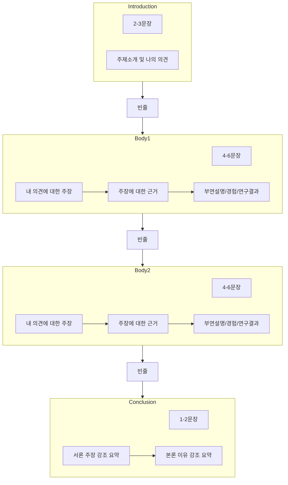
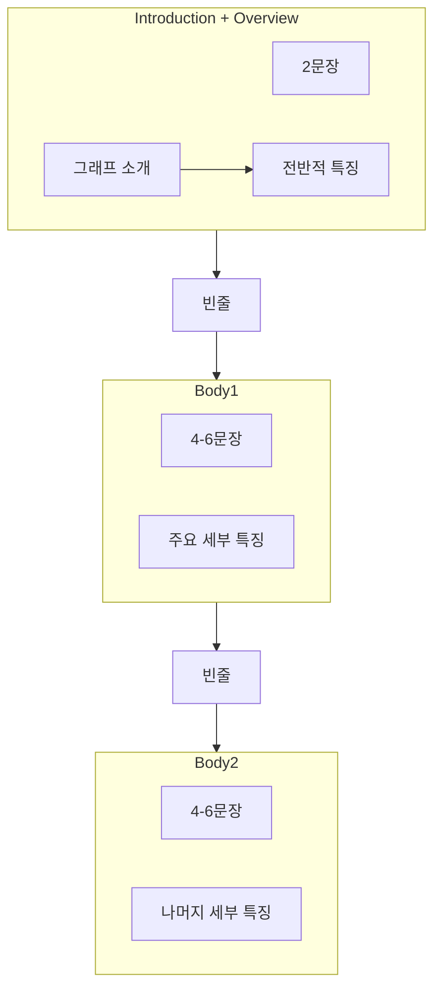

## Part2

### Types

- 찬성 또는 반대: Agree / Disagree
- 두 가지 견해: Both Views
- 장점과 단점: Advantage & Disadvantage
- 원인 / 문제점과 해결책: Cause / Problem & Solution
- 두 가지 과제: Two-part Question

### Format

### Agree | Disagree

- 서론
  - 배경: It is true that ~
  - 내 의견: Although S + V, S + V. Hence, this essay agrees / disagrees ~
- 본론
  - 반대주장1: To begin with,
  - 반대근거1: That is to say,
  - 주장1: However, ~. First,
  - 근거1: In other words,
  - 예시/부연설명1: A study has shown that ~, A survey has shown that ~, A statistic has shown that ~, For instance,
  - 주장2: Moreover,
  - 근거2: That is,
  - 예시/부연설명2: In addition, In contrast, On the other hand,
- 결론
  - 요약: In conclusion,

### Discuss

- 서론
  - 배경: There are a variety of opinions on whether S + V
  - 양쪽 의견: Some people argue that S + V. However, others argue that S + V
- 본론
  - 주장1: On the one hand,
  - 근거1: That is to say,
  - 예시/부연설명1: A study has shown that ~, A survey has shown that ~, A statistic has shown that ~, For instance,
  - 주장2-1: On the other hand,
  - 근거2-1: In other words,
  - 예시/부연설명2-1: A study has shown that ~, A survey has shown that ~, A statistic has shown that ~, For instance,
  - 주장2-2: Moreover,
  - 근거2-2: That is,
- 결론
  - 요약: In conclusion,

### Advantages | Disadvantages

- 서론
  - 배경: It is true that ~
  - 양쪽 의견: Some claim that ~ / However, others claim that ~
- 본론
  - 반대주장1: On the one hand, some argue that ~
  - 반대근거1: This is because ~
  - 예시/부연설명1: For instance, it has been reported that ~, In addition, In other ways,
  - 찬성주장2-1: On the other hand,
  - 찬성근거2-1: That is to say ~
  - 예시/부연설명2-1: As an example,
  - 찬성주장2-2: Moreover,
  - 찬성근거2-2: To be specific,
- 결론
  - 요약: In conclusion, there seem to be more drawbacks than benefits: it is ... that ...

## Part1

### Format

### 서론

- 소개
  - The graph illustrates
  - The graph provides information on
  - The table indicates various statistics on
  - The pie chars compare
- 개요
  - Overall, according to the figures provided S V
  - The overall trend we can see from the graph is that S V
  - Overall, it is evident from the chart that S V
  - The significant change reflected in the statistics is that S V
  - The pattern exhibited by the charts leads to a conclusion that S V

#### 서론 표현

- 증가
  - increase / increased / increased
  - rise / rose / risen
  - there was ~ an increase, a rise
  - show / see / experience ~ an upward treand
  - reach / hit ~ a peak of / at, the top of / at
- 감소
  - decrease / decreased / decreased
  - decline / declined / declined
  - fall / fell / fallen
  - drop / dropped / dropped
  - there was ~ a decrease, a decline, a fall, a drop
  - show / see / experience ~ a downward trend
  - reach / hit ~ a low of, the bottom at
- 안정
  - stabilise
  - remain / stay stable
  - fluctuate
- 형용사, 부사
  - 급격한, 급격히
    - rapid / rapidly
    - dramatic / dramatically
  - 상단한, 상당히
    - significant / significantly
    - considerable / considerably
  - 미미한, 미미하게
    - slight / slightly
    - minimal / minimally
  - 꾸준한, 꾸준히
    - steady / steadily
    - gradual / gradually

### 수치

| 퍼센트 | 표현                    |
| ------ | ----------------------- |
| 90%    | almost all              |
| 80%    | most of the + [UC][C]   |
| 80%    | vast majority of + [C]  |
| 80%    | four fiths              |
| 75%    | three quaters           |
| 70%    | a majority              |
| 70%    | slightly more than      |
| 50%    | a half                  |
| 50%    | one half                |
| 45%    | slightly less than half |
| 45%    | almost a half           |
| 45%    | nearly one half         |
| 30%    | a third                 |
| 25%    | a quarter               |
| 25%    | one fourth              |
| 25%    | one in four             |
| ﹤20%  | less than a fifth       |
| ﹤20%  | only a small minority   |
| ﹤20%  | only, mere, merely      |

### 수량 표현

- 수: The number of + [C]
- 양: The amount of + [UC]
- 비율1: The percentage of
- 비율2: The rate of
- 비율3: The ratio of
- 비율4: The proportion of
- 수치(모두 사용 가능): The figure **for**

### 표

- The most striking trend
- The most striking figure
- As clearly seen from the figures
- When it comes to
- Most of the ...
- Looking at the figures for ...

### 지도

#### 변화

- A made room for **B**
- A give way to **B**
- **A** take the place of B
- be changed to
- be substituted by
- be replaced with
- be converted into
- be displaced by
- be exchanged with
- be interchanged with
- be made into
- be swapped with
- be relocated to
- be moved to

## Grammer

- The number increased ... and the figure reached
  - === `, with the figure reaching`
  - 다른 목적어를 연결하는 경우
- The number increased ... and it reached
  - === `, reaching`
  - 같은 주어를 연결하는 경우
