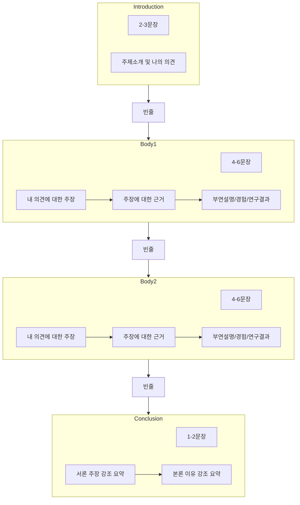

## Types

- 찬성 또는 반대: Agree / Disagree
- 두 가지 견해: Both Views
- 장점과 단점: Advantage & Disadvantage
- 원인 / 문제점과 해결책: Cause / Problem & Solution
- 두 가지 과제: Two-part Question

## Format

```mermaid
graph TD
    Introduction --> Line1[빈줄]
    Line1 --> Body1

    subgraph Introduction
        direction LR
        IntroLength[2-3문장]
        Intro[주제소개 및 나의 의견]
    end

    subgraph Body1
        direction LR
        Body1Length[4-6문장]
        Body1Child1[내 의견에 대한 주장]
        Body1Child2[주장에 대한 근거]
        Body1Child3[부연설명/경험/연구결과]

        Body1Child1 --> Body1Child2 --> Body1Child3
    end

    Body1 --> Line2[빈줄]
    Line2 --> Body2

    subgraph Body2
        direction LR
        Body2Length[4-6문장]
        Body2Child1[내 의견에 대한 주장]
        Body2Child2[주장에 대한 근거]
        Body2Child3[부연설명/경험/연구결과]

        Body2Child1 --> Body2Child2 --> Body2Child3
    end

    Body2 --> Line3[빈줄]
    Line3 --> Conclusion

    subgraph Conclusion
        direction LR
        ConcLength[1-2문장]
        Conc1[서론 주장 강조 요약]
        Conc2[본론 이유 강조 요약]

        Conc1-->Conc2
    end
```
