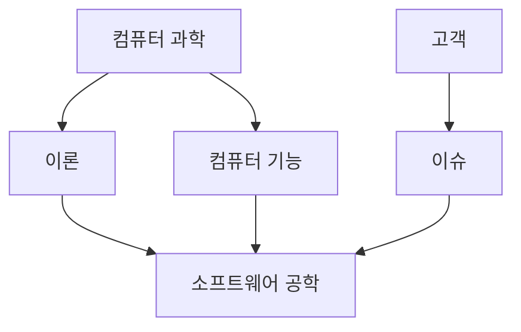
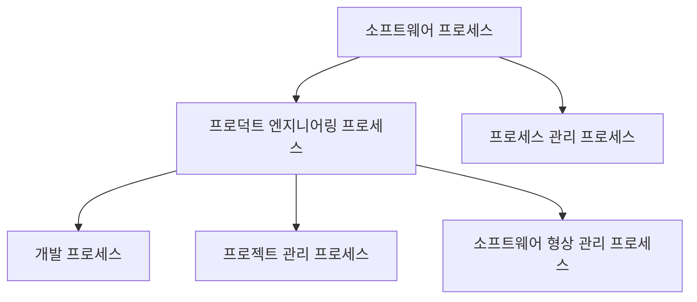
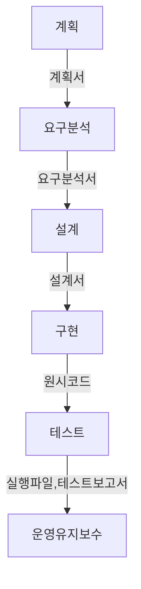
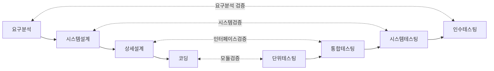
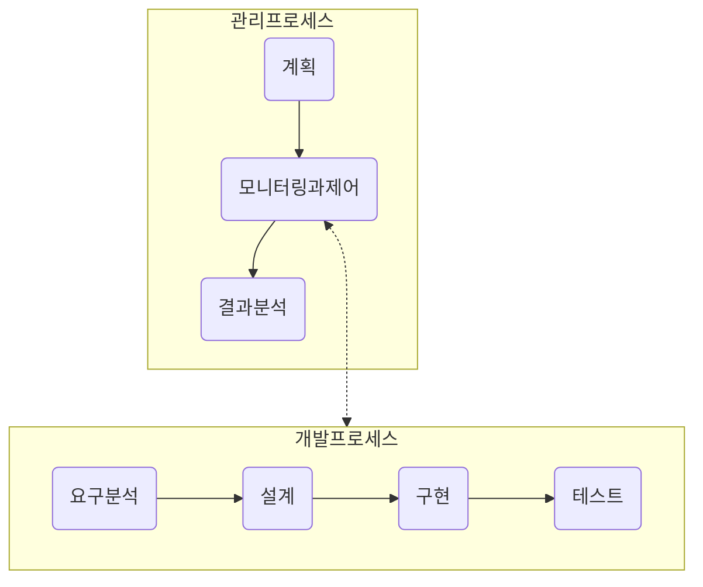
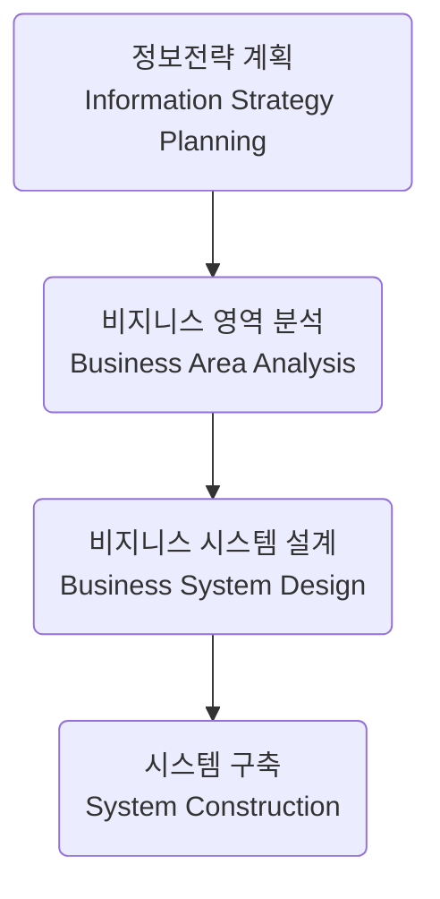

## 특징

- 복잡성: Complexity
- 순응성: Conformity
- 변경성: Changeability
- 비가시성: Invisibility

## 종류

- 주문형: 고객, 기업의 요구사항 만족
- 패키지형
- 임베디드형

## 위기

- 요구 증가, 복잡도 증가, 난이도 증가

## 목표

- 최소 비용
- 최고 효율

## 단계

- 요구 분석
- 설계
- 개발
- 테스트
- 유지보수

## 품질 보증

> ISO 25010, 기신사효유이호보

- 기능적절성: Functional suitability
- 신뢰성: Reliability
- 사용성: Usability
- 효율성: Performance efficiency
- 유지보수성: Usability
- 이식성: Portability
- 호환성: Compatibility
- 보안성: Maintainability

## 프로젝트 관리

- 계획
- 자원 관리
- 리스크 관리
- 프로젝트 수행 및 모니터링

## 연구 결과

- 방법: Method
- 도구: Tool
- 프로세스: Process
- 패러다임: Paradigm

## 연관 분야

> ISO 24773, [SWEBOK](https://www.computer.org/education/bodies-of-knowledge/software-engineering/v3)

| 구분                        | 내용                                                          | 비고                                        |
| --------------------------- | ------------------------------------------------------------- | ------------------------------------------- |
| 소프트웨어 공학 전문가 기량 | 소프트웨어 엔지니어링의 전문적 실천에 필요한 지식과 기술      | 윤리, 커뮤니케이션, 팀워크 등 포함          |
| 소프트웨어 공학 경제학      | 소프트웨어 공학 프로젝트의 비용과 가치를 평가하는 지식과 기술 | 경제적 분석 기법, ROI, TCO 포함             |
| 컴퓨팅 기반                 | 소프트웨어 엔지니어링의 기초가 되는 컴퓨팅 이론과 기술        | 데이터베이스, 네트워크, 운영체제 등 포함    |
| 수학적 기반                 | 소프트웨어 엔지니어링 문제 해결에 필요한 수학적 이론과 기법   | 통계, 확률, 이산 수학, 계산 이론 등 포함    |
| 공학적 기반                 | 일반 공학 원리를 소프트웨어 개발에 적용하는 지식과 기술       | 시스템 공학, 품질 관리, 성능 최적화 등 포함 |

## vs 컴퓨터 과학

## 소프트웨어 프로세스

### 좋은 프로세스

- 예측 가능성: Predictability
- 테스팅과 유지보수 용이성: Testability, Maintainability
- 변경 용이성: Changeability
- 결함 제거 용이성: Fault Tolerance

## 프로세스 모델

### 폭포수모델

### V모델

### 프로토타이핑 모델

### 나선형모델

- 프로토타입핑 반복

### 진화적 모델

- 점증적: incremental
- 반복적: iterative

### Unified Process

- 여러 사이클: iteration
- 도입(inception) -> 정련(elaboration) -> 구축(construction) -> 전환(transition) 반복

### 애자일 프로세스

- 2~6주간의 짧은 주기
- 익스트림 프로그래밍: XP, 사용자 스토리, 매일 빌드/통합, TDD, 페어프로그래밍
- 스크럼: 프로덕트 백로그 -> 스프린트 백로그 -> 2-4주기 개발, 스크럼미팅 -> 배포 가능 프로덕트 추가

## 지원 프로세스

> ISO 12207, SDLC

- 계약: 획득, 공급 프로세스
- 운영: 운영 프로세스
- 지원: 문서화, 형상관리, 품질 보증, 문제 해결 프로세스
- 관리: 관리, 개선 프로세스
- 엔지니어링: 개발, 유지보수 프로세스

## 관리 프로세스

- 계획
- 모니터링
- 제어, 분석

## 품질보증 프로세스

- 인스펙션 프로세스: 전문 인력, 고비용, 해결방법보다 이슈집중
- 프로세스 관리 프로세스: CMMI

## 형상 관리 프로세스

- 원시코드, 목적코드, 스크리븥, 관련 문서 전체 형상 관리

## 구조적 방법론

- 분할정복
- DFD: 배경도

## 정보공학 방법론

| 구분 | 내용                                                  | 비고                              |
| ---- | ----------------------------------------------------- | --------------------------------- |
| ISP  | 기업의 장기적 전략 계획 수립                          | 전략 계획서                       |
| BAA  | 비지니스 영역별 데이터와 프로세스 모델링, 연관성 분석 | 요구사항 명세서                   |
| BSD  | 데이터와 프로세스 설계                                | 논리 ERD, 프로세스 구조도, 흐름도 |
| SC   | 데이터 상세 설계, 코딩                                | 물리 ERD, UI, 코드                |

- 기업중심
- 전략적 시스템 계획중심
- 데이터 중심
- 분할 정복
- 공학적 접근
- 사용자의 적극 참여

## 객체지향 방법론

- 실세계를 객체로보고 객체사이 인터랙션을 모델링하는 방법
- 대규모 시스템을 클래스로 모듈화하고 캡슐화
- OMT: Object Modeling Technique, Booch, Usecase -> UML: Unified Modeling Language, UP: Unified Process

## 프로젝트 계획

- 목표설정
- 프로젝트 범위 설정
- WBS작성
- 작업별 소요시간 및 노력 예측
- 작업 의존관계 정의
- 자원 할당
- 마일스톤 설정
- 일정 개발

### CPM 네트워크

- Critical Path Method
- Critical Path: 가장 오래 걸리는 경로

## 비용 예측 기법

- 전문가 판단
- PERT: Program Evaluation and Review Technique, 낙관적, 보통, 비관적
- 알고리즘식 방법: 코코모, FB

### COCOMO

- Constructive Cost Model
- LOC등 단계에 따라 값 예측하고 노력 추정

| 구분          | 1단계              | 2단계                   | 3단계                                                    |
| ------------- | ------------------ | ----------------------- | -------------------------------------------------------- |
| 단계          | 프로토타이핑       | 초기설계                | 설계이후                                                 |
| 크기          | application points | FP, 언어 종류           | FP와 LOC                                                 |
| 요구변경비용  | 모델에 포함        | 변경 비율 반영          | 변경 비율 반영                                           |
| 프로덕트 비용 | 없음               | 복잡도, 재사용요구도    | 신뢰도, DB규모, 문서화요구정도, 재사용 요구도, 복잡도    |
| 플랫폼 비용   | 없음               | 플랫폼 난이도           | 실생시간, 기억공간 제약                                  |
| 인력 비용     | 없음               | 개인능력, 경험          | 분석능력, 응용경험, 프로그래머 능력/경험, 언어/도구 경험 |
| 프로젝트 비용 | 없음               | 개발기간, 개발환경 요구 | SW도구 사용, 개발 기간, 여러 사이트 개발 요구            |

## 기능점수

- Function Point
- 입력(트랜잭션), 출력(화면 및 출력양식), 질의, 파일, 응용 인터페이스

## 소프트웨어 대가 산정 가이드

- 외부 입력: External Input, 내부 파일의 내용에 영향을 주는 사용자데이터 또는 입력을 트랜잭션 단위로 카운터 (입력, 수정, 삭제)
- 외부 출력: External Output, 소프트웨어 외부로 표출되는 사용자 데이터 또는 제어 출력을 트랜젝션 단위로 카운트 (계싼, 통계 그래프 등)
- 내부 논리 파일: Internal Logical File, 소프트웨어에 의해 생성, 사용, 관리되는 파일을 포함하여 시스템 내 존재하는 사용자 데이터 및 제어 정보의 그룹 카운트
- 외부 인터페이스 파일: External Interface File, 소프트웨어 시스템 사이에 전다로디거나 공유된 파일 카운트
- 외부 조회: External Query, 중간 출력을 생성하는 외부 조회를 카운트

## 프로젝트 모니터링

- 어닝 밸류 분석: Earning Value Analysis, 비용과 일정 통합 모니터링
- BAC: 프로젝트 예산
- AC: 실제 비용
- PV: 계획된 비용
- EV: 어닝 밸류
- PV - EV: 일정 차이
- AC - EV: 비용 차이

## 리스크 관리

- 6M: Machine, Method, Materials, Measurement, Man, Mother nature, 기계, 방법, 재료, 측정, 사람, 환경
- 8P: Price, Promotion, People, Process, Place/Plant, Policy, Procedure, Product, 가격, 광고, 인력, 프로세스, 장소, 정책, 절차, 제품
- SW프로젝트(Boehm): 인력부족, 비현실적 일정 및 예산, 잘못된 기능과 특징 개발, 잘못된 인터페이스 개발, 과포장, 계속적 요구변경, 외부 노출 컴포넌트 빈약, 실시건 성능 빈약, 녹슨 컴퓨터 분야 기술

## 요구

- 시스템에 대한 고객의 요청을 확정한 것

### 기능 요구

> 기능, 데이터, 입출력, 사용자

- 시스템과 외부 요소들 간의 인터렉션
- 입력 검증
- 정확한 작업 순서
- 비정상적 상태에 대한 응답 및 복구
- 매개변수 유효성
- 입출력 관계

### 비기능 요구

> 성능, 품질, 안전, 보안, 사용성

- 시스템 구축에 대한 성능, 보안, 품질, 안전 등에 대한 요구 사항
- 외부 인터페이스
- 메모리 제약
- 성능 요구
- 사용자 특성과 가정
- 설치 환경의 적합성

## 요구 추출

- Requirement Elicitation
- 요구에 대한 정보 출처 파악 > 요구에 대한 정보 취합 > 요구와 제한 사항 정리

### 요구 정보 출처

- 고객
- 도메인 전문가
- 이해당사자
- 사용자
- 역공학
- 기존 문서
- 인터뷰
- 설문
- 브레인스토밍
- 프로토타이핑

## 요구 품질

- 원자성: atomic, 요구사항이 복합 목적이 아니라 단일 목적인지
- 완전성: complete, 요구 사항 안에 정의된 것이 정보의 모든 것을 포함하는 것인지
- 비모호성, 통일성: unambiguous, consistent, 명확하지 않거나 같은 내용을 다르게 언급하지 않는 것
- 추적성: traceable, 요구 사항을 쉽게 추적할 수 있도록 고유번호
- 우선순위화: prioritize: 요구 사항의 중요도를 파악하는 성질
- 테스트 가능성: testable, 요구 사항이 검증 가능하도록 기술되어있는 특성

## 유스케이스

- 찾아낸 각 액터에 대해 시스템과 관련된 작업은 무엇인가?
- 시스템에서 발생하는 특정 사건에 대해 액터에게 알려야 하는가?
- 액터가 갑작스런 외부 변화에 대해 시스템에 알려야 할 것인가?
- 시스템이 비지니스에 정확한 동작을 제공하나?
- 찾아낸 유스케이스로 모든 기능을 수행할 수 있는가?
- 어떤 유스케이스가 시스템을 지원하고 유지보수하나?
- 시스템에서 어떤 정보를 수정하거나 만들어야하나?

## 요구분석 명세서

- SRS: Software Requirement Specification
- 소개
  - 목적
  - 제품 범위
  - 정의, 동의어, 약어
  - 참조문서
  - 개요
- 일반적인 기술사항
  - 제품의 개관
  - 제품의 기능
  - 사용자 특성
  - 제약사항
  - 가정 및 의존성
- 상세한 요구사항
  - 외부 인터페이스
  - 기능요구
  - 성능요구
  - 논리 데이터베이스 요구
  - 설계 제약사항
  - 소프트웨어 시스템 속성
  - 상세요구 사향의 구성
- 부록
- 색인

## 요구 검증

- 이해용이성: comprehensibility, 요구 명세서를 읽을 떄 요구의 의미를 잘 이해할 수 있는가?
- 중복: redundancy, 필요없이 중복된 부분이 없는가?
- 완전성: completeness, 빠진 요구가 없는지, 요구 기술시 빠진 정보가 없는가?
- 일관성: consistency, 요구사항이 모순되지 않는가?
- 모호성: ambiguity, 요구분석 내용이 모호함 없이 모든 참여자들에 의해 명확하게 이해될 수 있는가?
- 검증가능성: verifiable, 요구분석 명세서에 기술된 내용이 사용자의 요구를 만족하는가? 개발된 시스템이 요구사항 분석 내용과 일치하는지 검증할 수 있는가?
- 추적가능성: traceable, 시스템 요구사항과 시스템 설계문서 및 구현과 매핑되어 추적할 수 있는가?

## 요구 모델링

- 도메인지식을 체계화하는 과정
- 도메인지식: 업무 프로세스, 기능, 역할, 업무 규칙
- 기능적 모델링: 유스케이스 다이어그램, 액티비티 다이어그램
- 정적 모델링: 클래스 다이어그램, ERD
- 동적 모델링: 시퀀스 다이어그램, 협동 다이어그램
- 제어 모델링: 액티비티 다이어그램

## UML

- 구조다이어그램: 클래스, 객체 ,컴포넌트, 배치, 패키지, 컴포지트 구조
- 동작 다이어그램: 유스케이스, 액티비티, 상태
- 인터랙션 다이어그램: 시퀀스, 커뮤니케이션, 인터랙션 오버뷰, 타이밍

## 참조

- [소프트웨어 공학의 모든 것](https://m.yes24.com/Goods/Detail/87531385)
- [ISO 12207: SDLC](https://wildart.github.io/MISG5020/standards/IEEE-12207-2008.pdf)
- [ISO 24773: SWEBOK](https://ieeecs-media.computer.org/media/education/swebok/swebok-v3.pdf)
- [ISO 25010: 소프트웨어 품질특성](https://quality.arc42.org/articles/iso-25010-update-2023)
