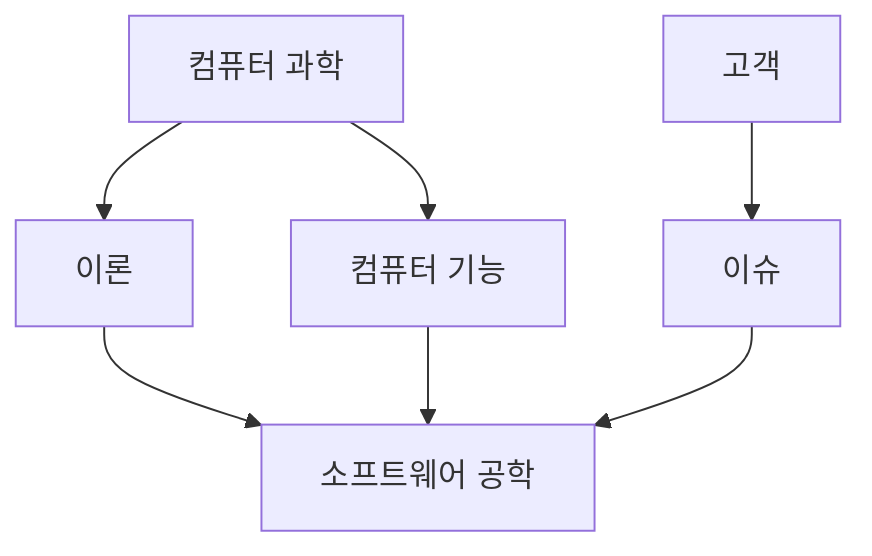

## 특징

- 복잡성: Complexity
- 순응성: Conformity
- 변경성: Changeability
- 비가시성: Invisibility

## 종류

- 주문형: 고객, 기업의 요구사항 만족
- 패키지형
- 임베디드형

## 위기

- 요구 증가, 복잡도 증가, 난이도 증가

## 목표

- 최소 비용
- 최고 효율

## 단계

- 요구 분석
- 설계
- 개발
- 테스트
- 유지보수

## 품질 보증

> ISO 25010, 기신사효유이호보

- 기능적절성: Functional suitability
- 신뢰성: Reliability
- 사용성: Usability
- 효율성: Performance efficiency
- 유지보수성: Usability
- 이식성: Portability
- 호환성: Compatibility
- 보안성: Maintainability

## 프로젝트 관리

- 계획
- 자원 관리
- 리스크 관리
- 프로젝트 수행 및 모니터링

## 연구 결과

- 방법: Method
- 도구: Tool
- 프로세스: Process
- 패러다임: Paradigm

## 연관 분야

> ISO 24773, [SWEBOK](https://www.computer.org/education/bodies-of-knowledge/software-engineering/v3)

| 구분                        | 내용                                                          | 비고                                        |
| --------------------------- | ------------------------------------------------------------- | ------------------------------------------- |
| 소프트웨어 공학 전문가 기량 | 소프트웨어 엔지니어링의 전문적 실천에 필요한 지식과 기술      | 윤리, 커뮤니케이션, 팀워크 등 포함          |
| 소프트웨어 공학 경제학      | 소프트웨어 공학 프로젝트의 비용과 가치를 평가하는 지식과 기술 | 경제적 분석 기법, ROI, TCO 포함             |
| 컴퓨팅 기반                 | 소프트웨어 엔지니어링의 기초가 되는 컴퓨팅 이론과 기술        | 데이터베이스, 네트워크, 운영체제 등 포함    |
| 수학적 기반                 | 소프트웨어 엔지니어링 문제 해결에 필요한 수학적 이론과 기법   | 통계, 확률, 이산 수학, 계산 이론 등 포함    |
| 공학적 기반                 | 일반 공학 원리를 소프트웨어 개발에 적용하는 지식과 기술       | 시스템 공학, 품질 관리, 성능 최적화 등 포함 |

## vs 컴퓨터 과학

## 참조

- [소프트웨어 공학의 모든 것](https://m.yes24.com/Goods/Detail/87531385)
- [ISO 24773: SWEBOK](https://ieeecs-media.computer.org/media/education/swebok/swebok-v3.pdf)
- [ISO 25010: 소프트웨어 품질특성](https://quality.arc42.org/articles/iso-25010-update-2023)
