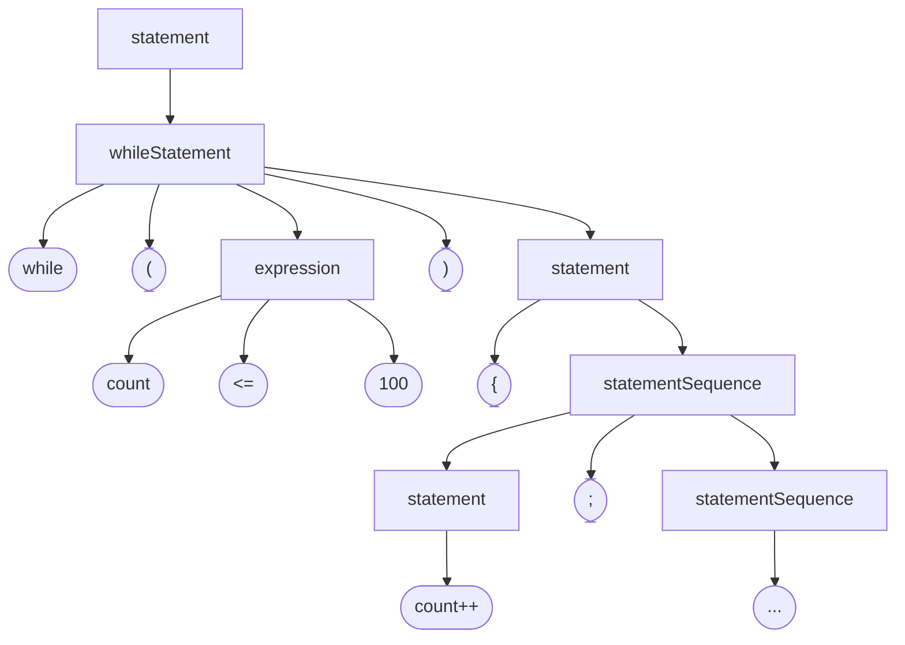

## 개념도

```c
while (count <= 100) {
  count++;
  // ...
}
```



- 재귀적 하향 구문 분석: recursive descent parsing
- LL(0) 문법: 어떤 비단말 노드에서 유도되는 규칙이 여러 개인 경우에, 그 중 어떤 규칙을 적용할지는 항상 첫 번째 토큰만 보고 결정 가능한 속성

## 구문 예시

| 요소 | 예시 |
| --- | --- |
| keyword | 'class' \| 'function' \| 'if' \| 'else' \| 'while' \| 'for' \| 'return' \| 'int' \| 'string' \| 'boolean' \| 'true' \| 'false' \| 'null'... |
| symbol | '(', ')' \| '{', '}' \| '[', ']' \| ';' \| ',' \| '.' \| '=' \| '==' \| '!=' \| '<' \| '>' \| '<=' \| '>=' \| '~' |
| integerConstant | 10진수 숫자 |
| stringConstant | 따옴표와 줄바꿈 문자를 제외한 유니코드 문자열 |
| identifier | 숫자로 시작하지 않는, 영문자, 숫자, 밑줄(_)로 구성된 문자열 |
| comment | `//`로 시작하는 한 줄 주석, `/* ... */`로 감싸진 여러 줄 주석 |
| whitespace | 공백, 탭, 줄바꿈 문자 등 |

## 프로그램 구조

| 요소 | 예시 |
| --- | --- |
| class | 'class' className '{' classVarDec\* subroutineDec\* '}' |
| classVarDec | ('static' \| 'field') type varName (',' varName)\* ';' |
| type | 'int' \| 'boolean' \| 'char' \| className |
| subroutineDec | ('constructor' \| 'function' \| 'method') ('void' \| type) subroutineName '(' parameterList ')' '{' varDec\* subroutineBody '}' |
| parameterList | (type varName (',' type varName)*)? |
| subroutineBody | '{' varDec* statements '}' |
| varDec | 'var' type varName (',' varName)* ';' |
| className | identifier |
| subroutineName | identifier |
| varName | identifier |

## 명령문

| 요소 | 예시 |
| --- | --- |
| statements | statement\* |
| statement: | letStatement \| ifStatement \| whileStatement \| doStatement \| returnStatement |
| letStatement | 'let' varName ('[' expression ']')? '=' expression ';' |
| ifStatement | 'if' '(' expression ')' '{' statements '}' ('else' '{' statements '}')? |
| whileStatement | 'while' '(' expression ')' '{' statements '}' |
| doStatement | 'do' subroutineCall ';' |
| returnStatement | 'return' (expression)? ';' |

## 표현식

| 요소 | 예시 |
| --- | --- |
| expression | term (op term)* |
| term | integerConstant \| stringConstant \| keywordConstant \| varName \| varName '[' expression']' \| subroutineCall \| '(' expression ')' \| unaryOp term |
| subroutineCall | subroutineName '(' expressionList ')' \| (className \| varName) '.' subroutineName '(' expressionList ')' |
| expressionList | (expression (',' expression)*)? |
| op | '+' \| '-' \| '*' \| '/' \| '&' \| '\|' \| '<' \| '>' \| '=' |
| unaryOp | '-' \| '~' |
| keywordConstant | 'true' \| 'false' \| 'null' \| 'this' |
