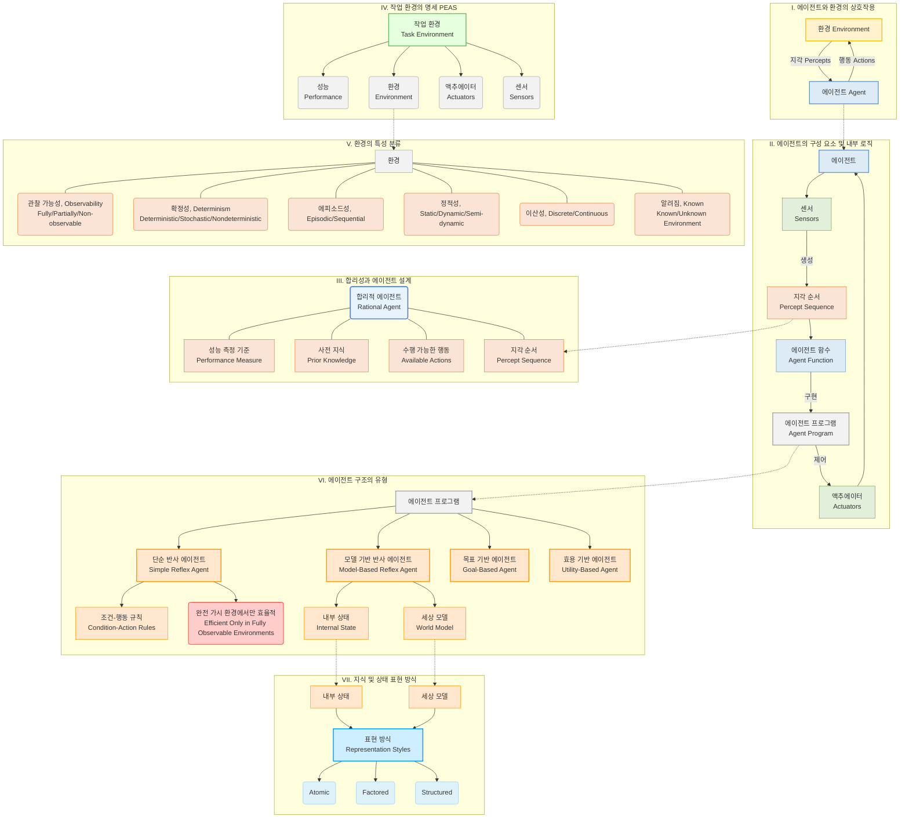

## 에이전트와 환경의 상호작용

```mermaid
graph TD
    subgraph "I. 에이전트와 환경의 상호작용"
        E[환경 Environment] -- 지각 Percepts --> A[에이전트 Agent]
        A -- 행동 Actions --> E
    end

    subgraph "II. 에이전트의 구성 요소 및 내부 로직"
        A2[에이전트] --> S[센서<br/>Sensors]
        S -- 생성 --> PS[지각 순서<br/>Percept Sequence]
        PS --> AF[에이전트 함수<br/>Agent Function]
        AF -- 구현 --> AP[에이전트 프로그램<br/>Agent Program]
        AP -- 제어 --> Act[액추에이터<br/>Actuators]
        Act --> A2
    end

    subgraph "III. 합리성과 에이전트 설계"
        R(합리적 에이전트<br/>Rational Agent) --- PM[성능 측정 기준<br/>Performance Measure]
        R --- PK[사전 지식<br/>Prior Knowledge]
        R --- AA[수행 가능한 행동<br/>Available Actions]
        R --- PS2[지각 순서<br/>Percept Sequence]
    end

    subgraph "IV. 작업 환경의 명세 PEAS"
        TE[작업 환경<br/>Task Environment] --> P(성능<br/>Performance)
        TE --> EN(환경<br/>Environment)
        TE --> ACT(액추에이터<br/>Actuators)
        TE --> SEN(센서<br/>Sensors)
    end

    subgraph "V. 환경의 특성 분류"
        EN2[환경] --- OB(관찰 가능성, Observability<br/>Fully/Partially/Non-observable)
        EN2 --- DET(확정성, Determinism<br/>Deterministic/Stochastic/Nondeterministic)
        EN2 --- EP(에피소드성, Episodic/Sequential)
        EN2 --- STAT(정적성, Static/Dynamic/Semi-dynamic)
        EN2 --- DISC(이산성, Discrete/Continuous)
        EN2 --- KN(알려짐, Known<br/>Known/Unknown Environment)
    end

    subgraph "VI. 에이전트 구조의 유형"
        AP2[에이전트 프로그램] --> SR[단순 반사 에이전트<br/>Simple Reflex Agent]
        SR --> CR[조건-행동 규칙<br/>Condition-Action Rules]
        SR --> FOE(완전 가시 환경에서만 효율적<br/>Efficient Only in Fully Observable Environments)

        AP2 --> MBR[모델 기반 반사 에이전트<br/>Model-Based Reflex Agent]
        MBR --> IS[내부 상태<br/>Internal State]
        MBR --> MW[세상 모델<br/>World Model]

        AP2 --> GB[목표 기반 에이전트<br/>Goal-Based Agent]
        AP2 --> UB[효용 기반 에이전트<br/>Utility-Based Agent]
    end

    subgraph "VII. 지식 및 상태 표현 방식"
        IS2[내부 상태] --> REP[표현 방식<br/>Representation Styles]
        MW2[세상 모델] --> REP
        REP --> AT(Atomic)
        REP --> FA(Factored)
        REP --> ST(Structured)
    end

    %% 연결선
    A -.-> A2
    PS -.-> PS2
    EN -.-> EN2
    AP -.-> AP2
    IS -.-> IS2
    MW -.-> MW2

    %% 스타일 적용
    style A fill:#DDEBF7,stroke:#6699CC,stroke-width:2px
    style A2 fill:#DDEBF7,stroke:#6699CC,stroke-width:2px
    style E fill:#FFF2CC,stroke:#FFC000,stroke-width:2px
    style S fill:#E2EFDA,stroke:#70AD47,stroke-width:1px
    style Act fill:#E2EFDA,stroke:#70AD47,stroke-width:1px
    style PS fill:#FBE4D5,stroke:#ED7D31,stroke-width:1px
    style PS2 fill:#FBE4D5,stroke:#ED7D31,stroke-width:1px
    style AF fill:#DDEBF7,stroke:#6699CC,stroke-width:1px
    style AP fill:#F2F2F2,stroke:#A6A6A6,stroke-width:2px
    style AP2 fill:#F2F2F2,stroke:#A6A6A6,stroke-width:2px

    style R fill:#E6F3FF,stroke:#3366FF,stroke-width:2px
    style PM fill:#FBE4D5,stroke:#ED7D31,stroke-width:1px
    style PK fill:#FBE4D5,stroke:#ED7D31,stroke-width:1px
    style AA fill:#FBE4D5,stroke:#ED7D31,stroke-width:1px
    
    style TE fill:#E6FFDD,stroke:#66BB66,stroke-width:2px
    style P fill:#F2F2F2,stroke:#A6A6A6,stroke-width:1px
    style EN fill:#F2F2F2,stroke:#A6A6A6,stroke-width:1px
    style EN2 fill:#F2F2F2,stroke:#A6A6A6,stroke-width:1px
    style ACT fill:#F2F2F2,stroke:#A6A6A6,stroke-width:1px
    style SEN fill:#F2F2F2,stroke:#A6A6A6,stroke-width:1px

    style OB fill:#FBE4D5,stroke:#ED7D31,stroke-width:1px
    style DET fill:#FBE4D5,stroke:#ED7D31,stroke-width:1px
    style EP fill:#FBE4D5,stroke:#ED7D31,stroke-width:1px
    style STAT fill:#FBE4D5,stroke:#ED7D31,stroke-width:1px
    style DISC fill:#FBE4D5,stroke:#ED7D31,stroke-width:1px
    style KN fill:#FBE4D5,stroke:#ED7D31,stroke-width:1px

    style SR fill:#FFE6CC,stroke:#FF9900,stroke-width:2px
    style MBR fill:#FFE6CC,stroke:#FF9900,stroke-width:2px
    style GB fill:#FFE6CC,stroke:#FF9900,stroke-width:2px
    style UB fill:#FFE6CC,stroke:#FF9900,stroke-width:2px
    style CR fill:#FFE6CC,stroke:#FF9900,stroke-width:1px
    style IS fill:#FFE6CC,stroke:#FF9900,stroke-width:1px
    style IS2 fill:#FFE6CC,stroke:#FF9900,stroke-width:1px
    style MW fill:#FFE6CC,stroke:#FF9900,stroke-width:1px
    style MW2 fill:#FFE6CC,stroke:#FF9900,stroke-width:1px
    style FOE fill:#FFCCCC,stroke:#FF0000,stroke-width:1px

    style REP fill:#CCEEFF,stroke:#0099FF,stroke-width:2px
    style AT fill:#E0F2F9,stroke:#99CCEE,stroke-width:1px
    style FA fill:#E0F2F9,stroke:#99CCEE,stroke-width:1px
    style ST fill:#E0F2F9,stroke:#99CCEE,stroke-width:1px
```

- Static environment: crossword puzzle
- Semi-dynamic environment: Chess
- Dynamic environment: self-driving car
