## Software Engineering

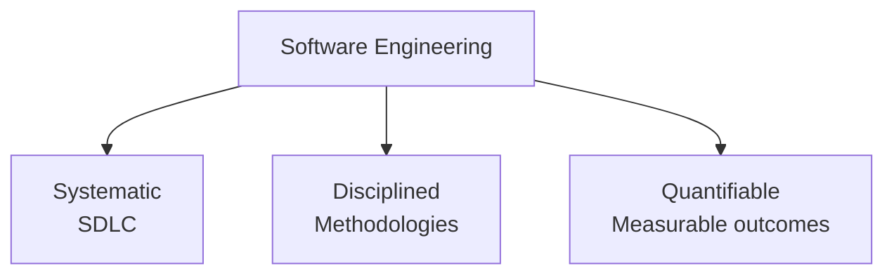

### SDLC

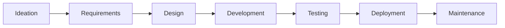

### SW Development Methodologies

#### Waterfall

- Pros
  - Simple & easy: each phase has specific deliverables
  - Clear & set milestones
  - Fixed requirements
  - Works well for small projects with specific set of requirements
  - Determine the schedule early
  - Clear structure
- Cons
  - Working sw produced only at the end
  - High uncertainty of sw quality and functionality
  - Delayed testing, delays sw bugs discovery
  - After completion, no formal way to change the requirements
  - Fix working model, difficult to implement for complex projects

#### Agile

- Iterative cyclical progression of the SDLC
  - Repetitive structure based on iterations (sprints)
  - 2 ~ 4 weeks, SDLC repeats
  - Each release has 3 or more iterations
  - Working prototype is produced at the end of each iteration
  - Prototype is for QA and used as input for next iteration
  - Multiple releases
- Pros
  - Innovation through team collaboration
  - Time to market
  - Continuous testing
  - Risk reduction, finding sw bugs early
  - Customer feedback loop
  - Flexibility to change requirements
  - Automates most of the SDLC === DevOps approach
- Cons
  - Lack of long-term planning
  - Cost estimation is difficult
  - Limited documentation
  - No finite end
  - Difficult to see the end result due due to cyclic nature of agile

### SW Development Paradigms

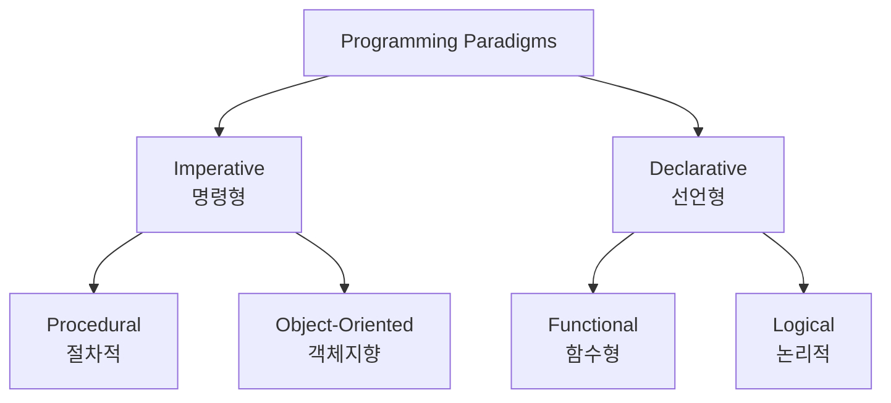

#### Procedural Programming

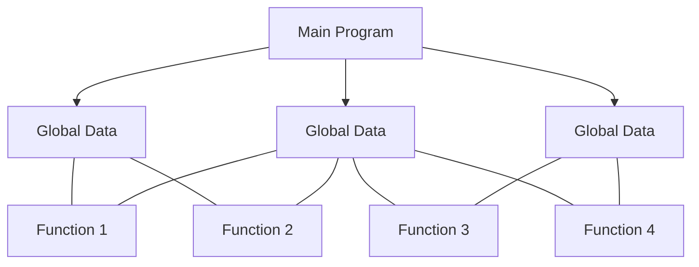

- Top-down decomposition: Each sub-problem is typically implemented as a function or procedure
- Root represents the main program
- Leaves denote individual procedures or functions

#### Object-Oriented Programming

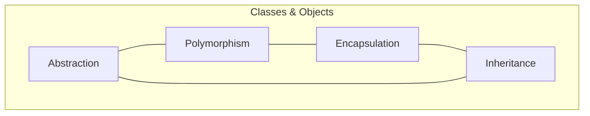

- Abstraction: The process of hiding unnecessary details
- Encapsulation: Restricts the direct access to components of an object, while using methods to access and modify the data
- Inheritance: The process of creating sub-class
- Polymorphism: Allows for the creation, use, and storage of multiple objects that inherit from the same parent class

## Requirements Analysis

> Instructions provided by the stakeholder describe a target system

- system properties, attributes and how a system should behave
- Decomposed into Functional requirements / Non-functional requirements

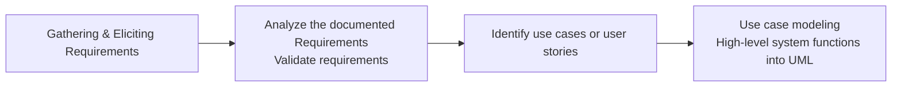

### Requirements Validation

- Compliance
- Correctness
- Completeness
- Consistency
- Usability

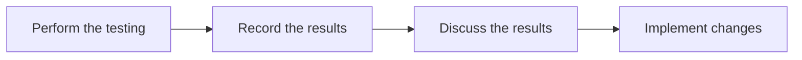

| Criteria | Description | Satisfactory Score (0-5) | Recommendations |
| --- | --- | --- | --- |
| Compliance | Degree to which the requirements meet with industry standards and regulations | 0 | - |
| Correctness | Degree to which the requirements is correct in terms of spelling, accuracy, grammatically. | 0 | - |
| Completeness | Degree to which the functional requirements match the intended software behavior | 0 | - |
| Consistency | Degree to which the requirements can be mapped to use cases | 0 | - |
| Expandability | Degree to which the requirements can be modified and improved to meet the project objectives | 0 | - |

### Use Case

> an actor wants the system to, and captures functional requirements

- always started by an actor, always written from the perspective of the actor
- a series of actions that a user must initiate to carry out some useful work and to achieve a goal
  - preconditions -> main flow -> alternative flow -> postconditions
- reflects all the possible events in the system
- complete set of use cases describes all the possible ways the system will behave and defines all the requirements

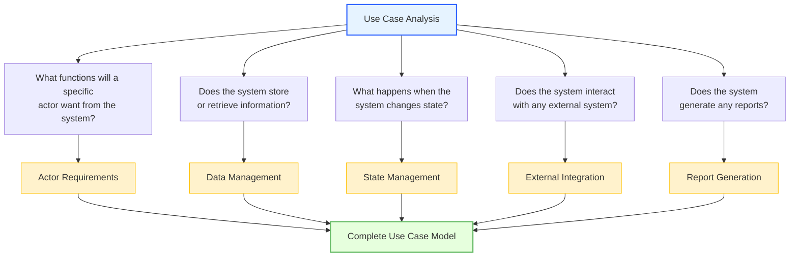

### Use Case Backlog Template

| ID | Use Case Title | Actor(s) | Goal/Description | Preconditions | Postconditions | Priority | Status | Notes |
| --- | --- | --- | --- | --- | --- | --- | --- | --- |
| UC-001 | User Login | User | Allow users to log in to the system | User must have an account | User is logged in | High | Open | - |
| UC-002 | View Profile | User | Allow users to view their profile information | User must be logged in | User profile is displayed | Medium | Open | - |

### User Stories

- Planned to be delivered in a single iteration, some user stories may span multiple iterations
- Single requirement expressed from developer's perspective
- Describes a functional or non-functional requirement

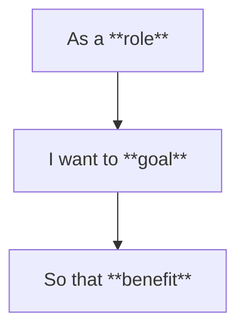

- **As a** student
- **I want to** submit assignments online
- **so that** I can receive feedback from my instructor.

| ID | User Story | Acceptance Criteria | Priority | Status | Story Points | Notes |
| --- | --- | --- | --- | --- | --- | --- |
| US-001 | As a student, I want to submit assignments online so that I can receive feedback from my instructor. | - User can upload assignment files - User receives confirmation of submission - Instructor can view submitted assignments | High | Open | 5 | - |
| US-002 | As a student, I want to view my grades online so that I can track my academic progress. | - User can view grades for each assignment - User can see overall course grade - Grades are updated in real-time | Medium | Open | 3 | - |

## UML

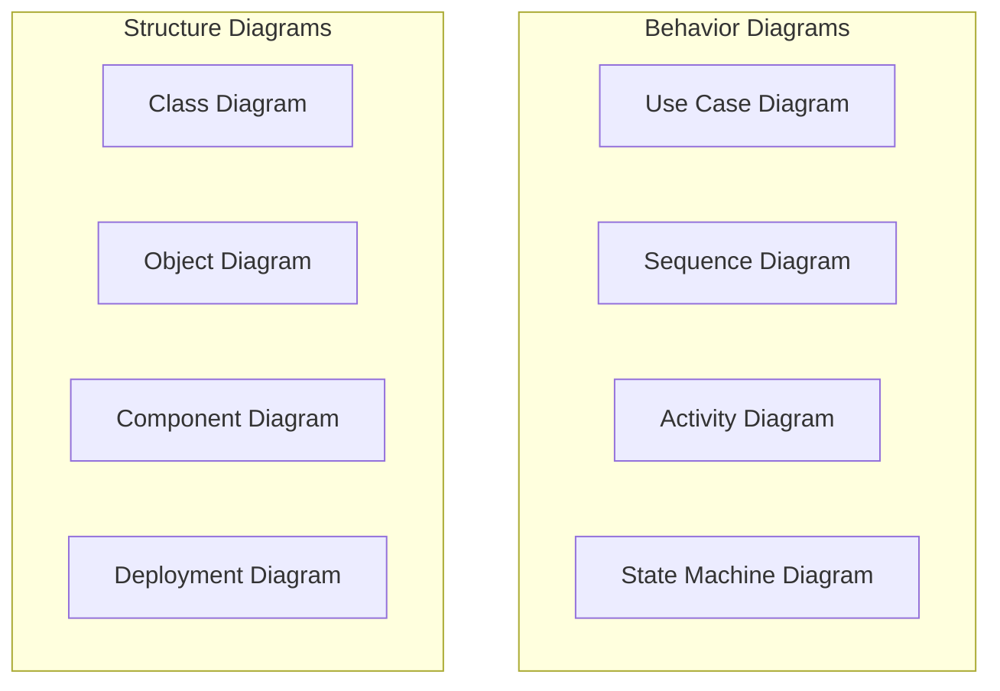

- Actors: Entity that performs actions in the system
- Use Cases: Oval representation inside the system boundary of a functional requirement
- System Boundary: Square representation of the system scope
- Relationships
  - Association: Between an actor and a use case
  - Include: Between use cases, The included use case is always necessary for the completion of the activating use case.
  - Extend: Between use cases, The extension use case is activated occasionally at specific extension point.
  - Generalization/Inheritance: Between use cases, they achieve the same goal but in different ways.

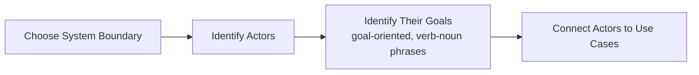

### Use Case Model

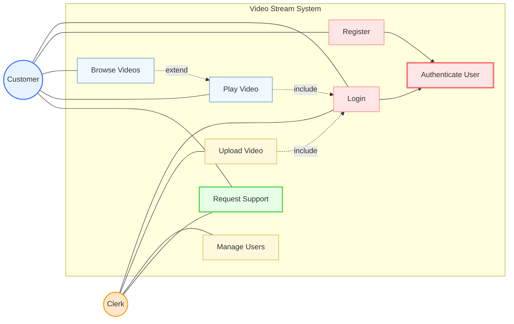

- System boundary: Defines the scope of the system
- Generalization: Describes the shared parts in a parent use case, then specializes in child use cases
  - Inherit features from their parent use case
  - Add new features
  - Change inherited features
- Short, simple use cases on the core functionality may be completed within one iteration.
- Keep use cases short and simple
- Focus on what, not the how
- Avoid functional decomposition

### UML Use Case Model

- CRUD
  - Create a record
  - Retrieve the record given a key
  - Update the record with new data and store it
  - Delete a record
- Each is a separate goal, possibly carried by a different person with a different security level.
