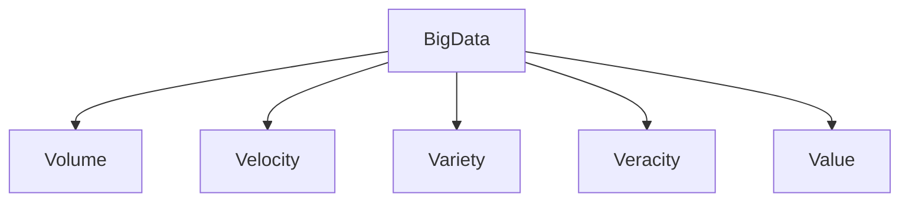
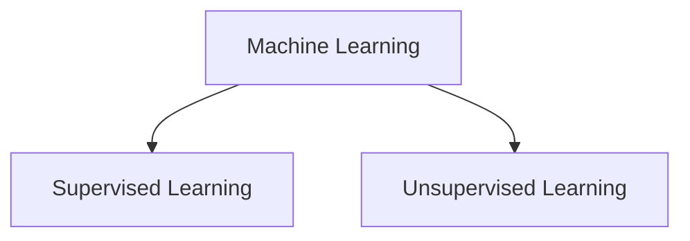
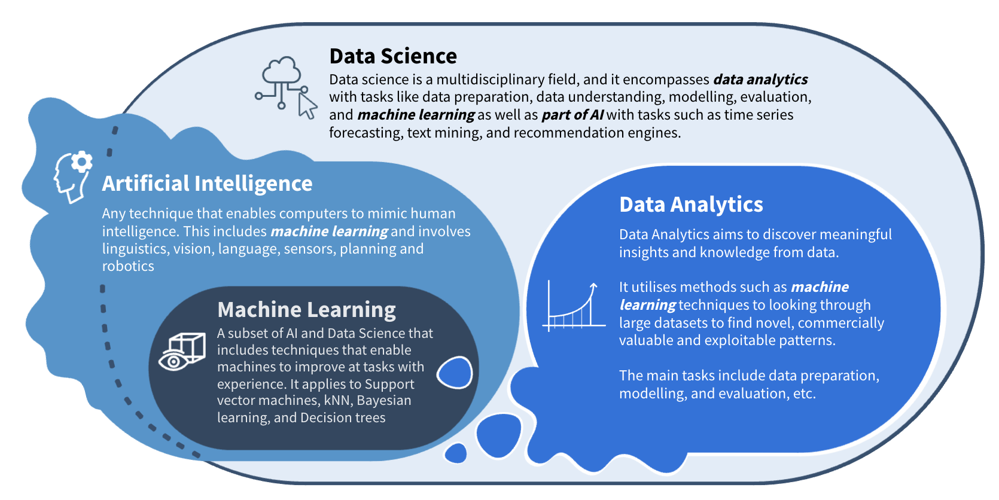
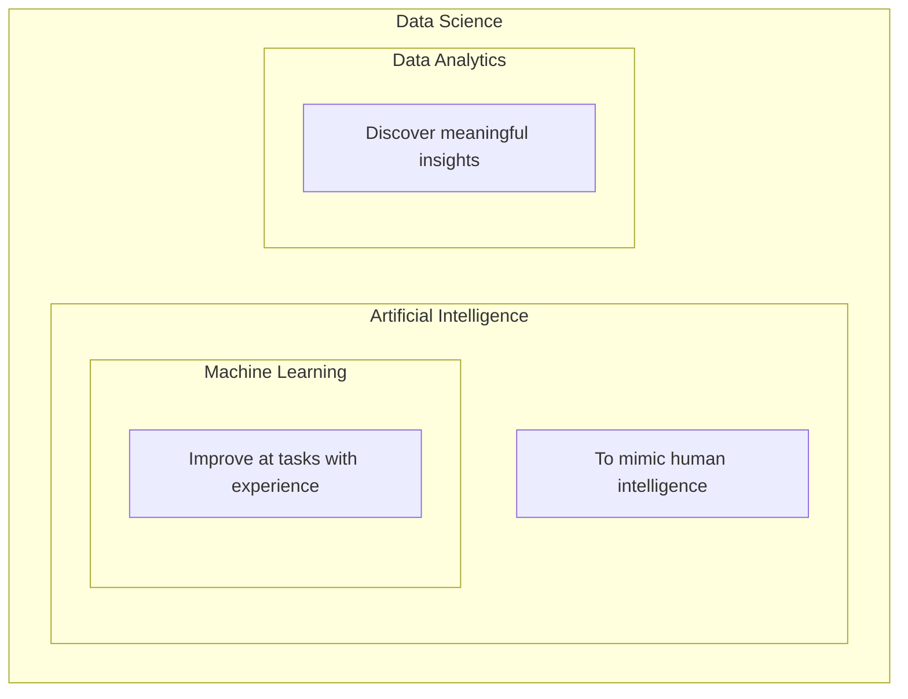
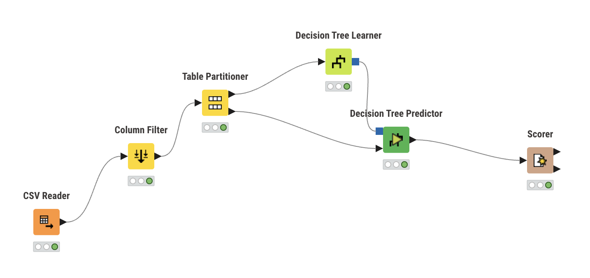

## Big Data

- Volume: describes the data size, up to PB
- Velocity: the speed of data generation and illustrates how fast the datasets are being produced.
- Variety: the complexity of datasets, with datasets including both structured and unstructured data.
- Veracity: The truthfulness or reliability of the data. large + reliable in order to achieve value in the analysis of it.
- Value: The worth in information that can be achieved by the processing and analysis of large datasets. It can be measured by an assessment of the other qualities of big data.

## ML

- Supervised learning: uses the old data to learn the relationship between the inputs and outputs, which will be able to predict the outcomes.
  - Decision Trees, Neural Networks, SVM, Random Forests.
- Unsupervised learning: try to make sense of the data without labelled responses by representing it in another form.
  - Clustering, association rule mining, Neural Networks.

## AI

- reasoning
- knowledge representation
- planning
- learning
- natural language processing
- perception
- pattern recognition

> Data Science (Second Edition), Chapter 1 - Introduction Pages 1-18, by Vijay Kotu, Bala Deshpande, 2019,

## KNIME

