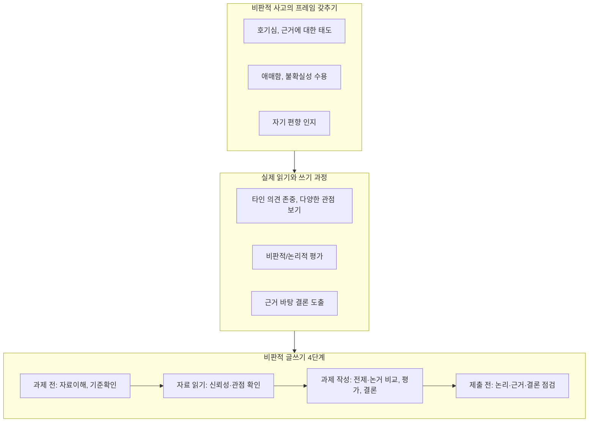

# 비판적 사고, 읽기, 쓰기란?

비판적 읽기/쓰기(critical reading & writing)는 단순한 요약(Descriptive writing)과 다르게

- **증거와 논거를 평가**하고,
- **여러 관점을 비교**하며,
- **논리적이고 균형 잡힌 자기 주장을 펼치는 것**

## 비판적 글쓰기 개념

- **Descriptive writing:**
  - 단순히 연구 배경, 기존 연구 요약, 사건의 흐름이나 인물의 이력 등을 나열
- **Critical writing:**
  - 논쟁에 참여, 남의 주장과 증거 평가, 자신의 분석 추가, 다양한 관점 반영, 논리와 근거에 따라 결론 도출

## 중요성

- 대학에서는 읽은 것을 그냥 받아들이지 말고, **다양한 시각에서 분석/비판/종합**할 수 있어야 진짜 학문적 목소리(academic voice)를 가질 수 있음
- 여러 관점을 다루고 평가할수록 내 논거가 더 설득력 있어짐
- 궁극적으로 **현실 세계에 적용 가능한 지식**을 만드는 게 목표

## 비판적 읽기·쓰기의 두 단계

- **1단계: 비판적 사고의 프레임 갖추기**
  - 정보에 대한 호기심
  - 합리적 근거에 따르려는 태도
  - 애매함, 불확실성 받아들이기
  - 자기 편향, 선입견 인지

- **2단계: 실제로 읽고, 쓰는 과정에서 실천**
  - 타인의 아이디어 존중, 열린 마음
  - 편견 없이 다양한 관점 보기
  - 비판적·논리적 평가, 근거를 바탕으로 결론 내리기

## 비판적 글쓰기의 실제 단계

1. **과제 시작 전**
    - 이미 읽은 자료를 정확히 이해
    - 과제 질문, 기준, 학술적 글쓰기 규범 확인

2. **자료 읽기 중**
    - 정보의 신뢰성, 균형성, 출처 확인
    - 여러 시각/관점의 증거를 분석
    - 편향·스폰서십·참여자 수 등 확인 (CRAAP test: Currency, Reliability, Authority, Purpose)

3. **과제 작성 중**
    - 전제와 일반화 찾기, 그 한계 분석
    - 논거 비교·대조, 근거 강약 평가
    - 논리적으로 결론 도출, 너무 많은 인용은 삼가고 반드시 해석·연결

4. **제출 전**
    - 논리적 흐름, 근거, 결론 점검
    - 평가 기준에 부합하는지 확인

## 비판적 글쓰기의 언어적 특징

- 주장/반박 표현동사: asserts, doubts, contends 등
- 비교·대조 전환어: in addition, moreover, however, in contrast
- 판단, 중요성, 의미 부여하는 어휘 사용

## 결론

- 너무 많은 인용은 오히려 내 목소리를 약하게 만듦. 반드시 해석·비교·평가까지 덧붙이기
- 주장/반박/비교·대조 어휘를 적극 활용
- 내 의견이 합리적 근거에 기반하고 있는지 늘 점검
- 비판적 글쓰기는 연습과 피드백을 통해 발전
