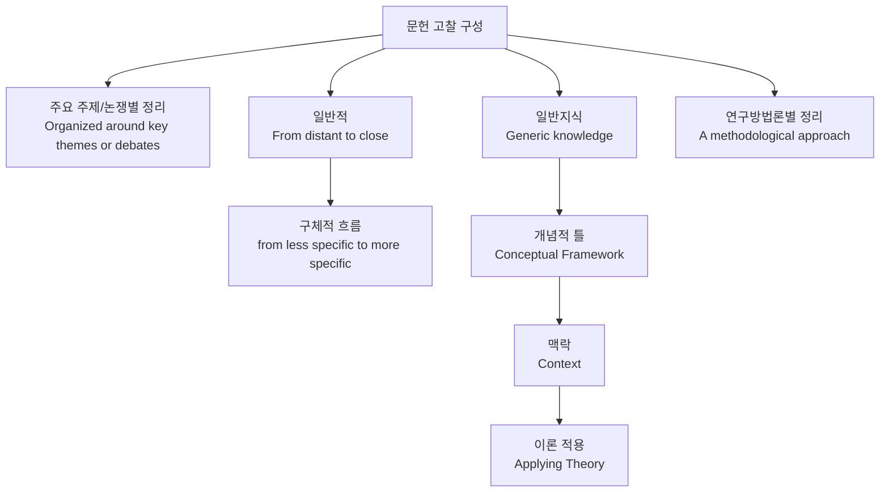

# 문헌 고찰

## 개념

> An evaluation of previous research on your topic.

- 문헌 고찰(Literature Review)은 **내가 연구하는 주제와 관련된 기존 연구들을 평가하는 글**이다.

## 목적

> "provides background information needed to understand your study  
> assures your readers that you are familiar with the important research that has been carried out in your area  
> establishes your study as one link in a chain of research that is developing and enlarging knowledge in your field"  
> (Weissberg & Buker 1990, p.41)

- 내 연구의 배경을 설명하고, 독자에게 내가 주요 연구를 충분히 파악하고 있다는 점, 그리고 내 연구가 기존 연구의 연장선상에 있음을 보여준다.

## 포함해야 할 내용

> Minimum: well-established research in the field; most recent relevant research.

- 문헌 고찰에는 반드시 **이 분야에서 잘 알려진 주요 연구**와 **가장 최근의 관련 연구**를 포함해야 한다.

## 구성

- 필요에 따라 조합할 수 있다.

## 레퍼런스

> The REFERENCE system you follow will be that of one of the leading journals in your field: check with your lecturer or supervisor.

- 분야에서 영향력 있는 저널의 인용 방식을 따라야 하며, 확실하지 않으면 담당 교수나 슈퍼바이저에게 확인

## 인용

- 정보에 초점을 둘지, 저자에 초점을 둘지에 따라 다르다.
- on the information: use name/number in parentheses.
  - It was demonstrated [2]
  - It was demonstrated (Williams, 2003)
- on the author: use acknowledging phrases
  - Williams (2003) demonstrated that...
  - Williams [2] demonstrated that...

## 길이

> Around 15-30% of the whole proposal

- 별도 기준이 없다면 15% - 30%
- 논문은 60%가 본인의 작업이어야 한다. 문헌 고찰이 논문의 40%를 초과하면 안 된다.

## 문헌 고찰에서 해야 할 일

- 분야 내에서 **중요하고 관련 있는 연구들을 파악하는 능력**을 보여준다.
- 해당 연구들을 **체계적으로 정리, 평가**할 수 있음을 보여준다.
- **연구의 빈틈(gap)** 을 파악하고, 내 연구가 그 부분을 채우려 한다는 점을 제시한다.
