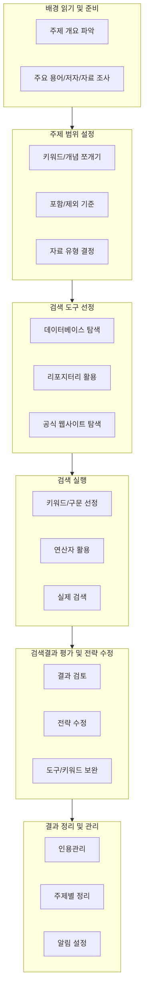

# 문헌 검색

> 문헌 검색(literature search)은 연구 주제와 관련된 선행 연구, 주요 이론, 트렌드, 핵심 저자를 체계적으로 찾는 과정

## 배경 읽기 및 준비

> 주제의 전반적인 개요를 파악하고, 주요 용어, 저자, 핵심 논문, 자료 조사

- Google, Google Scholar 검색
- ProQuest, Scopus, Web of Science 같은 데이터베이스 탐색
- 주제별 백과사전, 사전, 입문서 활용

## 주제 범위 설정

> 검색 방향 구체화하고, 범위를 너무 넓거나 좁지 않게 조정

- 주제를 세부 개념(키워드)으로 쪼개기
- 관련 개념, 동의어, 반의어 탐색
- 포함/제외 기준(연도, 지역, 이론, 인구 등) 정하기
- 필요한 자료 유형(논문, 통계, 1차자료 등) 확정

## 검색 도구 선정

> 플랫폼 선택 및 자료 검색

- 도서관 데이터베이스(Finder, Study Guides 등)
- 정부·연구기관·대학 리포지터리
- 신뢰할 수 있는 공식 웹사이트 등

## 검색 실행 (Search)

> 실제 검색을 통해 자료 찾기

- 핵심 키워드, 구문(“sustainable development” 등) 선정
- truncation/wildcard(sustainab* -> sustainable, sustainability 등)
- Boolean 연산자(AND, OR, NOT) 조합
- 검색 전략을 세우고 직접 실행

## 검색결과 평가 및 전략 수정

> 검색결과의 적합성 평가, 전략 수정

- 제목, 초록을 훑어보고 실제로 유용한 자료인지 확인
- 검색어, 키워드, 범위 등을 조정
- 필요하면 다른 데이터베이스, 도구로 확장

## 6. 결과 정리 및 관리

> 자료와 검색 전략 관리, 재사용

- EndNote, Mendeley, RefWorks 등 인용·참고문헌 관리 툴 활용
- 검색결과를 주제별로 분류 및 정리
- 알림(Google Scholar alerts, 데이터베이스 알림 등) 설정하여 최신 연구 follow-up
