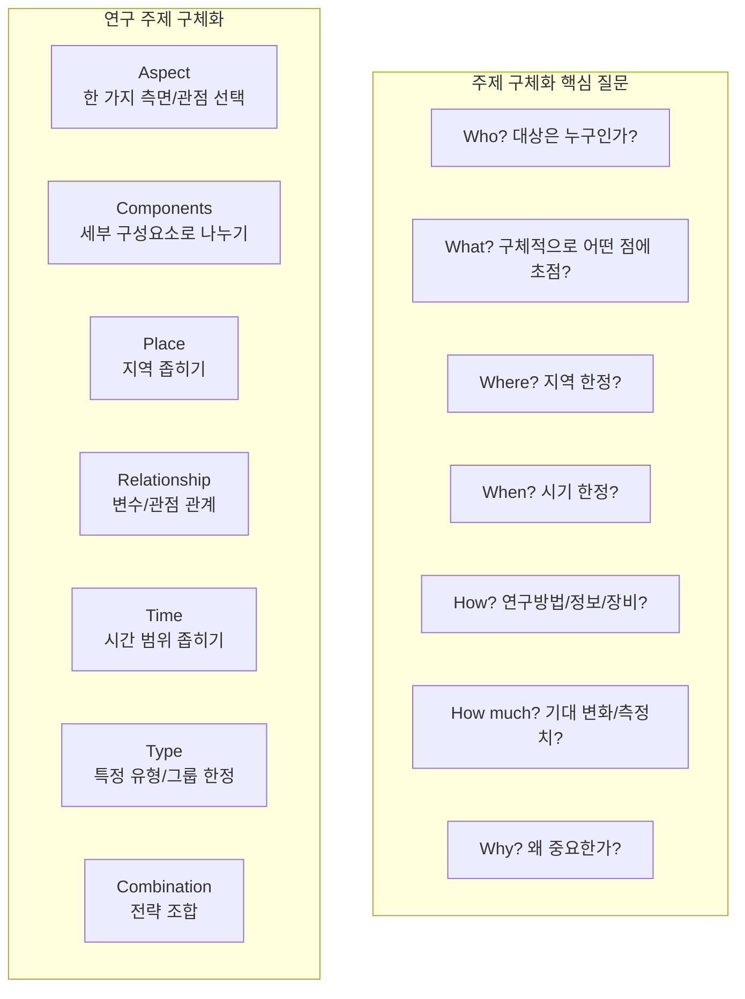

- 연구 주제를 너무 넓게 잡으면 관련 자료도 방대해지고, 분석·논의도 모호해짐
- 명확하고 구체적인 연구 주제/질문을 만드는 것이 효과적

## 구체화 전략

> 주제를 구체화하면 연구 질문도 자연스럽게 따라옴

- **Aspect**: 연구 문제를 바라보는 하나의 '측면'이나 '관점'만 선택
  - *예시: 전체 현상 중 한 가지 특성, 한 가지 변수 등*
- **Components**: 주제를 더 작은 구성 요소로 분해
  - *예시: 대상을 세부 단위별로 나누어 분석*
- **Place**: 분석 지역을 좁힐수록 주제도 구체화됨
  - *예시: 남태평양 지역 → 호주*
- **Relationship**: 변수 간 관계나 관점(원인/결과, 비교/대조 등) 초점
  - *예시: 남녀 비교, 현대/과거 비교, 문제/해결 구조 등*
- **Time**: 분석하는 시간 범위를 한정
  - *예시: 최근 5년, 특정 역사적 시기 등*
- **Type**: 대상을 구체적 유형, 그룹, 사례 등으로 한정
  - *예시: 교통 → 학교 주변 SUV만, 학생 운전자만 등*
- **Combination**: 위 전략들을 2개 이상 조합
  - *예시: 특정 지역 + 특정 시간 + 특정 유형*

## 주제 구체화를 위한 핵심 질문

- **Who?**: 연구의 대상을 누구로 제한할 것인가?
- **What?**: 넓은 주제에서 구체적으로 어떤 점이 흥미로운가?
- **Where?**: 지리적 범위를 어디로 한정할 것인가?
- **When?**: 어느 시기에 집중할 것인가?
- **How?**: 연구 방법, 필요한 정보/장비는 무엇인가?
- **How much?**: 기대하는 변화나 측정 가능한 차이는 무엇인가?
- **Why?**: 이 주제가 왜 중요/의미 있는가? 왜 이 주제를 연구하는가?
