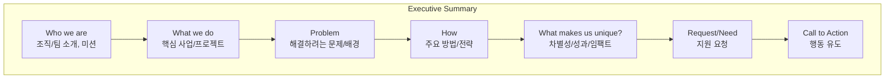

# Executive Summary & Project Proposal

> 프로젝트 제안서·연구비 지원서·그랜트(Grant) 작성에서 **Executive Summary**는 가장 중요함

## Executive Summary 개념

- 전체 제안서의 “영화 예고편” 역할
- 2~4단락, 200~400단어 이내
- 의사결정자·후원자·심사자에게 “왜 이 제안을 지원해야 하는가”를 **짧고 강렬하게 설득**
- **정보 + 영감(설득)** 이 모두 포함되어야 함 (무엇을/왜/어떻게/우리만의 강점/무엇을 요청하는가)

## Executive Summary 필수 요소

1. **Who you are**  
   - 조직/팀의 정체성, 미션, 전문성  
2. **What you do**  
   - 핵심 사업·프로젝트(이번 제안의 골자)  
3. **Problem**  
   - 해결하려는 핵심 이슈, 사회적/과학적 필요성  
4. **How**  
   - 어떻게 해결할 것인가? (방법, 서비스, 전략)  
5. **What makes you unique**  
   - 차별성, 기존과의 차이, 실적·수치·임팩트  
6. **Request/Need**  
   - 필요한 자원, 예산, 협력 등  
7. **Call to Action**  
   - 심사자/후원자에게 “지원/협업”을 유도하는 마무리

## 작성예시

### 1단락

> 2~3문장으로 자연스럽게 포함

- 미션/정체성(Who),
- 핵심 내용/프로그램(What),
- 요청사항(Request)
- 차별성(Why us?)

### 2단락

- 제안/프로젝트가 어떤 문제, 대상, 지역에 초점을 두는지
- 성장·성과·임팩트 등 구체 데이터
- 현재 지원이 왜 필요한지, 구체적으로 설명

### 3단락

- 특별함, 실적, 추천사·통계·객관적 데이터
- 심사자·후원자를 행동하게 하는 콜투액션(Call to action)
  - (“지금 함께 해달라”, “이 지원이 필요하다” 등)

## 작성 팁

- 너무 추상적이거나 정보만 나열하지 않기
- 임팩트 있는 수치·결과·추천사 적극 활용
- 심사자(후원자)의 관점에서 “왜 지금, 왜 우리”를 답할 것
- 본문(프로포절) 전체 내용과 일치, 연결되어야 함
- 최종 작성 후 동료/멘토에게 피드백 꼭 받기

## 평가기준

| 항목 | 배점 | 세부 평가 기준 |
|---|---|---|
| **Cover Page and Table of Contents** | 2 | 지정된 모든 정보(양식, 목차 등)를 정확히 포함하고 있음 |
| **Executive Summary** | 6 | 제안서를 바탕으로, 간결하면서도 완전한 요약과 합리적인 권고(제안)가 제시되어 있음 |
| **Introduction** | 5 | 연구 문제, 연구의 맥락, 목표, 작성자 관점이 명확히 진술됨. 연구의 중요성과 관련성이 명확히 전달됨. 보고서의 주요 결과가 간단히 언급됨. 보고서의 전체 구성에 대한 간략한 안내가 제공됨. |
| **Research Aims and Objectives** | 5 | 이해하기 쉽고 실현 가능한 연구 목표와 목적이 제시됨. 연구 문제의 명확성과 연구 프로젝트로서의 실행 가능성이 잘 드러남. |
| **Background** | 6 | 해당 주제에 대한 기존 지식을 논리적이고 비판적으로 종합함. 배경 설명이 연구 문제와 직접적으로 연관되어 있음. |
| **Research Significance and Innovation** | 6 | 연구의 중요성이 명확히 진술됨. 연구 결과로 이득을 얻는 대상이 구체적으로 제시됨. 연구의 혁신성/새로움이 분명히 기술됨. 배경(문헌고찰)과 연계해 왜 이 문제가 연구되어야 하는지 설득력 있게 논증함. |
| **Research Methods** | 6 | 선택한 연구 방법이 명확히 설명되고, 적절한 참고 문헌(근거)로 뒷받침됨. 선택한 연구 방법과 연구 문제 및 목표 간의 연결이 명확히 드러남. |
| **Conclusion** | 5 | 프로젝트 제안서 전체의 논리적 요약을 제공함. 연구 문제의 중요성과, 제안된 연구 접근법의 효과성을 설득력 있게 결론지음. |
| **Reference List** | 4 | Harvard 스타일에 맞춘 완벽한 참고문헌 리스트가 작성됨. |
