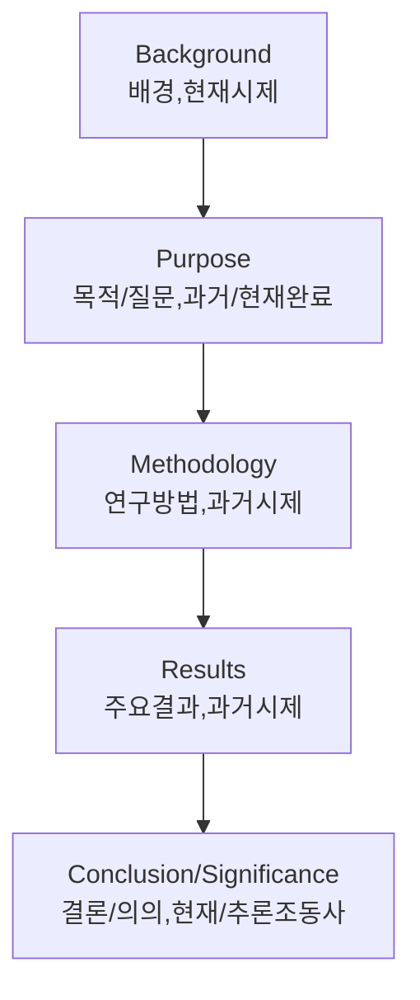

# 연구논문 초록(Abstract) 개념

- 초록(Abstract)은 논문·리포트·학위논문에서 **가장 먼저 읽히는 핵심 요약문**
- 많은 독자가 초록만 보고 본문을 읽을지 결정하기 때문에, 짧지만 완성도 높고 정보 밀도가 높은 글을 써야함

## 초록 역할

- **독립적(stand-alone)** 텍스트로, 100~300단어(학술지/컨퍼런스는 120~150단어 내외)
- 논문 전체의 **스냅샷**
- 초록만 읽고도 "무엇을/왜/어떻게/무엇을 발견/왜 중요한지"를 알 수 있어야 함

## 초록의 핵심 포함 요소(순서 & 질문)

1. **Background**: 배경 정보, 연구가 다루는 일반적 문제(현재 시제)
2. **Purpose**: 연구 목적, 주요 질문(과거/현재완료 시제)
3. **Methodology**: 연구 방법, 데이터(과거 시제)
4. **Results**: 핵심 결과(과거 시제)
5. **Conclusion/Significance**: 결론 또는 시사점, 추천사항(현재 시제 또는 추론/조심스러운 조동사)

### 핵심 질문

- What did you do? (무엇을 했나?)
- Why did you do it? (왜 했나?)
- How did you do it? (어떻게 했나?)
- What did you find? (무엇을 발견했나?)
- Why does it matter? (왜 중요한가?)

## 초록의 언어적 특징 & 문장 구성

- **정보 밀도 높게, 간결하고 구체적으로**
- **읽기 쉬운 구성** (시작-중간-끝이 자연스럽게 이어짐)
- **자기완결성**: 약어/고유어 정의, 인용·참조 없이 이해 가능
- **키워드 풍부하게 포함**
- **객관적/사실 중심 서술, 평가는 최소**
- **동사 중심, 명사·형용사·부사 축소**
- **중요한 정보부터 문장 맨 앞에**
- **문법/시제 규칙**
  - 배경: 현재시제
  - 목적/주요활동: 과거 or 현재완료
  - 방법/결과: 과거
  - 결론/의의: 현재시제, 추론/조동사(should, may 등)

## 간결한 초록 작성 팁

- 모든 숫자는 문장 첫머리가 아니면 숫자(1, 2, 3...)로 표기
- 가능한 한 **능동태**(active voice) 사용, 1인칭은 지양
- 동사로 핵심을 전달, 명사구·수식어 축소
- "at this point in time" → "now" / "on a yearly basis" → "yearly" 등으로 짧게
- 의미 없는 수식어·중복 표현 삭제
- 불필요한 평가/일반화 문장 피하기
- 외부 인용문/참조(특히 서지)는 거의 사용하지 않음
- 관례/규정은 소속 분야 또는 학회/저널 예시 참고

## 예시: 초록의 전형적 구조와 시제

| 요소(순서)   | 시제             | 예시 |
|-------------|------------------|--------------------------|
| Background  | 현재시제         | Type A behavior is...   |
| Purpose     | 과거/현재완료    | In this study we evaluated... |
| Method      | 과거시제         | Children performed a 5-trial task. |
| Results     | 과거시제         | Results showed...         |
| Conclusion  | 현재/조동사      | The results suggest that...|

## 체크리스트

- [ ] Background, Purpose, Method, Results, Conclusion/Significance 모두 포함?
- [ ] 불필요한 단어나 중복 수식어가 없는가?
- [ ] 키워드는 충분히 들어있는가?
- [ ] 초록만 읽어도 논문의 흐름(시작-중간-끝)이 자연스러운가?
- [ ] 독립적으로 이해될 수 있는가? (외부 인용, 약어 미정의 등 문제 없음?)
- [ ] 평가/감정적 표현 없이, 사실 중심으로 요약되어 있는가?
- [ ] 학회/저널의 초록 분량, 작성 규칙을 따랐는가?

## 초록 예시(틀)

- **배경:** 주제, 문제 설명
- **목적:** 연구 목적, 질문
- **방법:** 데이터, 실험, 조사법 등
- **결과:** 주요 결과
- **의의:** 결론, 실무적/학문적 영향, 한계/미래 연구

## 결론

- 내 분야의 여러 논문 초록을 직접 읽고, 정보 배치/언어/길이를 파악할 것
- 초록은 마지막에 급하게 쓰지 말고, 본문보다 더 신경 써서 여러 번 다듬을 것
- 반드시 연구의 "새로움, 의의, 차별성"을 한두 문장으로 명확히 드러낼 것
