## Classes & Objects

### Class

- A template that defines the attributes and methods of an object, which can be used to create many objects.
- Name of the class is noun.
- Functions are defined in the class, containing the function data.
- Many objects can be created from the same class.
- A class can be inherited by many sub-classes
- A child class can have one or more parent classes. (super-classes)
- Encapsulated data
- Behaviors of a class are exposed while the implementation is hidden.

### Object

- An instance of a class, created the class template during runtime.
- Object-oriented software is composed of many objects
- a composite data type identified by its attributes (fields) and behaviors (functions), which are defined in the class.
- object-oriented design analysis: to identify the classes and relationships between the classes to model how the system would work.

## Object-Oriented Paradigm Principles

### Abstraction

- hides the internal implementation of functions and expose to other class the behavior of those functions.
- Data abstraction: hide the variables stored the data and only expose the values.
- Function abstraction: hide the function code and only export the function behavior.

### Encapsulation

- a fundamental principle of OOP, increases data and code security, enhances performance by reducing object interactions.
- minimize the number of interactions from outside.

### Inheritance

- allows classes to have sub-classes.
- a parent class can have many children.
- a child class can have more than one parent.
- a child class inherits their parent class and can also override them.

### Polymorphism

- more of the same type of object can be used interchangeably.
- object of different types to be treated as objects of a common parent.
- multiple object types with the same parent can implement the same function in different ways.
- multiple object types with the same parent can use the same attributes with different values.

## Object-Oriented Design

- The process of designing a software using oop.
- Identify the classes
  -> Identify the classes' attributes and behaviors
  -> Identify the how classes interact with each other and create a visual class model

### Identify classes

- Classes are derived from use cases and actors described in the requirement analysis process.
- Classes should be identified exactly as needed.
- Reduce coupling and enable extensibility.
- Identifying a class always requires to identify the fields and methods.
- A class can use the methods of another class.
  -> one class (the client) uses or depends on another class (the supplier).

## UML Class diagram

- UML visual representation of the object-oriented software system.
- Describes the attributes and operations of classes, relationships, and any constraints.
- Used as a plan to construct executable code and define the way in which objects may interact.

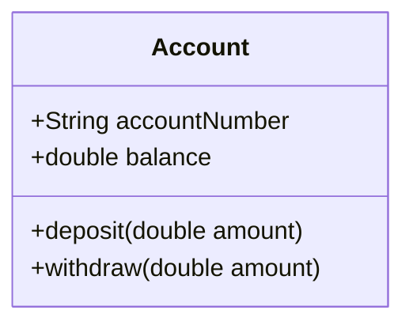

### Associations

- a relationship between classes indicating a meaningful connection.
- Labelled by
  - Association name
  - Role name
  - Multiplicity
  - Navigability

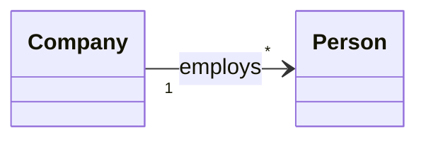

#### Multiplicity

- how many instances of type A can be associated with on instance of type B.

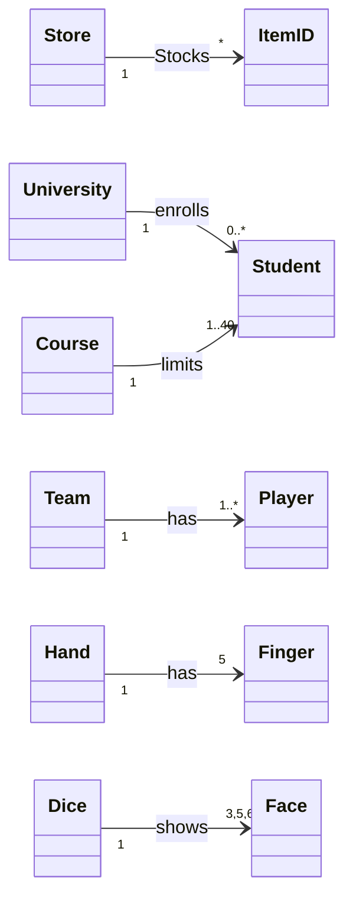

#### Recursive or reflexive association

- a class can have an association with itself.

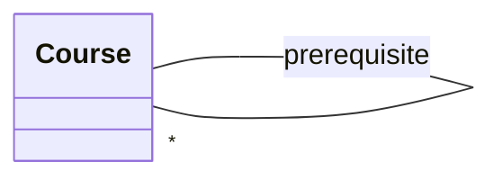

#### Attributes

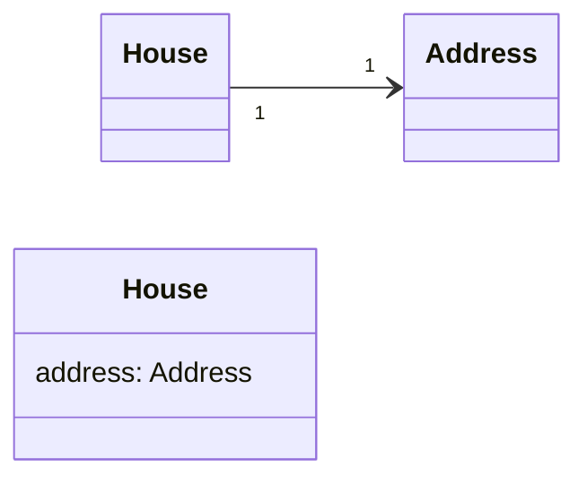

- m:m association can be divided into two 1:m associations.

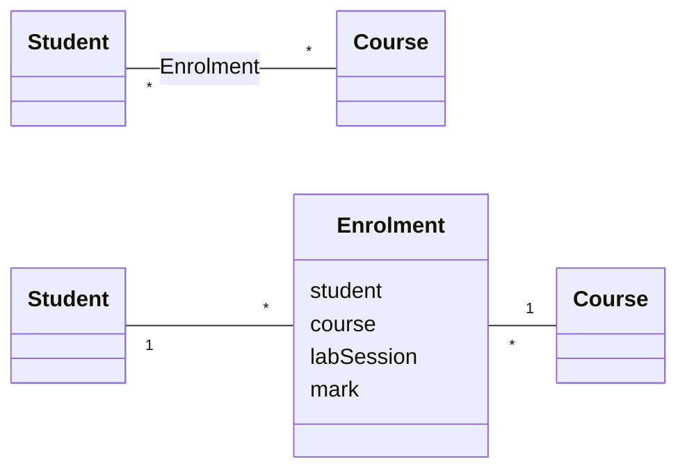

#### Association Classes

- An attribute is related to an association.
- Instance of the association class have a life-time dependency on the association.

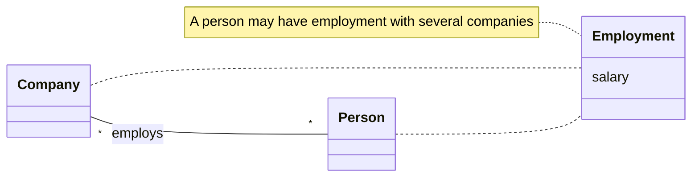

- an associative type should exist in the background somewhere.

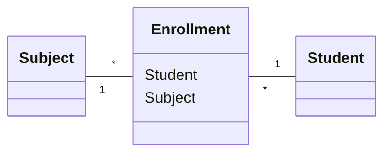

### Generalization & Specialization

- Generalization: the activity of identifying commonalities among concepts and defining superclass (general concept) and subclass (specialized concepts) relationships.
- "is-a" relationship
- a subclass inherits from a superclass.

### Benefits of generalization

- Code Reusability
- Cleaner/Simplified design
- Scalability
- Extensibility
- Easier Maintenance
- Testability
- Modularity

### Class inheritance

- same as generalization and specialization.
- the subclasses inherit the attributes and methods of the superclasses.

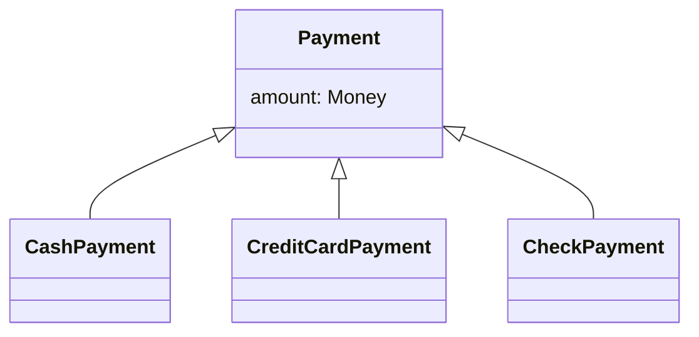

- When a hierarchy is created, statements about the superclass apply to subclasses.
- A conceptual subclass should be a member of the set of the superclass.
- The conceptual subclass is a kind of superclass.
- `<subclass> is a <superclass>`
- Every instance of the `<subclass>` can be viewed as an instance of the `<superclass>`.

### Subclass

- has additional attributes of interest.
- has additional associations of interest.
- is handled differently than the superclass or other subclasses.
- represents an object that behaves differently than the superclass or other subclasses.

### Superclass

- Create a conceptual superclass when:
  - The potential conceptual subclasses represent variations of a similar concept.
  - The subclass fully conforms to the attributes and associations of its superclass. (100% rule)
- All subclasses have the same attributes and operations which can be factored out and expressed in the superclass.
- All subclasses have the same associations which can be factored out and related to the superclass.

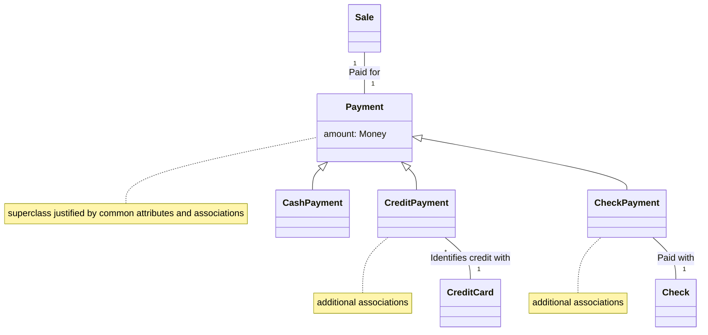

### Abstract Class

- a parent class that cannot be instantiated.
- at least one of its operations is abstract.
- an abstract operation has its signature defined in the abstract parent class, but the implementation is defined in the child class.
- create a high-level modelling vocabulary.

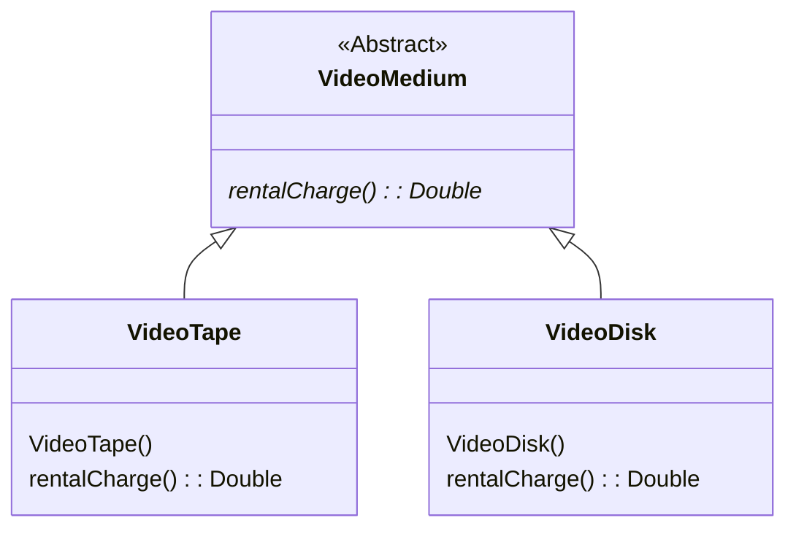

### Interface & Realization

- a class with no attributes.
- can't be instantiated.
- simply declares a contract that may be realized by zero or more classes.
- to separate the specification from its implementation.
- only defines a specification for what the class should do and it never implies how it should do it.
- the class implementing an interface has a realization relationship with the interface.

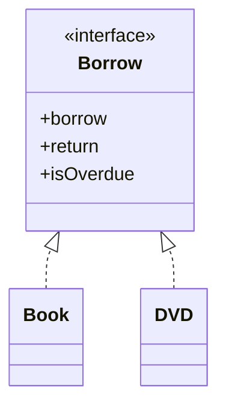

### Aggregation

- a type of whole-part relationship in which the aggregate is made up of many parts.
- Signified with a hollow diamond.
- implies the part may be in many composite instances.

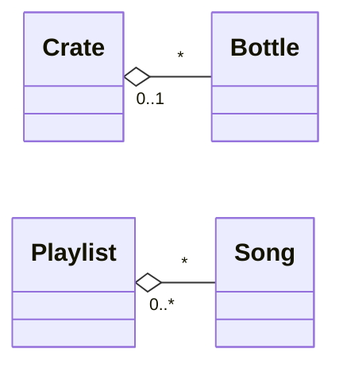

### Composition

- a stronger form of aggregation.
- the multiplicity at the composite end may be at most one
- Signified with a filled diamond.
- There is a create-delete dependency. Their lifetime is bound within the lifetime of the composite.

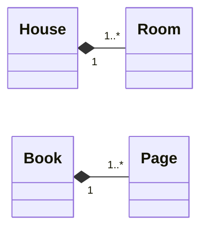

### Dependency

- a relationship between two or more model elements whereby a change to one element
- The most common dependency stereotype is `<<use>>`, which simply states that the client makes use of the supplier in some way.

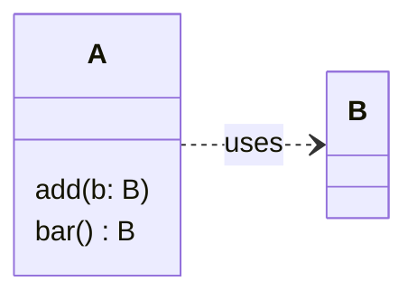

### Visibility

- `+` public
- `-` private
- `#` protected
- `~` package

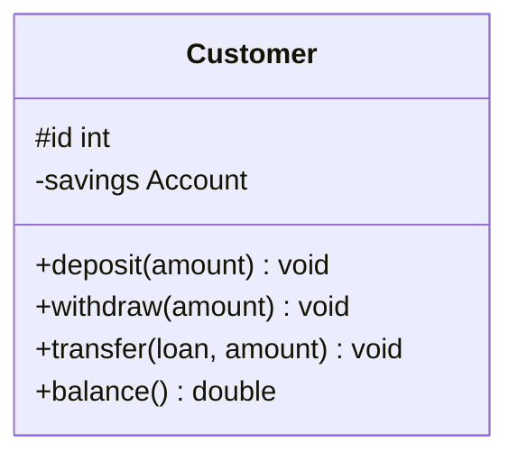

### Example

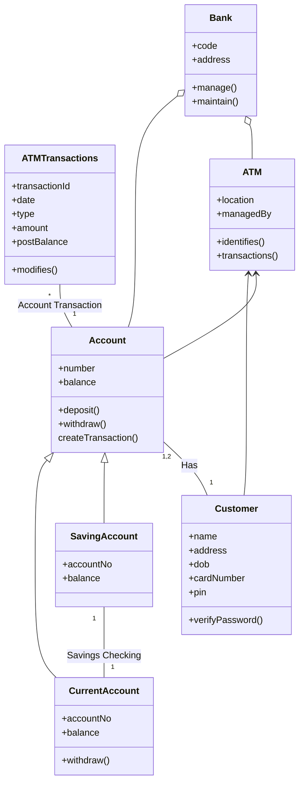

## UML Tools

- [Draw.io](https://www.draw.io)
- [Lucidchart](https://www.lucidchart.com)
- [Visual Paradigm](https://www.visual-paradigm.com)
- [StarUML](https://staruml.io)
- [Creately](https://creately.com)
- [PlantUML](https://www.planttext.com/)
