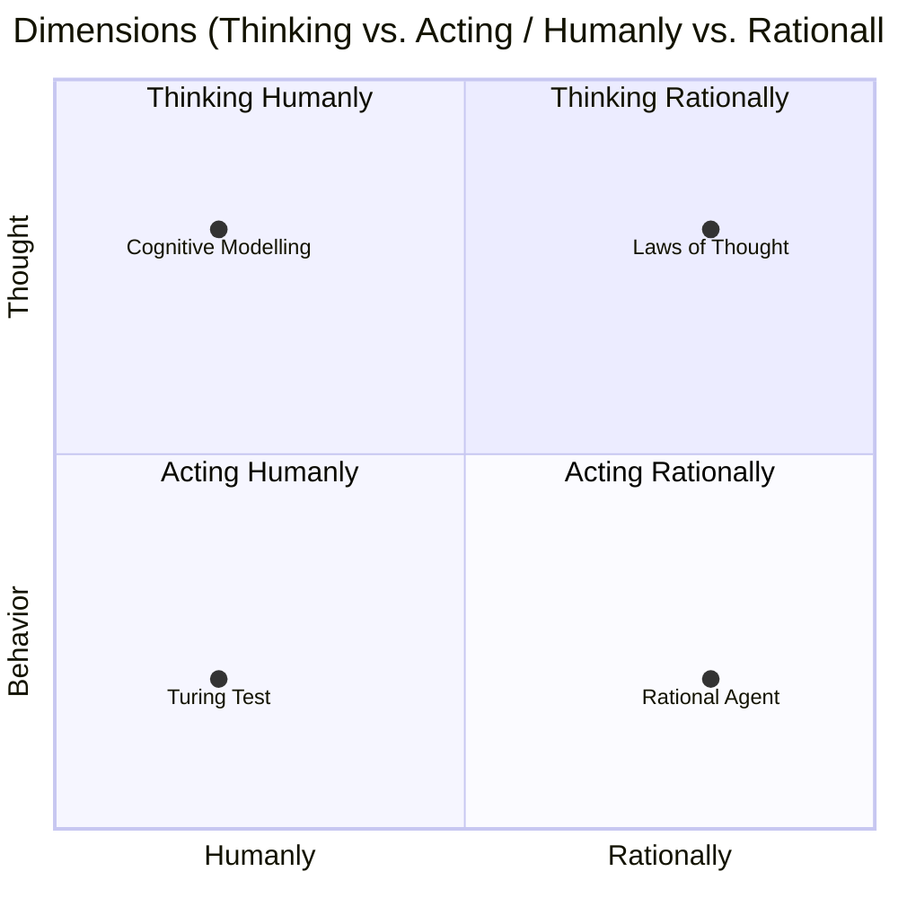
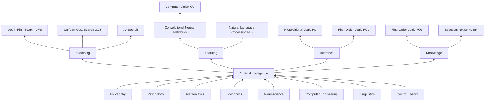
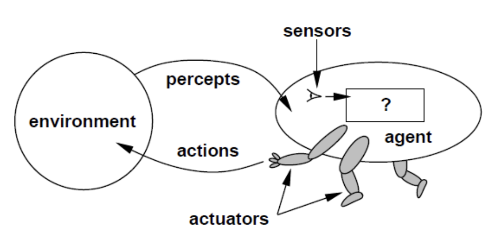

## AI

> AI refers to the simulation of human intelligence in machines that are programmed to think like humans and mimic their actions.

- As a research field, AI aims to develop techniques including algorithms, methods and models to enable systems to perform tasks which require intelligence when performed by humans.
- AI is concerned with developing machines or computer agents that are capable of performing tasks that typically require human intelligence.
- AI is about the study and construction of agent programs that perform well in a given environment, for a given agent architecture.
- AI is a true universal field.
- The term "Artificial Intelligence" was coined by John McCarthy for the Dartmouth Summer Research Project in 1956, marking the formal beginning of AI as a research field.

### History

- 1943-1956: Inception of AI
- 1966-1973: A dose of reality
- 1969-1986: Expert systems
- 2011-present: Deep learning

### Turing reward winners

- Defining the foundation of the field based on representation and reasoning
  - 1969 Marvin Minsky
  - 1971 John McCarthy
- Making fundamental contributions to AI and human cognition
  - 1975 Allen Newell & Herbert Simon
- Developing expert systems that encode human knowledge to solve real-world problems
  - Ed Feigenbaum & Raj Reddy
- Honored for "probably approximately correct learning (PAC learning)", a foundational theoretical framework for AI and ML
  - 2010 Leslie Valiant
- Developing probabilistic reasoning techniques that deal with uncertainty in a principled manner
  - 2011 Judea Pearl
- Making "deep learning" a critical part of modern computing.
  - 2018 Yoshua Bengio & Geoffrey Hinton & Yann LeCun
- Recognized for lifetime contributions to reinforcement learning, a core method in modern AI
  - 2024 Andrew Barto & Richard Sutton

### Nobel Prize in Physics

- For foundational discoveries and inventions that enable machine learning with artificial neural networks
  - 2024 John J. Hopfield & Geoffrey Hinton

### Dimensions of AI

> Action (Behavior) vs Thinking (Thought)

## AI Tree

## PEAS

- Performance: The performance measure that defines the criterion of success
- Environment: The agent’s prior knowledge of the environment
- Actuators: The actions that the agent can perform through actuators
- Sensors: The agent’s percept sequence to date through sensors

| Agent Type | Performance Measure | Environment | Actuators | Sensors |
| --- | --- | --- | --- | --- |
| Taxi driver | Safe, fast, comfortable transportation | Roads, traffic, passengers | Steering wheel, accelerator, brakes | Cameras, GPS, speedometer |
| Medical diagnosis system | Healthy patient, reduced costs | Patient, hospital, staff | Display of questions, tests, diagnosis, treatments | Touchscreen/voice entry of symptoms and findings |
| Satellite image analysis system | Correct categorization of objects, terrain | Orbiting satellite, downlink weather | Display of scene categorization | High-resolution digital camera |

## Rational Agent

> Agent = architecture + program

- Agent function: abstract mathematical description
- Agent program: concrete implementation, running within some physical system
- Agent architecture: running on some sort of computing device with physical sensors and actuators

## Weak vs Strong AI

- Weak AI: treats a computer as a device that can simulate the performance of a brain
- Strong AI: a theoretical form of machine intelligence that is equal to human intelligence.

## Why AI becoming so hot

- Big data
- Cloud computing
- Deep learning

## Risks

- Lethal autonomous weapons
- Surveillance and persuasion
- Biased decision making
