## Business Intelligence

## KDD

> knowledge discovery in databases (KDD) refers to the comprehensive process of finding knowledge in data.

- Learning from the application domain
- Creating a target dataset
- Data cleansing/pre-processing
- Data reduction/projection
- Choosing the function of data mining
- Choosing the data mining algorithm
- Data mining
- Interpretation
- Using discovered knowledge

```mermaid
graph LR
    subgraph Step1["1 Domain Understanding & KDD Goals"]
        Databases[(Databases)]
    end
    
    subgraph Step2["2 Selection and addition"]
        DataWarehouses[(Data Warehouses)]
    end
    
    subgraph Step3["3 Preprocessing: data cleansing, etc"]
        Step3Process[Data Preprocessing]
    end
    
    subgraph Step4["4 Data reduction/transformation"]
        Step4Process[Data Transformation]
    end
    
    subgraph Step567["5 6 7 Data mining"]
        TaskRelevantData[(Task Relevant Data)]
        DataMiningProcess[Data Mining Process]
        Patterns[(Patterns)]
    end

    subgraph Step8["8 Evaluation and interpretation"]
        EvaluationProcess[Pattern Evaluation]
    end

    subgraph Step9["9 Discovered Knowledge"]
        VisualizationAndIntegration[visualization & integration]
        Knowledge[💡 Knowledge]
    end
    Databases --> DataWarehouses
    DataWarehouses --> Step3Process
    Step3Process --> Step4Process
    Step4Process --> TaskRelevantData
    TaskRelevantData --> DataMiningProcess
    DataMiningProcess --> Patterns
    Patterns --> EvaluationProcess
    EvaluationProcess --> Knowledge
    
    %% Iteration arrows
    EvaluationProcess -.-> Step567
    EvaluationProcess -.-> Step4
    EvaluationProcess -.-> Step3
    EvaluationProcess -.-> Step2
    
    classDef artifactStyle fill:#f9d71c,stroke:#d4a017,stroke-width:2px
    classDef processStyle fill:#3498db,stroke:#2980b9,stroke-width:2px
    classDef knowledgeStyle fill:#e74c3c,stroke:#c0392b,stroke-width:2px
    
    class Databases,DataWarehouses,TaskRelevantData,Patterns artifactStyle
    class Step3Process,Step4Process,DataMiningProcess,EvaluationProcess processStyle
    class Knowledge knowledgeStyle
```

## CRISP-DM

> The Cross-Industry Standard Process for Data Mining (CRISP-DM) methodology provides a structured approach to planning a data mining project.
> As it is a cross-industry standard, it is widely used by practitioners who need a repeatable approach for data mining projects and can be used in a variety of machine learning projects.

- Business understanding: Set up a business problem and understand what you want to accomplish from a business perspective.  
- Data understanding: Identify, collect and review the required data.
- Data preparation: Prepare your data for modeling.
- Modeling: Analyze possible approaches and develop the model.
- Evaluation: Evaluate results against business needs.
- Deployment: Deploy the model.

```mermaid
graph TB
  subgraph CRISPD["CRISP-DM Process"]
      BusinessUnderstanding["📊 Business Understanding"]
      DataUnderstanding["🗄️ Data Understanding"] 
      DataPreparation["🔧 Data Preparation"]
      Modeling["🤖 Modeling"]
      Evaluation["✅ Evaluation"]
      Deployment["🚀 Deployment"]
  end
  
  %% Main process flow (clockwise)
  BusinessUnderstanding --> DataUnderstanding
  DataUnderstanding --> DataPreparation
  DataPreparation --> Modeling
  Modeling --> Evaluation
  Evaluation --> Deployment
  
  %% Bidirectional connections
  DataUnderstanding <--> BusinessUnderstanding
  DataPreparation <--> Modeling
  Evaluation --> BusinessUnderstanding
  
  
  %% Styling
  classDef businessStyle fill:#e8f4fd,stroke:#2980b9,stroke-width:3px,color:#2c3e50
  classDef dataStyle fill:#fff2e8,stroke:#e67e22,stroke-width:3px,color:#2c3e50
  classDef prepStyle fill:#e8f8f5,stroke:#27ae60,stroke-width:3px,color:#2c3e50
  classDef modelStyle fill:#fef9e7,stroke:#f39c12,stroke-width:3px,color:#2c3e50
  classDef evalStyle fill:#fdedec,stroke:#e74c3c,stroke-width:3px,color:#2c3e50
  classDef deployStyle fill:#f4ecf7,stroke:#9b59b6,stroke-width:3px,color:#2c3e50
  
  class BusinessUnderstanding businessStyle
  class DataUnderstanding dataStyle
  class DataPreparation prepStyle
  class Modeling modelStyle
  class Evaluation evalStyle
  class Deployment deployStyle
```

## Statistical Analysis

> Data analytics has borrowed from statistical analysis, which involves collecting data, counting, probabilities, and hypothesis testing.

The two main approaches that are relevant to data analytics are:

### Descriptive Statistics

- **Purpose**: Analyze past events using historical data
- **Data Source**: Stored data from previous activities
- **Application**: Assists companies to make informed decisions based on statistical analysis of historical patterns
- **Focus**: "What happened?" - Understanding past performance and trends

### Predictive Statistics

- **Purpose**: Predict future events based on currently available data
- **Data Source**: Present and historical data combined with analytical models
- **Application**: Provides statements or predictions about events that have not yet occurred
- **Focus**: "What will happen?" - Forecasting future outcomes and behaviors

```mermaid
graph LR
    subgraph StatisticalAnalysis["Statistical Analysis"]
        DataCollection[Data Collection]
        Counting[Counting]
        Probabilities[Probabilities]
        HypothesisTesting[Hypothesis Testing]
    end
    
    subgraph DescriptiveStats["📊 Descriptive Statistics"]
        HistoricalData[(Historical Data)]
        PastAnalysis[Past Event Analysis]
        DecisionSupport[Decision Support]
    end
    
    subgraph PredictiveStats["🔮 Predictive Statistics"]
        CurrentData[(Current Data)]
        PredictiveModel[Predictive Models]
        FuturePredictions[Future Predictions]
    end
    
    StatisticalAnalysis --> DescriptiveStats
    StatisticalAnalysis --> PredictiveStats
    
    HistoricalData --> PastAnalysis
    PastAnalysis --> DecisionSupport
    
    CurrentData --> PredictiveModel
    PredictiveModel --> FuturePredictions
    
    classDef statStyle fill:#e8f4fd,stroke:#2980b9,stroke-width:2px
    classDef descStyle fill:#fff2e8,stroke:#e67e22,stroke-width:2px
    classDef predStyle fill:#e8f8f5,stroke:#27ae60,stroke-width:2px
    classDef dataStyle fill:#f9d71c,stroke:#d4a017,stroke-width:2px
    
    class DataCollection,Counting,Probabilities,HypothesisTesting statStyle
    class PastAnalysis,DecisionSupport descStyle
    class PredictiveModel,FuturePredictions predStyle
    class HistoricalData,CurrentData dataStyle
```

## Data analytics results

> The presentation of data analytics results needs to be understandable by humans, easily used, and accurate on computers.

The effectiveness of different data analytics methods can be evaluated across two dimensions:

- **X-axis**: Computer accuracy (how accurate the method is)
- **Y-axis**: Human understandability (how easily humans can interpret the results)

