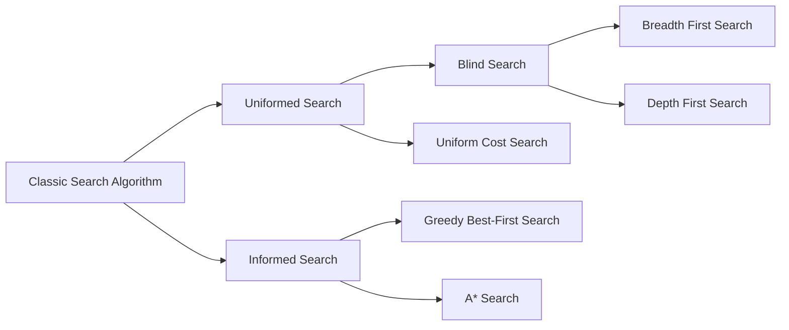

## Environment

- All possible state and information about how the states are related.
- The costs from one state to each of its adjacent states are also given.

### Agent

- Simulated intelligence knows which state it is in.
- If it takes an action at a given state, it knows the next state and the corresponding cost.

## Characteristics of the environment

- Fully Observable: The agent always knows the current state of the environment at each point in time.
- Deterministic: The next state of the environment is completely determined by the current state and the action taken by the agent.
- Static: The environment is unchanged.
- Discrete: A limited number of distinct, clearly defined actions.
- Single agent: An agent operating by itself in an environment.

## Search problem

> Finding a path from a starting point to a goal point in a space.

- **The initial state**
- **State space**: The environment or area where the search takes place
- **A set of actions**: The possible actions that the agent can take in each state.
  - `ACTION (s)`
- **A transition model**:
  - takes in a state and an action.
  - returns the successor state, which is any state reachable from doing action `a` in state `s`.
  - `RESULT(s, a)`
- **A goal state**:
  - The target location or position that needs to be reached.
  - represented by a goal test function
- **A path cost function**:
  - The cost associated with a particular path taken through the state space.
  - `c(s1, a, s2)`

## Frontier

- A set of nodes that are under consideration to be expanded.
- A set of leaf nodes in the search spanning tree are available for expansion at any given step.
- A search algorithm determines how to choose a node in the Frontier to grow the search spanning tree.

## Search Algorithm



### Tree Search vs Graph Search

> Explored Set

- The frontier in graph search separates the search-space graph into two regions, the explored region and the unexplored region, so that Every path from the initial state to an unexplored state has to pass through a state in the frontier.

### Performance measures

- Completeness
- Cost Optimality
- Time complexity
- Space complexity

### BFS

> Queue

#### BFS Tree

```py
from collections import deque

def bfs_tree(start, goal_test, successors):
    """
    start: 시작 상태
    goal_test(s): 목표 검사 함수 -> bool
    successors(s): 상태 s에서 갈 수 있는 다음 상태들의 리스트 반환

    반환: 목표에 도달하는 경로(list) 또는 None
    (Tree-search: explored/중복 체크 안 함)
    """
    if goal_test(start):
        return [start]

    # 노드 = (state, parent_index)
    nodes = [(start, None)]
    frontier = deque([0])  # nodes의 인덱스를 큐에 저장

    while frontier:
        parent_idx = frontier.popleft()
        parent_state, _ = nodes[parent_idx]

        for nxt in successors(parent_state):
            nodes.append((nxt, parent_idx))
            child_idx = len(nodes) - 1

            if goal_test(nxt):
                # 경로 복원
                path, i = [], child_idx
                while i is not None:
                    path.append(nodes[i][0])
                    i = nodes[i][1]
                return list(reversed(path))

            frontier.append(child_idx)

    return None
```

```py
from collections import deque

def bfs_graph(start, goal_test, successors):
    """
    start: 시작 상태 (예: 'Arad')
    goal_test(s): s가 목표면 True
    successors(s): 상태 s에서 (다음상태, 비용) 혹은 그냥 다음상태 리스트 반환
                   아래에서는 다음상태 리스트라고 가정
    반환: start -> ... -> goal 경로 리스트, 없으면 None
    """
    # 노드 = (state, parent_index)
    frontier = deque([(start, None)])   # FIFO 큐
    frontier_states = {start}           # frontier에 있는 상태 집합 (중복 방지)
    explored = set()                    # 이미 확장한 상태(Closed)

    # 경로 복원을 위해 모든 노드를 배열에 따로 저장
    nodes = [(start, None)]             # nodes[i] = (state, parent_index)
    index_in_queue = deque([0])         # frontier에서의 인덱스(=nodes의 인덱스)

    if goal_test(start):
        return [start]

    while frontier:
        state, parent = frontier.popleft()
        node_idx = index_in_queue.popleft()
        frontier_states.discard(state)
        explored.add(state)

        for nxt in successors(state):
            if (nxt not in explored) and (nxt not in frontier_states):
                # child 노드 저장
                nodes.append((nxt, node_idx))
                child_idx = len(nodes) - 1

                if goal_test(nxt):
                    # 경로 복원
                    path = []
                    i = child_idx
                    while i is not None:
                        path.append(nodes[i][0])
                        i = nodes[i][1]
                    return list(reversed(path))

                # frontier에 삽입
                frontier.append((nxt, node_idx))
                index_in_queue.append(child_idx)
                frontier_states.add(nxt)

    return None
```

```py
graph = {
    "Arad": ["Sibiu", "Timisoara", "Zerind"],
    "Sibiu": ["Arad", "Fagaras"],
    "Timisoara": ["Arad", "Lugoj"],
    "Zerind": ["Arad"],
    "Fagaras": [],
    "Lugoj": []
}

path = bfs(
    start="Arad",
    goal_test=lambda s: s == "Lugoj",
    successors=lambda s: graph.get(s, [])
)
print(path) 
```

- Has the shallowest path to every node on the frontier
- memory-intensive as it stores all nodes.

### DFS

> Stack

```py
def depth_first_search(initial_state, goal_test, actions):
    """
    initial_state: 시작 상태
    goal_test(s): 상태 s가 목표면 True
    actions(s): 상태 s에서 이동 가능한 다음 상태들의 리스트 반환
    반환: start → goal 경로(list) 또는 None
    """

    # 모든 노드 저장: nodes[i] = (state, parent_index)
    nodes = [(initial_state, None)]

    # frontier ← FILO 스택 (여기서는 노드 인덱스만 저장)
    frontier = [0]

    # frontier에 있는 상태들의 집합 (중복 삽입 방지용)
    stacked_states = {initial_state}

    # explored ← 이미 확장(자식 생성)한 상태들의 집합
    explored = set()

    # 시작 상태가 목표라면 바로 반환
    if goal_test(initial_state):
        return [initial_state]

    # DFS 루프 시작
    while True:
        # frontier가 비면 실패
        if not frontier:
            return None

        # 스택에서 맨 위 노드 꺼내기
        node_idx = frontier.pop()
        state, parent_idx = nodes[node_idx]

        # 스택 상태 집합에서 제거 (이제 확장할 차례)
        stacked_states.discard(state)

        # 현재 상태에서 가능한 모든 자식 상태 확인
        for child_state in actions(state):
            # 자식 상태가 explored나 frontier에 없을 때만 처리
            if (child_state not in explored) and (child_state not in stacked_states):
                # 새 노드 저장 (부모는 현재 노드)
                nodes.append((child_state, node_idx))
                child_idx = len(nodes) - 1

                # 목표 상태면 경로 복원해서 반환
                if goal_test(child_state):
                    path, i = [], child_idx
                    while i is not None:
                        path.append(nodes[i][0])
                        i = nodes[i][1]
                    return list(reversed(path))

                # 목표가 아니면 스택에 push
                frontier.append(child_idx)
                stacked_states.add(child_state)

        # 모든 자식 처리가 끝나면 explored에 추가
        explored.add(state)
```

- Low memory usage
- Can get stuck in deep or infinite branches (Not cost-optimal)

### UCS

> Priority Queue

- lowest path cost `f(n) = g(n)`
- Best-first search with the evaluation function
- Uniform-cost search is complete and cost optimal
- Dijkstra's algorithm finds the shortest path from the root node to every other node in a graph with non-negative edge weights.
- A special case of Dijkstra's algorithm in which the

```py
import heapq

def uniform_cost_search(initial_state, goal_test, actions, step_cost):
    """
    initial_state: 시작 상태
    goal_test(s): 상태 s가 목표면 True
    actions(s): 상태 s에서 가능한 다음 상태 리스트
    step_cost(s, s_next): s -> s_next 이동 비용 (양수 가정)

    반환: start → goal 경로(list) 또는 None
    """

    # 모든 노드 저장: nodes[i] = (state, parent_idx, path_cost)
    nodes = [(initial_state, None, 0.0)]

    # frontier ← PATH-COST 기준 최소 힙 (원소: (cost, node_idx))
    frontier = [(0.0, 0)]
    heapq.heapify(frontier)

    # frontier에 있는 상태의 현재 최저 비용(멤버십/비용 비교용)
    frontier_costs = {initial_state: 0.0}

    # explored ← 이미 확장 완료한 상태 집합
    explored = set()

    # 시작이 곧 목표면 바로 반환
    if goal_test(initial_state):
        return [initial_state]

    # loop do
    while frontier:
        # node ← POP(frontier)  /* 최소 비용 노드 */
        cost, node_idx = heapq.heappop(frontier)
        state, parent_idx, path_cost = nodes[node_idx]

        # 힙에 남아 있는 구버전(더 비싼 버전)이면 건너뛴다
        if state in frontier_costs and cost != frontier_costs[state]:
            continue

        # goal test (슈도코드: pop 직후 검사)
        if goal_test(state):
            # SOLUTION(node) → 경로 복원
            path = []
            i = node_idx
            while i is not None:
                path.append(nodes[i][0])
                i = nodes[i][1]
            return list(reversed(path))

        # add node.STATE to explored
        explored.add(state)
        # frontier 목록에서 이 상태 제거(더 이상 frontier에 없음)
        frontier_costs.pop(state, None)

        # for each action in ACTIONS(node.STATE) do
        for nxt in actions(state):
            new_cost = path_cost + step_cost(state, nxt)

            # child.STATE not in explored or frontier ?
            in_explored = (nxt in explored)
            in_frontier = (nxt in frontier_costs)

            # (1) explored/ fronter 어디에도 없으면 새로 삽입
            if not in_explored and not in_frontier:
                nodes.append((nxt, node_idx, new_cost))
                child_idx = len(nodes) - 1
                heapq.heappush(frontier, (new_cost, child_idx))
                frontier_costs[nxt] = new_cost

            # (2) frontier에 있는데, 더 싼 경로를 찾았다면 "교체"
            elif in_frontier and new_cost < frontier_costs[nxt]:
                nodes.append((nxt, node_idx, new_cost))
                child_idx = len(nodes) - 1
                heapq.heappush(frontier, (new_cost, child_idx))
                # 현재 최저비용을 갱신 → 이전 힙 항목은 나중에 팝될 때 비용불일치로 자동 무시
                frontier_costs[nxt] = new_cost

    # if EMPTY?(frontier) then failure
    return None
```

### Greedy Best First Search

- `f(n) = h(n)`
- $h(n) = h_{SLD}$, where $SLD$ for the **Straight-Line Distance**
- It expands the node with the lowest $h(n)$ value at each step

```py
from heapq import heappush, heappop

def gbfs_path(G, start, goal, heuristic):
    """
    Greedy Best-First Search (GBFS)
    G: 인접 리스트 dict, G[u] = 이웃들의 리스트/이터러블
    heuristic(x, goal): 추정거리 h(x)
    반환: start -> ... -> goal 경로(list) 또는 None
    """

    # 우선순위 큐 원소: (h(state), state, path)
    pq = []
    heappush(pq, (heuristic(start, goal), start, [start]))

    visited = set()          # 이미 꺼내서 확장한 노드(재방문 방지)
    in_frontier = {start}    # 큐에 들어간 노드(중복 삽입 방지)

    while pq:
        # 휴리스틱이 가장 작은 노드를 꺼냄
        _, vertex, path = heappop(pq)
        in_frontier.discard(vertex)

        # 이미 확장했다면 스킵
        if vertex in visited:
            continue
        visited.add(vertex)

        # 목표면 경로 반환
        if vertex == goal:
            return path

        # 이웃을 휴리스틱 순으로 큐에 추가
        for neighbor in G.get(vertex, []):
            if neighbor in visited or neighbor in in_frontier:
                continue
            heappush(pq, (heuristic(neighbor, goal), neighbor, path + [neighbor]))
            in_frontier.add(neighbor)

    return None
```

### A* Search

- `f(n) = g(n) + h(n)`
- The most common informed search algorithm.
- The tree-search version of A* is optimal if `h(n)` is an admissible heuristic.
- The graph-search version is optimal if `h(n)` is consistent.

```py
def astar_path(G, start, goal):
    """
    Find a path from start to goal using A* Search.
    G: NetworkX Graph
    start: 시작 노드
    goal: 목표 노드
    """
    pq = PriorityQueue()
    # 시작 노드를 경로 리스트와 함께 큐에 추가, f = 0
    pq.push((start, [start]), 0)
    visited = set()

    while pq:
        (vertex, path) = pq.pop()

        # 이미 방문했다면 스킵
        if vertex in visited:
            continue
        visited.add(vertex)

        # 목표 도착 시 경로 반환
        if vertex == goal:
            return path

        # 인접 노드 탐색
        for neighbor in G[vertex]:
            if neighbor in visited:
                continue
            # g(n) = 현재 경로까지의 실제 비용
            g_cost = nx.path_weight(G, path + [neighbor], 'weight')
            # h(n) = 휴리스틱(목표까지의 추정 비용)
            h_cost = heuristic(cities[neighbor], cities[goal])
            f_cost = g_cost + h_cost

            pq.push((neighbor, path + [neighbor]), f_cost)

    return None
```
