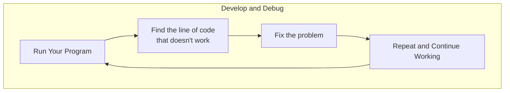
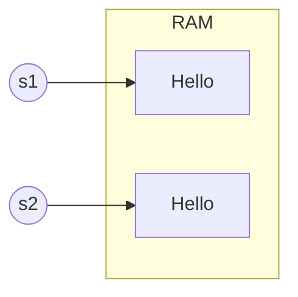

## Terminology

- Software: A set of statements written in a programming language to perform tasks
- Statement: A single instruction in a program that performs an action when executed.
- Snippet: A block of statements.
- Software Development: The process of creating a software program.
- OOP: Program composed of interconnected objects at runtime.
- Expression: An entity-code component of a statement that can be evaluated to produce a value.
- Assign: The process of storing the result (a value) of one or more expressions.
- Value: A data item (literal or computed) that is stored in a variable.
- Compiler: A special program that translates a programming language's source code into machine code.
  - Compilers complete the conversion process all at once after changes are made to the code and before the code is executed
- Interpreter: A computer program that directly executes code without requiring it to be previously compiled into machine language.
  - Interpreters complete the conversion process one step at a time while the code is being executed.

## Software development

- Software development process is an iterative approach.



- java
  - `javac Welcome.java`: Compiles the Java source file `Welcome.java` into class binary file.
  - `java Welcome`: Executes the Java program `Welcome`.
- python
  - `python welcome.py`: Executes the Python script `welcome.py`.

## OOP

- Object: An object is a thing, tangible and intangible. An object has fields that contain the data and methods to access and modify the data.
- Class: A class is an abstract definition of objects. A class is a template of a blueprint that defines what data and methods are included in objects.
- Method: A block of code grouped together to perform an operation. A method has a **name**, **parameters**, and a **return type**.
- Field: A field is a data attribute of an object. A field value is exposed using object methods.
- Organizing code into classes improves modularity, reusability, extendability, and scalability.

### Java vs Python

| Identifier type | Java | Python |
| --- | --- | --- |
| Class | Use CamelCase for multi-word classes | Use snake_case for multi-word classes |
| Function | use verbs or verb phrases | use lowercase_with_underscores |
| Procedure | use verbs or verb phrases | use lowercase_with_underscores |
| Variable | camelCase | lowercase_with_underscores |
| Constant | All uppercase words separated by underscores | All uppercase words separated by underscores |
| Package | Lowercase words separated by dots | Lowercase words separated by underscores |

- Java uses the `toString()` function to return objects' information.
- Python can refer to attributes directly or use the `__str()__` function to return objects' information

## Data types

| Data Type | Size | Default value | Description |
| --- | --- | --- | --- |
| byte | 1 byte | 0 | 8-bit signed integer |
| short | 2 bytes | 0 | 16-bit signed integer |
| int | 4 bytes | 0 | 32-bit signed integer |
| long | 8 bytes | 0 | 64-bit signed integer |
| float | 4 bytes | 0.0f | 32-bit floating point |
| double | 8 bytes | 0.0d | 64-bit floating point |
| boolean | 1 bit | false | true or false |
| char | 2 bytes | '\\u0000' | 16-bit Unicode character |

### Non-Primitive Data Types

- Non-primitive: Arrays, Classes, Interfaces, and Strings.
- Non-primitive data types are by default set to **null** in Java, **None** in Python.

## Variables

- `Static`: enables the variable to be used without creating an object of its defining class.
- `Final`: makes the variable unchangeable.

## Operators

| Operator Category | Java | Python |
| --- | --- | --- |
| Unary | expr++ expr-- | |
| | ++expr --expr +expr -expr | +expr -expr |
| Arithmetic | `* / &` | `* / &` |
| | `+ -` | `+ -` |
| Relational | `< > <= >=` | `< > <= >=` |
| | `==  !=` | `==  !=` |
| Logical | `! &&` | `not and` |
| | &#124;&#124; | `or` |
| Ternary | `(expr1) ? <expr2> : <expr3>` | `(expr1) if <expr2> then <expr3>` |
| Assignment | `= += -= *= /= %=` | `= += -= *= /= %= **=` |
| Identity/Membership | | `is  is not  in  not in` |

- Java: `boolean q = (5 % 2 != 2) ? true : false`
- Python: `q = True if (5 % 2 != 2) else False`

## Standard Input

```java
import java.util.Scanner;

public class Inputs {
  static Scanner in = new Scanner(System.in);

  public static void main(String[] args) {
    System.out.print("X = ");
    int x = in.nextInt();
    System.out.println("x squared = " + Math.pow(x, 2));
  }
}
```

```py
import sys

x = int(input("x = "))

print("x squared = ", pow(x, 2))
```

## String

### String (java)

> Immutable

- `String s1 = "Hello";`: initialize using literal syntax
- `String s2 = new String("Hello");`: initialize using a constructor

```java
s1 == s1 // false
s1.equals(s2) // true
```



### String Format (Python)

| Symbol             | Meaning                       | Example code    | Output    |
| ------------------ | ----------------------------- | --------------- | --------- |
| `<`                | Left align                    | `f'[{42:<5}]'`  | `[42   ]` |
| `>`                | Right align                   | `f'[{42:>5}]'`  | `[   42]` |
| `^`                | Center align                  | `f'[{42:^5}]'`  | `[ 42  ]` |
| `<` with fill char | Left align with custom fill   | `f'[{42:-<5}]'` | `[42---]` |
| `>` with fill char | Right align with custom fill  | `f'[{42:->5}]'` | `[---42]` |
| `^` with fill char | Center align with custom fill | `f'[{42:->5}]'` | `[-42--]` |

## Array

### Array (java)

`int[] x = {2, 4, -1, 11, 3};`

- Declaration: `int[] x`
- Instantiation: `x = new int[5];`
- Initialization: `x[0] = 2; x[1] = 4; x[2] = -1;`
