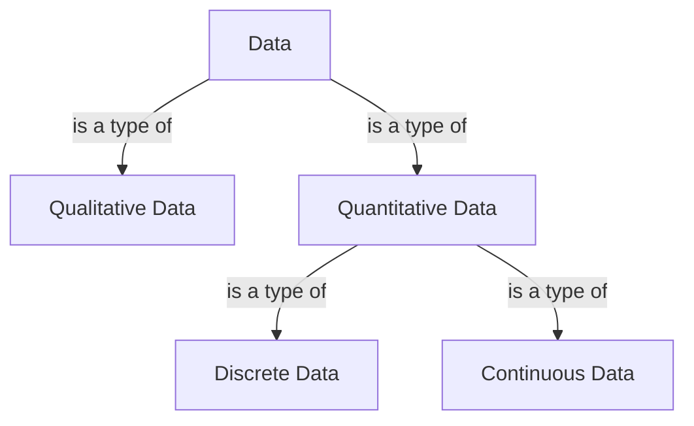

## CRISP-DM

> CRISP-DM (Cross-Industry Standard Process for Data Mining)

1. Business understanding
2. Data understanding
3. Data preparation
4. Modeling
5. Evaluation

### Business understanding

- Determine business objectives
- Assess situation
- Determine data mining goals
- Produce project plan

### Data understanding

- Collect initial data
- Describe data
- Explore data
- Verify data quality

### Data preperation

- Select data
- Clean data
- Consturct data
- Integrate data
- Format data

### Modeling

- Select modeling technique
- Generate test design
- Build model
- Assess model

### Evaluation

- Evaludate results
- Review process
- Determine next steps

### Deployment

- Plan development
- Plan monitoring & maintenance
- Produce final report
- Review project

## Instance & Attributes

- Instance: the terms associated with specific objects. Instances are described by a set of values for the features.
- Attributes: the collection of features of the object that are maintained in a dataset.
- Object: a collection of features about which measurements can be taken.
  - Car --> fuel consumption, cylinders, horsepower...

## Qualitative & Quantitative data

- Qualitative data: **less structured**, **non-statistical**, **measured using other descriptors and identifiers**
  - white, heavy, wild...
- Quantitative data: **statistical**, **measured using hard numbers.**
  - 130cm, 400kg, 4 legs...

### Discrete & Continuous (Quantitative) data

- Discrete data: **fixed, round numbers**, **countable**
  - number of legs, count of aeroplane depatures, number of times a person commutes for a job in a week
- Continuous data: **measured over time intervals**
  - weight, solar irradiation, temperature of a room

### Summary

| Qualitative | Quantitiative (discrete) | Quantitiative (continuous) |
| --- | --- | --- |
| Title | Duration | Rating |
| Production Country | Release Year | |
| Director | | |
| Genres | | |
| Description | | |

## Categorizing attributees

| 항목 | **Nominal (categorical)** | **Ordinal** | **Interval**  | **Ratio** |
| --- | --- | --- | --- | --- |
| **정의** | 값이 라벨·이름 역할만 함. 순서 없음. | 값 사이에 순서 있음. 간격은 정의되지 않음. | 순서 + 고정·동일한 단위(간격). 절대 0 없음. | Interval 속성 + 절대적 0 있음. 차이와 비율 모두 의미 있음.  |
| **예시** | 머리카락 색 `{blonde, brown, ginger}` 우편번호 산업코드, 연구분야 코드 | 키: `tall > average > short` 체중: `light < average < heavy` | 키(cm), 몸무게(kg) (원문 기준) 12시간제 시각(차이 비교) 시간 간격(5분\~10분) | 나이(년) 소득(천 달러) 켈빈 온도 금액, 개수, 질량, 길이, 전류   |
| **허용 비교** | `=, ≠` | `=, ≠, <, >` | `=, ≠, <, >, +, −` | `=, ≠, <, >, +, −, ×, ÷` |
| **연산 / 분석** | Mode(최빈값) Entropy(불확실성 측정) Contingency table(교차표) Correlation(Chi-squared test of independence) Chi-squared test | Median Percentiles Rank correlation(Spearman) Run tests(Mann–Whitney U, Wilcoxon) Sign tests | Mean Standard Deviation Pearson correlation T-test F-test(ANOVA) | Geometric Mean Harmonic Mean Percent variation(CV) |
| **설명** | 통계적 평균·표준편차 무의미 | 순위는 비교 가능하지만 간격·크기 비교 불가. 중앙값·순위기반 통계 적합. | 간격 일정 → +, − 가능. 절대 0 없음 → 비율 해석 불가. | 절대 0 → 모든 연산 가능. 비율·곱셈 해석 가능. |
