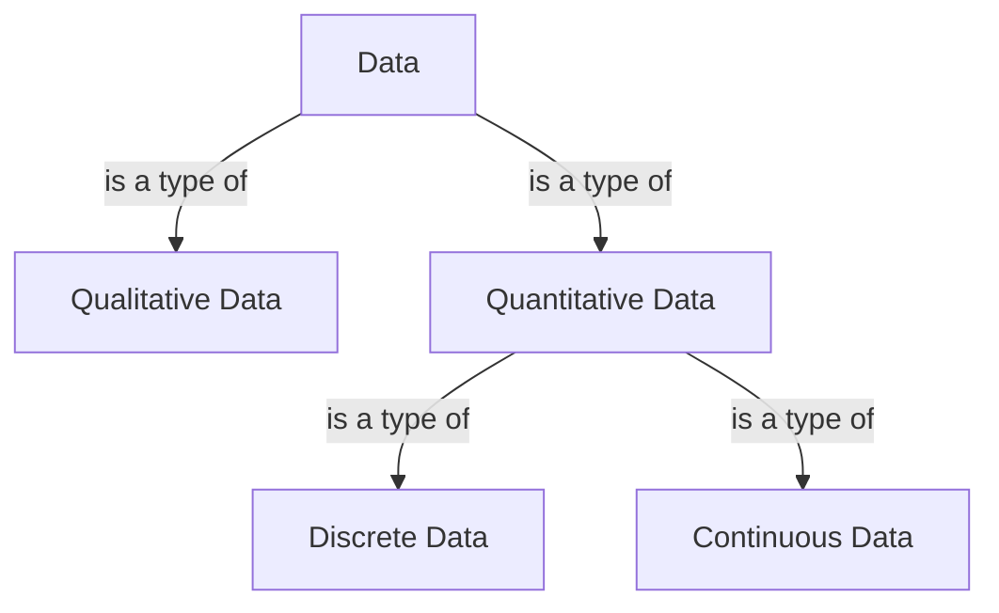
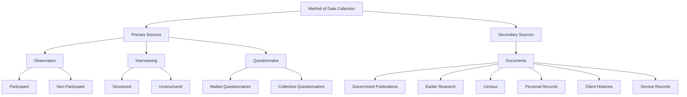

## CRISP-DM

> CRISP-DM (Cross-Industry Standard Process for Data Mining)

1. Business understanding
2. Data understanding
3. Data preparation
4. Modeling
5. Evaluation

### Business understanding

- Determine business objectives
- Assess situation
- Determine data mining goals
- Produce project plan

### Data understanding

- Collect initial data
- Describe data
- Explore data
- Verify data quality

### Data preperation

- Select data
- Clean data
- Consturct data
- Integrate data
- Format data

### Modeling

- Select modeling technique
- Generate test design
- Build model
- Assess model

### Evaluation

- Evaludate results
- Review process
- Determine next steps

### Deployment

- Plan development
- Plan monitoring & maintenance
- Produce final report
- Review project

## Instance & Attributes

- Instance: the terms associated with specific objects. Instances are described by a set of values for the features.
- Attributes: the collection of features of the object that are maintained in a dataset.
- Object: a collection of features about which measurements can be taken.
  - Car: fuel consumption, cylinders, horsepower...

## Qualitative & Quantitative data

- Qualitative data: **less structured**, **non-statistical**, **measured using other descriptors and identifiers**
  - white, heavy, wild...
- Quantitative data: **statistical**, **measured using hard numbers.**
  - 130cm, 400kg, 4 legs...

### Discrete & Continuous (Quantitative) data

- Discrete data: **fixed, round numbers**, **countable**
  - number of legs, count of aeroplane depatures, number of times a person commutes for a job in a week
- Continuous data: **measured over time intervals**
  - weight, solar irradiation, temperature of a room

### Summary

| Qualitative | Quantitiative (discrete) | Quantitiative (continuous) |
| --- | --- | --- |
| Title | Duration | Rating |
| Production Country | Release Year | |
| Director | | |
| Genres | | |
| Description | | |

## Categorizing attributees

| 항목 | **Nominal (categorical)** | **Ordinal** | **Interval**  | **Ratio** |
| --- | --- | --- | --- | --- |
| **정의** | 값이 라벨·이름 역할만 함. 순서 없음. | 값 사이에 순서 있음. 간격은 정의되지 않음. | 순서 + 고정·동일한 단위(간격). 절대 0 없음. | Interval 속성 + 절대적 0 있음. 차이와 비율 모두 의미 있음.  |
| **예시** | 머리카락 색 `{blonde, brown, ginger}` 우편번호 산업코드, 연구분야 코드 Blood type, License number | 키: `tall > average > short` 체중: `light < average < heavy` Star ratings, Tshirt sizes | 키(cm), 몸무게(kg) (원문 기준) 12시간제 시각(차이 비교) 시간 간격(5분\~10분) Waist size, Time | 나이(년) 소득(천 달러) 켈빈 온도 금액, 개수, 질량, 길이, 전류 Body weight, Medicine dosage |
| **예시** | 머리카락 색 `{blonde, brown, ginger}`, 우편번호, 산업코드/연구분야 코드, Blood type, License number | 키: `tall > average > short`, 체중: `light < average < heavy`, Star ratings, Tshirt sizes | 키(cm), 몸무게(kg) (원문 기준), 12시간제 시각(차이 비교), 시간 간격(5분\~10분), Waist size, Time | 나이(년), 소득(천 달러), 켈빈 온도, 금액, 개수, 질량, 길이, 전류, Body weight, Medicine dosage |
| **허용 비교** | `=, ≠` | `=, ≠, <, >` | `=, ≠, <, >, +, −` | `=, ≠, <, >, +, −, ×, ÷` |
| **연산 / 분석** | Mode(최빈값) Entropy(불확실성 측정) Contingency table(교차표) Correlation(Chi-squared test of independence) Chi-squared test | Median Percentiles Rank correlation(Spearman) Run tests(Mann–Whitney U, Wilcoxon) Sign tests | Mean Standard Deviation Pearson correlation T-test F-test(ANOVA) | Geometric Mean Harmonic Mean Percent variation(CV) |
| **설명** | 통계적 평균·표준편차 무의미 | 순위는 비교 가능하지만 간격·크기 비교 불가. 중앙값·순위기반 통계 적합. | 간격 일정 → +, − 가능. 절대 0 없음 → 비율 해석 불가. | 절대 0 → 모든 연산 가능. 비율·곱셈 해석 가능. |
| **변수 특징** | Named variables | Named & Ordered variables | Named & Ordered & Distance between variables | Named & Ordered & Distance between variables & Makes sense to multiply/divide |
| **Analysis Method** | Frequency | Frequency Median and percentiles | Frequency Median and percentiles Add or Subtract Mean, standard deviation, standard error of the mean | Frequency Median and percentiles Add or Subtract Mean, standard deviation, standard error of the mean Ratio |
| **데이터 유형** | Qualitative | Qualitative | Quantitative | Quantitative |

| Attribute Type | Description  | Examples  | Operations |
| --- | --- | --- | --- |
| **Nominal** | The values of a nominal attribute are just different names, i.e. nominal attributes provide only enough information to distinguish one object from another. (`=, ≠`) | post codes, employee ID numbers, eye colour, sex: `{ male, female }` | mode, entropy, contingency, correlation, chi squared test |
| **Ordinal** | The values of an ordinal attribute provide enough information to order objects. (`<, >`) | hardness of minerals, `{ good, better, best }`, grades, street numbers  | median, percentiles, rank correlation, run tests, sign tests |
| **Interval** | For interval attributes, the differences between values are meaningful, i.e. a unit of measurement exists. (`+, −`) | calendar dates, temperature in Celsius or Fahrenheit | mean, standard deviation, Pearson’s correlation, t and F tests |
| **Ratio** | For ratio variables both differences and ratios are meaningful. (`×, ÷`) | temperature in Kelvin, monetary quantities, counts, age, mass, length, electrical current | geometric mean, harmonic mean, percent variation |

## Structured & Unstructured Data

- Structured Data: which has an associated fixed data structure.
  - Relational table
  - Manageable
- Unstructured Data: which is expressed in natural language and no specific structure and domain types are defined.
  - Documents and sounds.
- Semi-structured Data: the format is not fixed and has some degree of flexibility.
  - XML, JSON
  - emails, text data, image, video and sound, zipped files, web pages.

## Curse of dimensionality

> The explosive nature of increasing data dimensions and its resulting exponential increase in computational efforts required for its processing and/or analysis.

- Characteristics of structured data
  - Dimensionality: Datasets with higher numbers of attributes have more dimensions, challenging to work with high dimensional data.
  - Sparsity: A dataset termed spare data or having the property of sparsity, which contains many zeros values for most of the attributes.
  - Resolution: The patterns depend on the scale or level of resolution.
- Real life data is usually in a lower dimensional manifold
  - many dimensions can be either ignored or the dimensionality can be reduced.
- Local smoothness: small changes in input values give small changes in output values.
  - Local interpolation to make predictions.

## Datasets

- Record Data
  - Data Matrix
  - Document data: a special type of data matrix where the attributes are of the same type and are asymmetric.
  - Transaction data: a special type of record data. Each record involves a set of items. Most often, the attributes are binary, indicating whether or not an item was purchased.
- Graph data
  - World wide web, Molecular structures (Simplified molecular-inputline-entry system, SMILES)
- Ordered data: sequence data, this is a sequence of individual entities, such as a sequence of words or letters.
  - Spatial data
  - Temporal data
  - Sequential data

## Data collection

### Quality

- Missing values: The data was not collected (e.g. age), or some attributes may not be applicable in all cases (e.g. annual income for children).
- Empty values: Unlike missing values, an empty value is the one that has no actual value, whereas a missing value has an actual value but it is missing somehow.
- Noise: The modification of actual values.
- Outlier: A single or very low frequency occurrence of a value of an attribute that is far from the bulk of attribute values.
- Duplicate data: The same data is recorded multiple times.
- Inconsistent formats: When the same set of data appears in multiple tables from different inputs.

## Data auditing

- attributes
- measured values
- comments
- attribute type
- operations we can do
- data type (knime/py)
- missing value
- any comments about qualities

| attributes | measured values | comments | attribute type | operations we can do | Data type (knime/python) | missing value | Any comments about qualities |
| --- | --- | --- | --- | --- | --- | --- | --- |
| fixed acidity | `[3.8, 15.9]` | continuous number | ratio | all arithmetic | float | N/A |  |
| volatile acidity | `[0.08, 1.58]` | continuous number | ratio | all arithmetic | float | N/A |  |
| citric acid | `[0, 1.66]` | continuous number | ratio | all arithmetic | float | N/A |  |
| residual sugar | `[0.6, 65.8]` | continuous number | ratio | all arithmetic | float | N/A |  |
| chlorides | `[0.009, 0.611]` | continuous number | ratio | all arithmetic | float | N/A |  |
| free sulfur dioxide | `[1, 289]` | continuous number | ratio | all arithmetic | int | N/A |  |
| total sulfur dioxide | `[6, 440]` | continuous number | ratio | all arithmetic | int | N/A |  |
| density | `[0.98711, 1.03898]` | continuous number | ratio | all arithmetic | float | N/A |  |
| pH | `[2.72, 4.01]` | continuous number | interval | order, arithmetic | float | N/A |  |
| sulphates | `[0.22, 2]` | continuous number | ratio | all arithmetic | float | N/A |  |
| alcohol | `[8, 14.9]` | continuous number | ratio | all arithmetic | float | N/A |  |
| quality | `[extremely dissatisfied, extremely satisfied, moderately dissatisfied, moderately satisfied, neutral, slightly dissatisfied, slightly satisfied]` | distributed | ordinal | order, counting | str | N/A |  |
| color | `[white, red]` | distributed | nominal | counting | str | N/A |  |
