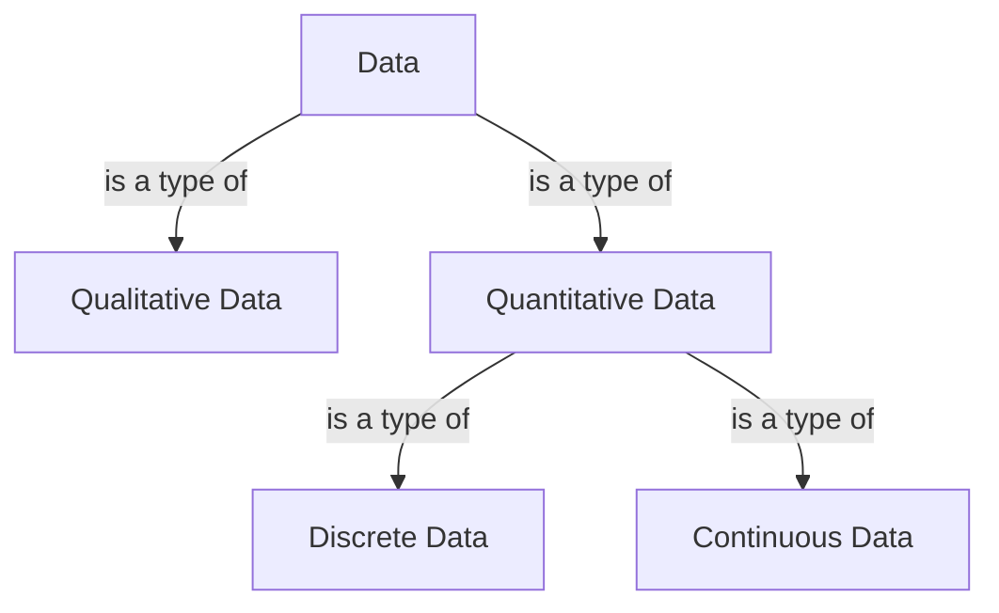

## CRISP-DM

> CRISP-DM (Cross-Industry Standard Process for Data Mining)

1. Business understanding
2. Data understanding
3. Data preparation
4. Modeling
5. Evaluation

### Business understanding

- Determine business objectives
- Assess situation
- Determine data mining goals
- Produce project plan

### Data understanding

- Collect initial data
- Describe data
- Explore data
- Verify data quality

### Data preperation

- Select data
- Clean data
- Consturct data
- Integrate data
- Format data

### Modeling

- Select modeling technique
- Generate test design
- Build model
- Assess model

### Evaluation

- Evaludate results
- Review process
- Determine next steps

### Deployment

- Plan development
- Plan monitoring & maintenance
- Produce final report
- Review project

## Instance & Attributes

- Instance: the terms associated with specific objects. Instances are described by a set of values for the features.
- Attributes: the collection of features of the object that are maintained in a dataset.
- Object: a collection of features about which measurements can be taken.
  - Car --> fuel consumption, cylinders, horsepower...

## Qualitative & Quantitative data

- Qualitative data: **less structured**, **non-statistical**, **measured using other descriptors and identifiers**
  - white, heavy, wild...
- Quantitative data: **statistical**, **measured using hard numbers.**
  - 130cm, 400kg, 4 legs...

### Discrete & Continuous (Quantitative) data

- Discrete data: **fixed, round numbers**, **countable**
  - number of legs, count of aeroplane depatures, number of times a person commutes for a job in a week
- Continuous data: **measured over time intervals**
  - weight, solar irradiation, temperature of a room

### Summary

| Qualitative | Quantitiative (discrete) | Quantitiative (continuous) |
| --- | --- | --- |
| Title | Duration | Rating |
| Production Country | Release Year | |
| Director | | |
| Genres | | |
| Description | | |
