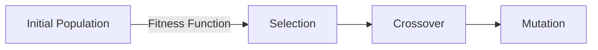
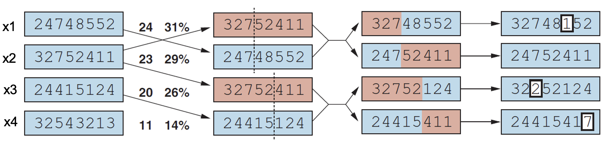
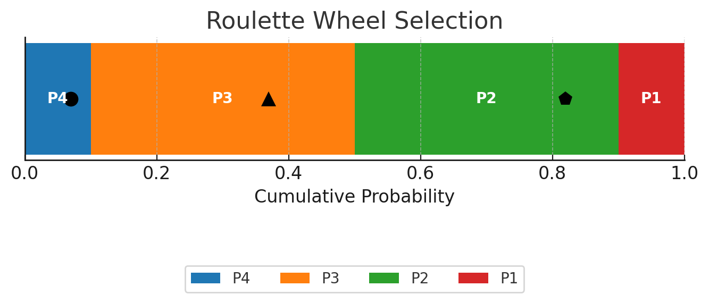

## Local Search Problem

> To find the state that gives the **optimal/best value** of the **evaluation function**

- It can be seen as an **optimization problem**.
- a computational problem that finds the best solution (a state) that satisfies the given constraints
- `evaluation function === objective function`
- Only cares about the optimal solution/best state without considering the paths to reach the best state (the optimal solution)
- Not systematic

### Feasible region & solution

- **Feasible region**: the set of all possible or candidate solutions which are the solutions that satisfies the problem's constraints
- **Feasible solution**: a solution in the feasible region

### Search Problem vs Local Search Problem

> Path-based vs State-based

| Aspects | Search Problem | Local Search Problem |
| --- | --- | --- |
| State | All possible states - state-space landscape | Range of decision variables and constraints |
| Goal | Goal state & goal test | Evaluation function & objective function |
| Evaluation | Measure closeness to goal - distance/fitness | Minimize cost or maximize fitness |
| Transition/Successor | Transition function | Successor function |

### Discrete & Continuous Optimization

- **Discrete optimization**: optimization problems where the solution space is discrete (e.g., 8 queens problem)
- **Continuous optimization**: optimization problems where the solution space is continuous (e.g., real numbers, any value within a range)

### Information needed for Local Search

- **All possible states**: state-space landscape
- **Transition function**: To find neighbor or successor state
- **Goal state**
- **Objective function**: A way to measure how close to the goal state
- **Start state**

### Search state-space

- **Global Maximum**: A state that maximizes the objective function over the entire state space
- **Local Maximum**: A state that maximizes the objective function within a small area around it.
- **Plateau**: A state such that the objective function is constant in an area around it.
  - **Shoulder**: A plateau that has uphill edge.
  - **Flat**: A plateau whose edges go downhill.

### Advantages

- use little memory
- can often find reasonably good solution in large or infinite search spaces
- useful for solving pure optimization problems
- don't need to know the path to the solution.

## Hill climbing

> keeps track of one current state and on each iteration moves to the neighboring state with highest value.

- $f = max(-cost(X))$
- Steps
  - Evaluate the initial stat
  - If it is equal to the goal state, return. Otherwise, continue.
  - Find a neighboring state
  - Evaluate this state. If it is closer to the goal state than before, replace the initial state with this state.
  - Repeat steps 2-4 until it reaches a goal state (local or global maximum) or runs out of time.
- No search tree, No backtracking, Don't look ahead beyond the current state.
  - get stuck due to local maxima, plateaus, or ridges.

### Variations of HC

- **Simple HC**: greedy local search which expands the current state and moves on to the best neighbor.
- **Stochastic HC**: choose randomly among the neighbors going uphill.
- **First-choice HC**: generate random successor until one is better. Good for states with high numbers of successors.
- **Random restart**: conducts a series of hill climbing searches from random initial states until a goal state is found.

## Simulated Annealing

> based upon the annealing process to model the search process for finding an optimal solution to an optimisation problem

- **annealing schedule**, **temperature**, **energy**
- finds the **minimal value** of the objective function (energy function)
- starts with a high temperature and then gradually reduces the temperature
- $P = e^{-\Delta E / kT}$
  - $\Delta E$: how bad the new state is compared to the old state
  - $T$: temperature is getting lower over time
  - $k$: a scaling factor
- Swap condition: $\Delta E <= 0$ or ${-\Delta E / kT} > \text{random}$

## Evolutionary algorithms

- Local beam search
- Stochastic beam search
- **Genetic algorithms**

### Characteristics

- size of the population
- representation of each individual
- mixing number
- selection process for selecting the individuals who will become the parents of the next generation
- recombination procedure
- mutation rate
- makeup of the next generation

### Genetic algorithm

> It uses operators, such reproduction, crossover and mutation, inspired by the natural evolutionary principles.

- **State**: is represented by an individual in a population. Traditional representation is a chromosome
- **Objective function**: is used to evaluate the fitness of an individual (= fitness function, 적합도 함수)
- **Successor function**: consists of three operators: reproduction, crossover, and mutation
- **Solution**: is found through evolution from one generation to another generation

### Roulette Wheel Selection

- **Compute total fitness** of all individuals.
  - Example: A=30, B=20, C=40, D=10 → Total = 100.
- **Calculate probability** of each individual being selected
  - Formula: $P(i) = \frac{fitness(i)}{total\_fitness}$
    - A = 30/100 = 0.30
    - B = 20/100 = 0.20
    - C = 40/100 = 0.40
    - D = 10/100 = 0.10
- **Convert to cumulative probabilities**
  - P4 = 0.10
  - P4 + P3 = 0.50
  - P4 + P3 + P2 = 0.90
  - P4 + P3 + P2 + P1 = 1.00
- **Generate a random number** between 0 and 1.
- Select an individual based on the random number and cumulative probabilities.

- ⚫ random = 0.07 → falls in P4 `[0, 0.10)`
- 🔺 random = 0.37 → falls in P3 `[0.10, 0.50)`
- ⬟ random = 0.82 → falls in P2 `[0.50, 0.90)`

### Applications of GA

- **Parameter tuning**: optimize the parameters in NN
- **Planning**: economic dispatch, train timetabling
- **Design & Control problems**: robotic control, adaptive control systems
- Successful use of GA requires careful engineering of the **representation**
