## Overview

> Most visual recognition studies rely heavily on crowdlabelled data in DNN

- Background development of visual recognition paradigms
- Foundations its architecture
- Datasets in VLM pre-training and evaluations
- Review and categorization of existing pre-training methods
- Benchmarking analysis discussion
- Reach challenges & potential research direction
- Training hard
  - New learning paradigm
- Vision-Language Model Pre-training and Zero-shot Prediction
  - Increasing attention
- VLMs with transfer learning
  - Prompt tuning
  - Visual adaption
- VLMs with knowledge distillation
  - distill knowledge from VLMs to downstream tasks

## The development of visual recognition paradigms

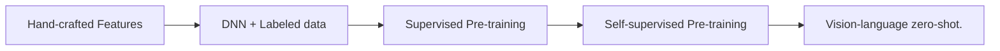

- Traditional ML: Hand-crafted features for prediction.
- Deep Learning: Deep networks (e.g., ResNet) with large-scale labeled data.
- Supervised Pre-training + Fine-tuning: Learned representations transferred to downstream tasks.
- Unsupervised / Self-supervised Pre-training + Fine-tuning: Objectives like masked modeling and contrastive learning to learn representations.
- Vision-Language Models & Zero-shot: Leverage large-scale web data, enabling zero-shot prediction without task-specific fine-tuning.
  - Collecting large-scale informative image-text data
  - Designing high-capacity models for effective learning from Bigdata.
  - Designing new pre-training objectives for learning effective VLMs.
  
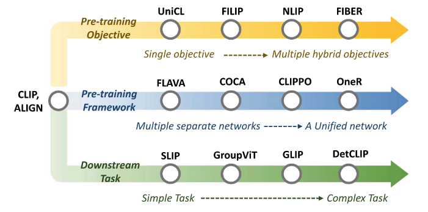

- CLIP: Image-text contrastive objective and learns by pulling the paired images and texts close and pushing others faraway in the embedding space.
  - enables effective usage of web data and allows zero-shot predictions without task-specific finetuning.

## VLM Overview

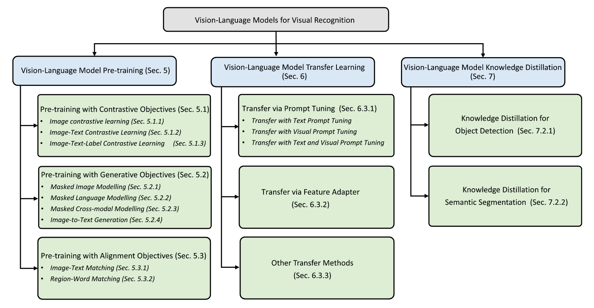

- Given Image-text pairs.
- Employs a text encoder and an image encoder to extract image and text features.
- Learns the vision-language correlation with certain pre-training objectives.
- GAP: Global Average Pooling, a technique used to reduce the spatial dimensions of feature maps while retaining important information.
- ViT: Vision Transformer: Transformers for image recognition at scale.
- CNN Based: VGG, **ResNet**, EfficientNet
  - ResNet: Adopts skip connections between convolutional blocks which mitigates gradient vanishing and explosion and enables DNN training.
  - ResNet-D: Replace global average pooling with transformer multi-head attention.
- Transformer Based: ViT
  - Adding a normalization layer before the transformer encoder.

## VLM pre-training Objectives

### Contrastive Objectives

- Pros
  - Enforce positive pairs to have similar embeddings in contrast to negative pairs.
  - Encourages VLMs to learn discriminative vision and language features, where more discriminative features lead to more confident and accurate zero-shot predictions.
- Cons
  - Joint optimizing positive and negative pairs is complicated and challenging.
  - Involves a heuristic temperature hyper-parameter for controlling the feature discriminability.

#### Image Contrastive Learning

- Forcing a query image to be close with its positive keys (its data augmentations)
- Faraway from its negative keys (other images)
- **Learn discriminative features** in image modality, which often serves as an auxiliary objective for fully exploiting the image data potential.

#### Image-Text Contrastive Learning

- Pulling the embeddings of paired images and texts close while pushing others away.
- Minimizing a symmetrical image-text infoNCE loss
- **Learn vision-language correlation** by contrasting image-text pairs.
  - CLIP: A symmetrical image-text infoNCE loss
  - ALIGN: scales up the VLM pre-training with large-scale (but noisy image-text pair with noise-robust contrastive learning)
  - DeCLIP: Nearest-neighbor supervision to utilize the information from similar pairs, enabling effective pre-training on limited data.
  - OTTER: Optimal transport to pseudo-pair images and texts reducing the required training data.
  - ZeroVL: Limited data resource via debiased data sampling and data augmentation with coin flipping mixup.
  - FILIP: Region-word alignment into contrastive learning, enabling to learn fine-grained vision-language corresponding knowledge.
  - Pyramid-CLIP: Multiple semantic levels and performs both cross-level and peer-level contrastive learning for effective VLM pre-training.
  - LA-CLIP, ALIP: LLM to augment synthetic captions for given images while RA-CLIP retrieves relevant image-text pairs for image-text pair augmentation.

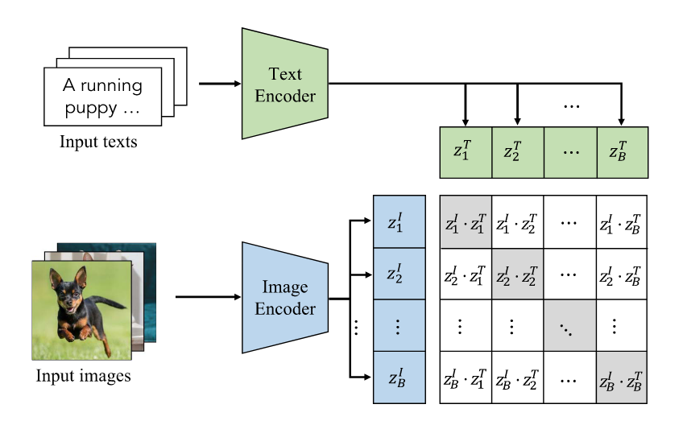

#### Image-Text-Label Contrastive Learning

- Supervised Contrastive Learning into image-text contrastive learning.
- **Learn discriminative and task-specific features** by exploiting both supervised labels and unsupervised image-text pairs.
  - UniCL: pre-training allows learning both discriminative and task-specific (image classification) features simultaneously with around 900M image-text pairs.

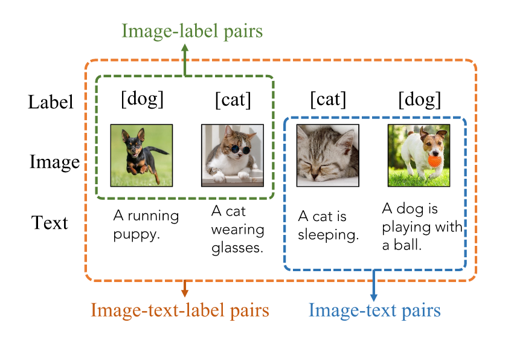

### Generative Objectives

- Encouraging VLMs to learn rich vision, language and vision-language contexts for better zero-shot predictions.
- Generally adopted as additional objectives above other VLM pre-training objectives for learning rich context information.

#### Masked Image Modelling

- Cross-patch correlation by masking and reconstructing images.
- **Learn image context information by masking and reconstructing images**
  - MAE, BeiT: certain patches in an image are masked and the encoder is trained to reconstruct them conditioned on unmasked patches.

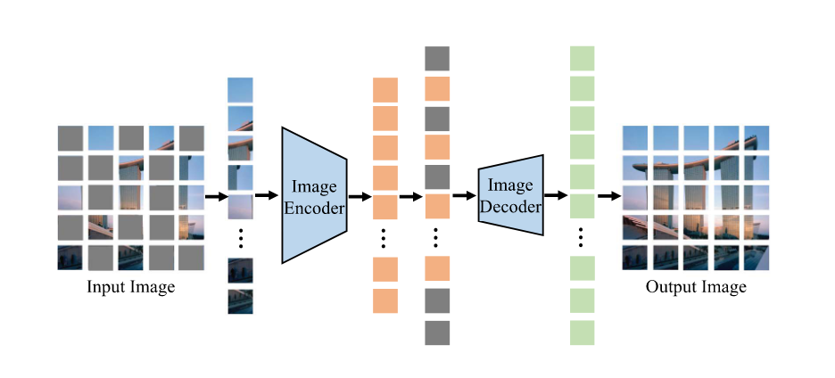

#### Masked Language Modelling

- Adopted pre-training objectives in NLP.
- Randomly masking a certain percentage of input tokens and predicting them. (15% in BERT)
- **Learn by masking a fraction of tokens** in each input text and training networks to predict the masked tokens.
  - FLAVA: masks out 15% text tokens and reconstructs them from the rest tokens for modelling cross-word correlation.
  - FIBER: adopts masked language modelling as one of the VLM pre-training objectives to extract better language features.

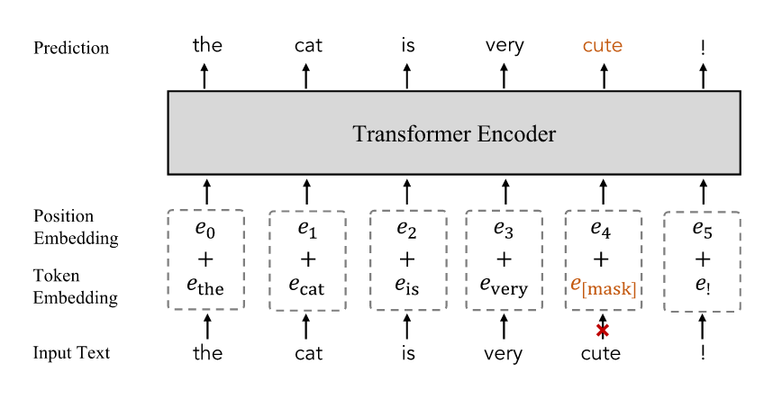

#### Masked Cross-Modal Modelling

- Integrates masked image modelling and masked language modelling.
- Given an image-text pair, it randomly masks a subset of image patches and a subset of text tokens and then learns to reconstruct them.
- **Learn by masking a certain percentage of image patches and text tokens** and training VLMs to reconstruct them based on the embeddings of unmasked image patches and text tokens.
  - FLAVA: 40% image patches and 15% text tokens as in, and employs a MLP to predict masked patched and tokens, capturing rich vision-language correspondence information.

#### Image-to-Text Generation

- **Generate descriptive texts for a given image** for capturing fine-grained vision-language correlation by training VLMs to predict tokenized texts.
  - COCA, NLP, PaLI: train VLMs with the standard encoder-decoder architecture and image captioning objectives.

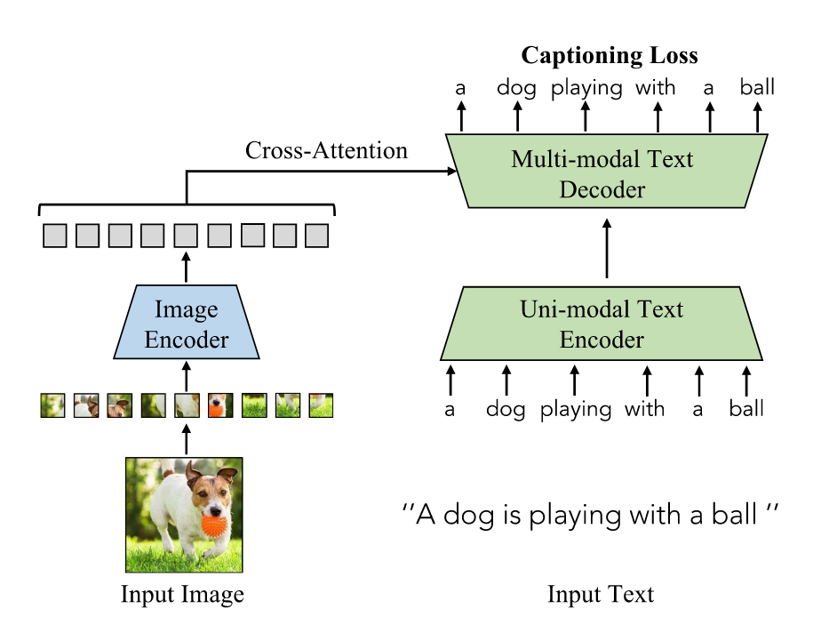

### Alignment Objectives

> Align image–text pairs in the embedding space.

- pros
  - simple, easy to optimize
  - can be easily extended to model fine-grained vision-language correlation
- cons
  - little correlation information within vision or language modality.
- adopted as auxiliary losses to other VLM pre-training objectives for enhancing modelling the correlation across vision and language modalities.

#### Image-Text Matching

- models the **overall correlation** between an entire image and an entire sentence. (전역적 상관관계)
- Image-text matching models global image-text correlation by directly aligning paired images and texts
  - FLAVA: matches the given image with its paired text via a classifier and a binary classification loss.
  - FIBER: follows to mine hard negatives with pair-wise similarities for better alignment between image and text.

#### Region-Word Matching

- captures **fine-grained correlations** between image regions and specific words. (지역적 상관관계)
- models local fine-grained vision-language correlation by aligning paired image regions and word tokens.
- benefiting **zero-shot dense predictions** in object detection and semantic segmentation.
  - GLIP, FIBER, DetCLIP: replace object classification logits by region-word alignment scores.
    - the dot-product similarity between regional visual features and token-wise features.

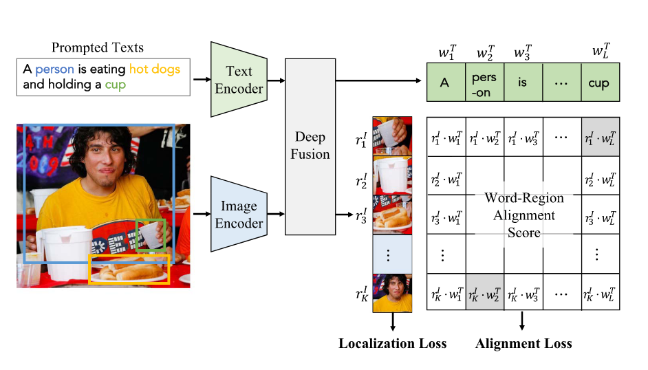

### VLM Pre-Training Frameworks

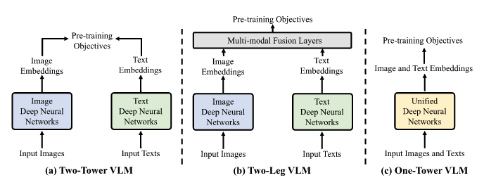

## Evaluation

### Zero-shot Prediction

- Image Classification: classify images into pre-defined categories like "prompt engineering".
- Semantic Segmentation: by comparing the embeddings of the given image pixels and texts.
- Object Detection: localize and classify objects in images with the object locating ability learned from auxiliary datasets.
- Image-Text Retrieval
  - Text-to-image retrieval that retrieves images based on texts
  - Image-to-text retrieval that retrieves texts based on images.

### Linear Probing

- freezes the pre-trained VLM
- trains a linear classifier to classify the VLM-encoded embeddings to assess the VLM representations.

## Datasets

- For Pre-training VLMs
  - CLIP, 2021, 400M, English
  - ALIGN, 2021, 1.8B, English
  - FILIP, 2021, 300M, English
  - WebLi, 2022, 12B, 129 Languages
- For VLM Evaluation
  - Image Classification
    - PSACAL VOC 2007 Classification, 11-point mAP
    - Oxford-IIIT PETS, Mean Per Class
    - EuroSAT, Accuracy
    - Hateful Memes, ROC AUC
    - Country211, Accuracy
  - Image-Text Retrieval
    - Flickr30k, Recall
    - COCO Caption, Recall
  - Action Recognition
    - UCF101, Accuracy
    - Kinetics700, Mean(top1, top5)
    - RareAct, mWAP, mSAP
  - Object Detection
    - COCO 2017 Detection, box mAP
    - LVIS, box mAP
    - ODinW, box mAP
  - Semantic Segmentation
    - Cityscapes, Mean IoU
    - ADE20K, Mean IoU

## VLM Transfer learning

> which adapts VLMs to fit downstream tasks via prompt tuning, feature adapter.

- image and text distributions gap: downstream dataset may have task-specific image styles and text formats
- training objectives gap: VLMs are generally trained with task-agnostic objectives, while downstream tasks often involve task-specific objectives. (coarse or fine-grained classification, region or pixel-level recognition)

### Transfer via Prompt Tuning

> Inspired by the "prompt learning" in NLP

- pros
  - simple, easy-to-implement
  - requires little extra network layer or complex network modifications
  - adapting VLMs in a black-box manner, which has clear advantages in transferring VLMs that involve concerns in intellectual property.
- cons
  - low flexibility by following the manifold (잠재 공간) of the original VLMs in prompting.

#### Transfer with Text Prompt Tuning

- Exploring more effective and efficient learnable text prompts with several labelled downstream samples for each class.
  - **supervised and few-shot supervised**
    - CoOp: Exploring context optimization to learn context words for a single class name with learnable word vectors.
    - CoCoOp: Exploring conditional context optimization that generates a specific prompt for each image.
    - SubPT: designs subspace prompt tuning to improve the generalization of learned prompts.
    - LASP: regularizes learnable prompts with hand-engineered prompts.
    - VPT: models text prompts with instance-specific distribution with better generalization on downstream tasks.
    - KgCoOp: enhances the generalization of unseen class by mitigating the forgetting of textual knowledge.
    - SoftCPT: fine-tunes VLMs on multiple few-shot tasks simultaneously for benefiting from multi-task learning.
    - PLOT: employs optimal transport to learn multiple prompts to describe the diverse characteristics of a category.
    - DualCoOp, TaI-DP: transport VLMs to multi-label classification tasks.
      - DualCoOp: adopts both positive and negative prompts for multi-label classification
      - TaI-DP: double-grained prompt tuning for capturing both coarse-grained and fine-grained embeddings.
    - DenseCLIP: explores language-guided fine-tuning that employs visual features to tune text prompts for dense prediction.
    - ProTeCt: improves the consistency of model predictions for hierarchical classification task.
  - **unsupervised**
    - UPL: optimizes learnable prompts with self-training on selected pseudo-labeled samples.
    - TPT: explores test-time prompt tuning to learn adaptive prompts from a single downstream sample.

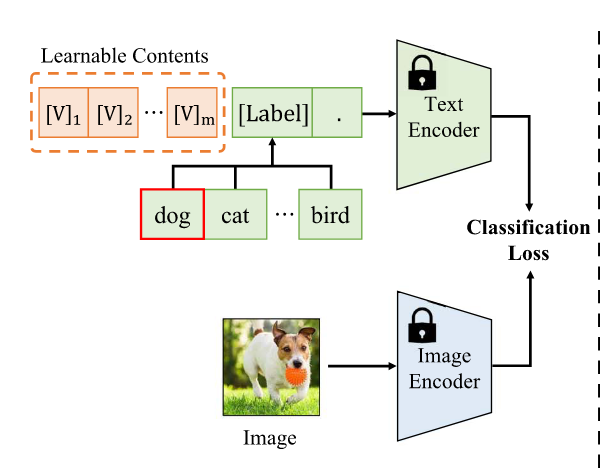

- `V` is learnable word vectors that are optimized by minimizing the classification loss with the downstream samples.

#### Transfer with Visual Prompt Tuning

- Transfers VLMs by modulating the input of image encoder.
  - VP: adopts learnable image perturbations $v$ to modify the input image $x^I$ by $x^I + v$, aiming to adjust $v$ to minimize a recognition loss.
  - RePrompt: integrates retrieval mechanisms into visual prompt tuning, allowing leveraging the knowledge from downstream tasks.
- enables pixel-level adaptation to downstream tasks, benefiting them greatly especially for dense prediction tasks.

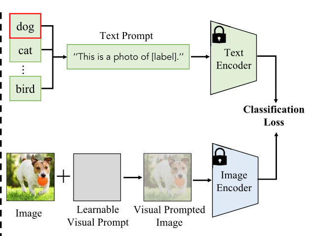

#### Transfer with Text-Visual Prompt Tuning

- modulate the text and image inputs simultaneously, benefiting from joint prompt optimization on multiple modalities.
  - UPT: unifies prompt tuning to jointly optimize text and image prompts, demonstrating the complementary nature of the two prompt tuning tasks.
  - MVLPT: explores multi-task vision-language prompt tuning to incorporate cross-task knowledge into text and image prompt tuning.
  - MAPLE: conducts multi-modal prompt tuning by aligning visual prompts with their corresponding language prompts, enabling a mutual promotion between text prompts and image prompts.
  - CAVPT: introduces a cross attention between class-aware visual prompts and text prompts, encouraging the visual prompts to concentrate more on visual concepts.

### Transfer via Feature Adaptation

- adapt image or text features with an additional light-weight feature adapter
  - Clip-Adapter: inserts several trainable linear layers after CLIP's language and image encoders and optimized them while keeping CLIP architecture and parameters frozen.
  - Tip-adapter: a training-free adapter that directly employs the embeddings of few-shot labelled images as the adapter weights.
  - SVL-Adapter: a self-supervised adapter which employs an additional encoder for self-supervised learning on input images.
- flexible and effective as its architecture and the insertion manner allow tailoring flexibly for different and complex downstream tasks.
- requires modifying network architecture and thus can not handle VLMs that have concerns in intellectual property.

### Other Transfer Methods

- Direct fine-tuning, architecture modification, cross attention
  - Wise-FT: combines the weights of a fine-tuned VLM and the original VLM for learning new information from downstream tasks.
  - MaskCLIP: extracts dense image features by modifying the architecture of the CLIP image encoder.
  - VT-CLIP: introduces visual-guided attention to semantically correlate text features with downstream images, leading to a better transfer performance.
  - CALIP: introduces parameter-free attention for effective interaction and communication between visual-guided text features.
  - TaskRes: directly tunes text-based classifier to exploit the old knowledge in the pre-trained VLM.
  - CuPL, VCD: employ large language models like GPT-3 to augment text prompts for learning rich discriminative text information.

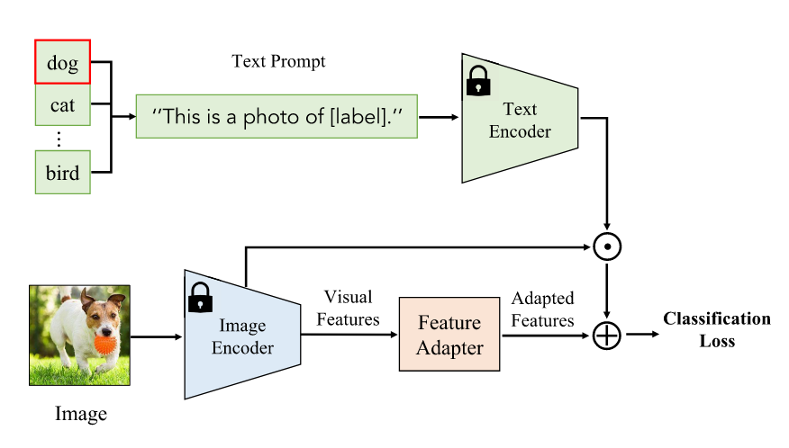

## VLM Knowledge Distillation

- distils general and robust VLM knowledge to task-specific models without the restriction of VLM architecture, benefiting task-specific designs while tackling various dense prediction tasks.
- most VLM knowledge distillation methods focus on transferring image-level knowledge to region- or pixel-level tasks such as object detection and semantic segmentation.

### Knowledge Distillation for Object Detection

- To distill VLM knowledge to enlarge the detector vocabulary
- To better align image-level and object-level representations
  - ViLD: distills VLM knowledge to a two-stage detector whose embedding space is enforced to be consistent with that of CLIP image encoder.
  - HierKD: hierarchical global-local knowledge distillation.
  - RKD: region-based knowledge distillation for better aligning region-level and image-level embeddings.
  - ZSD-YOLO: self-labeling data augmentation for exploiting CLIP for better object detection.
  - OADP: proposal features while transferring contextual knowledge.
  - BARON: uses neighborhood sampling to distill a bag of regions instead of individual regions.
  - RO-ViT: distills information from VLMs for open-vocabulary detection.
- VLM distillation via prompt learning
  - DetPro: a detection prompt technique for learning continuous prompt representations for open-vocabulary object detection.
  - PrompDet: regional prompt learning for aligning word embeddings with regional image embeddings.
  - PB-OVD: trains object detectors with VLM-predicted pseudo bounding boxes.
  - XPM: a robust cross-modal pseudo-labeling strategy that employs VLM-generated pseudo masks for open-vocabulary instance segmentation.
  - P3OVD: prompt-driven self-training that refines the VLM-generated pseudo labels with fine-grained prompt tuning.

### Knowledge Distillation for Semantic Segmentation

- Leverage VLMs to enlarge the vocabulary of segmentation models, aim to segment pixels described by arbitrary texts. (i.e., any categories of pixels beyond base classes)
- Tackling the mismatch between image-level and pixel-level representations.
  - CLIPSeg: a lightweight transformer decoder to extend CLIP for semantic segmentation.
  - LSeg: maximizes the correlation between CLIP text embeddings and pixel-wise image embedding encoded by segmentation models.
  - ZegCLIP: employs CLIP to generate semantic masks and introduces a relationship descriptor to mitigate overfitting on base classes.
  - MaskCLIP+, SSIW: distill knowledge with VLM-predicted pixel-level pseudo labels.
  - FreeSeg: generates mask proposals first and then performs zero-shot classification for them.

#### Knowledge distillation for weakly-supervised semantic segmentation

- Leverage both VLMs and weak supervision (e.g., image-level labels) for semantic segmentation.
- CLIP-ES: employs CLIP to refine the class activation map by designing a softmax function and a class-aware attention-based affinity module for mitigating the category confusion issue.
- CLIMS: employs CLIP knowledge to generate high-quality class activation maps for better weakly-supervised semantic segmentation.

## Performance

- VLM is largely attributed to three factors: Big data, Big Model, and Task-agnostic learning.
- Limitations
  - When data/model size keeps increasing, the performance saturates and further scaling up won’t improve performance
  - Adopting large-scale data in VLM pre-training necessitates extensive computation resources
  - Adopting large models introduces excessive computation and memory overheads in both training and inference
- Transfer Learning
  - can mitigate the domain gaps by learning from task-specific data, being labelled or unlabelled.
  - Supervised `>` few-shot supervised `=` unsupervised transfer (overfitting but challenging)
- Knowledge Distillation
  - brings clear performance improvement on detection and segmentation tasks
  - introduces general and robust VLM knowledge while benefiting from task-specific designs
- the development of VLM pre-training for dense visual recognition tasks (on region or pixel-level detection and segmentation) lag far behind.
- require certain norms in term of training data, networks and downstream tasks.
  - VLM transfer: release their codes and do not require intensive computation resources, easing reproduction and benchmarking.
  - VLM pre-training: studied with different data and networks, making benchmarking a very challenging task. also use non-public training data, or require intensive computation resources.
  - VLM knowledge distillation: adopt different task-specific backbones, which complicates benchmarking.

## Challenges

- VLM pre-training
  - **Fine-grained vision-language correlation modelling**: can better recognize patches and pixels beyond images, greatly benefiting dense prediction tasks
  - **Unification of vision and language learning**: enables efficient communications across data modalities which can benefit both training effectiveness and training efficiency.
  - **Pre-training VLMs with multiple languages**: could introduce bias in term of cultures and regions and hinder VLM applications in other language areas.
  - **Data-efficient VLMs**: instead of merely learning from each image-text pair, more useful information could be learned with the supervision among image-text pairs.
  - **Pre-training VLMs with LLMs**: employ LLMs to augment the texts in the raw image-text pairs, which provides richer language knowledge and helps better learn vision-language correlation.
- VLM Transfer Learning
  - **Unsupervised VLM transfer**: much lower risk of overfitting than few-shot supervised transfer.
  - **VLM transfer with visual prompt/adapter**: Existing studies focus on text prompt learning. Visual prompt learning or visual adapter, which is complementary to text prompting and can enable pixel-level adaptation in various dense prediction tasks.
  - **Test-time VLM transfer**: Existing studies conduct transfer by fine-tuning VLMs on each downstream task (i.e., prompt learning), leading to repetitive efforts while facing many downstream tasks. Adapting prompts on the fly during inference can circumvent the repetitive training in existing VLM transfer.
  - **VLM transfer with LLMs**: Different from prompt engineering and prompt learning, exploit LLMs to generate text prompts that better describe downstream tasks. This approach is automatic and requires little labelled data.
- VLM knowledge distillation
  - **Knowledge distillation from multiple VLMs**: harvest their synergistic effect by coordinating knowledge distillation from multiple VLMs.
  - **Knowledge distillation for other visual recognition tasks**: leverage the knowledge distilled from VLMs to improve performance on other visual recognition tasks. (instance segmentation, panoptic segmentation, person reidentification)

## Ref

- Zhang, J., Huang, J., Jin, S., & Lu, S. (2024). Vision-Language Models for Vision Tasks: A Survey. IEEE Transactions on Pattern Analysis and Machine Intelligence, 46(8), 5625–5644. `<https://doi.org/10.1109/TPAMI.2024.3369699>`
