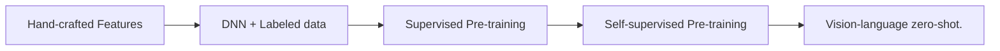

## Overview

> Most visual recognition studies rely heavily on crowdlabelled data in DNN

- Background development of visual recognition paradigms
- Foundations its architecture
- Datasets in VLM pre-training and evaluations
- Review and categorization of existing pre-training methods
- Benchmarking analysis discussion
- Reach challenges & potential research direction
- Training hard
  - New learning paradigm
- Vision-Language Model Pre-training and Zero-shot Prediction
  - Increasing attention
- VLMs with transfer learning
  - Prompt tuning
  - Visual adaption
- VLMs with knowledge distillation
  - distill knowledge from VLMs to downstream tasks

## The development of visual recognition paradigms

- Traditional ML: Hand-crafted features for prediction.
- Deep Learning: Deep networks (e.g., ResNet) with large-scale labeled data.
- Supervised Pre-training + Fine-tuning: Learned representations transferred to downstream tasks.
- Unsupervised / Self-supervised Pre-training + Fine-tuning: Objectives like masked modeling and contrastive learning to learn representations.
- Vision-Language Models & Zero-shot: Leverage large-scale web data, enabling zero-shot prediction without task-specific fine-tuning.
  - Collecting large-scale informative image-text data
  - Designing high-capacity models for effective learning from Bigdata.
  - Designing new pre-training objectives for learning effective VLMs.
  

- CLIP: Image-text contrastive objective and learns by pulling the paired images and texts close and pushing others faraway in the embedding space.
  - enables effective usage of web data and allows zero-shot predictions without task-specific finetuning.

## VLM Overview

- Given Image-text pairs.
- Employs a text encoder and an image encoder to extract image and text features.
- Learns the vision-language correlation with certain pre-training objectives.
- GAP: Global Average Pooling, a technique used to reduce the spatial dimensions of feature maps while retaining important information.
- ViT: Vision Transformer: Transformers for image recognition at scale.
- CNN Based: VGG, **ResNet**, EfficientNet
  - ResNet: Adopts skip connections between convolutional blocks which mitigates gradient vanishing and explosion and enables DNN training.
  - ResNet-D: Replace global average pooling with transformer multi-head attention.
- Transformer Based: ViT
  - Adding a normalization layer before the transformer encoder.

## VLM pre-training Objectives

### Contrastive Objectives

- Pros
  - Enforce positive pairs to have similar embeddings in contrast to negative pairs.
  - Encourages VLMs to learn discriminative vision and language features, where more discriminative features lead to more confident and accurate zero-shot predictions.
- Cons
  - Joint optimizing positive and negative pairs is complicated and challenging.
  - Involves a heuristic temperature hyper-parameter for controlling the feature discriminability.

#### Image Contrastive Learning

- Forcing a query image to be close with its positive keys (its data augmentations)
- Faraway from its negative keys (other images)
- **Learn discriminative features** in image modality, which often serves as an auxiliary objective for fully exploiting the image data potential.

#### Image-Text Contrastive Learning

- Pulling the embeddings of paired images and texts close while pushing others away.
- Minimizing a symmetrical image-text infoNCE loss
- **Learn vision-language correlation** by contrasting image-text pairs.
  - CLIP: A symmetrical image-text infoNCE loss
  - ALIGN: scales up the VLM pre-training with large-scale (but noisy image-text pair with noise-robust contrastive learning)
  - DeCLIP: Nearest-neighbor supervision to utilize the information from similar pairs, enabling effective pre-training on limited data.
  - OTTER: Optimal transport to pseudo-pair images and texts reducing the required training data.
  - ZeroVL: Limited data resource via debiased data sampling and data augmentation with coin flipping mixup.
  - FILIP: Region-word alignment into contrastive learning, enabling to learn fine-grained vision-language corresponding knowledge.
  - Pyramid-CLIP: Multiple semantic levels and performs both cross-level and peer-level contrastive learning for effective VLM pre-training.
  - LA-CLIP, ALIP: LLM to augment synthetic captions for given images while RA-CLIP retrieves relevant image-text pairs for image-text pair augmentation.

#### Image-Text-Label Contrastive Learning

- Supervised Contrastive Learning into image-text contrastive learning.
- **Learn discriminative and task-specific features** by exploiting both supervised labels and unsupervised image-text pairs.
  - UniCL: pre-training allows learning both discriminative and task-specific (image classification) features simultaneously with around 900M image-text pairs.

### Generative Objectives

- Masked Image Modelling
  - Cross-patch correlation by masking and reconstructing images.
- Masked Language Modelling
  - Adopted pre-training objectives in NLP.
  - Randomly masking a certain percentage of input tokens and predicting them. (15% in BERT)
- Masked Cross-Modal Modelling
  - Integrates masked image modelling and masked language modelling.
  - Given an image-text pair, it randomly masks a subset of image patches and a subset of text tokens and then learns to reconstruct them.

### Alignment Objectives

> Align image–text pairs in the embedding space.

- Image-Text Matching
  - models the **overall correlation** between an entire image and an entire sentence. (전역적 상관관계)
- captures **fine-grained correlations** between image regions and specific words. (지역적 상관관계)

### VLM Pre-Training Frameworks

## Evaluation

### Zero-shot Prediction

- Image Classification: classify images into pre-defined categories like "prompt engineering".
- Semantic Segmentation: by comparing the embeddings of the given image pixels and texts.
- Object Detection: localize and classify objects in images with the object locating ability learned from auxiliary datasets.
- Image-Text Retrieval
  - Text-to-image retrieval that retrieves images based on texts
  - Image-to-text retrieval that retrieves texts based on images.

### Linear Probing

- freezes the pre-trained VLM
- trains a linear classifier to classify the VLM-encoded embeddings to assess the VLM representations.

## Datasets

- For Pre-training VLMs
  - CLIP, 2021, 400M, English
  - ALIGN, 2021, 1.8B, English
  - FILIP, 2021, 300M, English
  - WebLi, 2022, 12B, 129 Languages
- For VLM Evaluation
  - Image Classification
    - PSACAL VOC 2007 Classification, 11-point mAP
    - Oxford-IIIT PETS, Mean Per Class
    - EuroSAT, Accuracy
    - Hateful Memes, ROC AUC
    - Country211, Accuracy
  - Image-Text Retrieval
    - Flickr30k, Recall
    - COCO Caption, Recall
  - Action Recognition
    - UCF101, Accuracy
    - Kinetics700, Mean(top1, top5)
    - RareAct, mWAP, mSAP
  - Object Detection
    - COCO 2017 Detection, box mAP
    - LVIS, box mAP
    - ODinW, box mAP
  - Semantic Segmentation
    - Cityscapes, Mean IoU
    - ADE20K, Mean IoU

## Ref

- Zhang, J., Huang, J., Jin, S., & Lu, S. (2024). Vision-Language Models for Vision Tasks: A Survey. IEEE Transactions on Pattern Analysis and Machine Intelligence, 46(8), 5625–5644. `<https://doi.org/10.1109/TPAMI.2024.3369699>`
