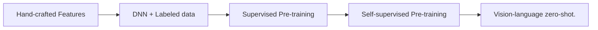

## Overview

> Most visual recognition studies rely heavily on crowdlabelled data in DNN

- Background development of visual recognition paradigms
- Foundations its architecture
- Datasets in VLM pre-training and evaluations
- Review and categorization of existing pre-training methods
- Benchmarking analysis discussion
- Reach challenges & potential research direction
- Training hard
  - New learning paradigm
- Vision-Language Model Pre-training and Zero-shot Prediction
  - Increasing attention
- VLMs with transfer learning
  - Prompt tuning
  - Visual adaption
- VLMs with knowledge distillation
  - distill knowledge from VLMs to downstream tasks

## The development of visual recognition paradigms

- Traditional ML: Hand-crafted features for prediction.
- Deep Learning: Deep networks (e.g., ResNet) with large-scale labeled data.
- Supervised Pre-training + Fine-tuning: Learned representations transferred to downstream tasks.
- Unsupervised / Self-supervised Pre-training + Fine-tuning: Objectives like masked modeling and contrastive learning to learn representations.
- Vision-Language Models & Zero-shot: Leverage large-scale web data, enabling zero-shot prediction without task-specific fine-tuning.
  - Collecting large-scale informative image-text data
  - Designing high-capacity models for effective learning from Bigdata.
  - Designing new pre-training objectives for learning effective VLMs.
  

- CLIP: Image-text contrastive objective and learns by pulling the paired images and texts close and pushing others faraway in the embedding space.
  - enables effective usage of web data and allows zero-shot predictions without task-specific finetuning.

## VLM Overview

- Given Image-text pairs.
- Employs a text encoder and an image encoder to extract image and text features.
- Learns the vision-language correlation with certain pre-training objectives.
- GAP: Global Average Pooling, a technique used to reduce the spatial dimensions of feature maps while retaining important information.
- ViT: Vision Transformer: Transformers for image recognition at scale.
- CNN Based: VGG, **ResNet**, EfficientNet
  - ResNet: Adopts skip connections between convolutional blocks which mitigates gradient vanishing and explosion and enables DNN training.
  - ResNet-D: Replace global average pooling with transformer multi-head attention.
- Transformer Based: ViT
  - Adding a normalization layer before the transformer encoder.

## VLM pre-training Objectives

### Contrastive Objectives

- Image Contrastive Learning
  - Forcing a query image to be close with its positive keys (its data augmentations)
  - Faraway from its negative keys (other images)
- Image-Text Contrastive Learning
  - Pulling the embeddings of paired images and texts close while pushing others away.
  - Minimizing a symmetrical image-text infoNCE loss
- Image-Text-Label Contrastive Learning
  - Supervised Contrastive Learning into image-text contrastive learning.

### Generative Objectives

- Masked Image Modelling
  - Cross-patch correlation by masking and reconstructing images.
- Masked Language Modelling
  - Adopted pre-training objectives in NLP.
  - Randomly masking a certain percentage of input tokens and predicting them. (15% in BERT)
- Masked Cross-Modal Modelling
  - Integrates masked image modelling and masked language modelling.
  - Given an image-text pair, it randomly masks a subset of image patches and a subset of text tokens and then learns to reconstruct them.

### Alignment Objectives

> Align image–text pairs in the embedding space.

- Image-Text Matching
  - models the **overall correlation** between an entire image and an entire sentence. (전역적 상관관계)
- captures **fine-grained correlations** between image regions and specific words. (지역적 상관관계)

### VLM Pre-Training Frameworks

## Evaluation

### Zero-shot Prediction

- Image Classification: classify images into pre-defined categories like "prompt engineering".
- Semantic Segmentation: by comparing the embeddings of the given image pixels and texts.
- Object Detection: localize and classify objects in images with the object locating ability learned from auxiliary datasets.
- Image-Text Retrieval
  - Text-to-image retrieval that retrieves images based on texts
  - Image-to-text retrieval that retrieves texts based on images.

### Linear Probing

- freezes the pre-trained VLM
- trains a linear classifier to classify the VLM-encoded embeddings to assess the VLM representations.

## Ref

- Zhang, J., Huang, J., Jin, S., & Lu, S. (2024). Vision-Language Models for Vision Tasks: A Survey. IEEE Transactions on Pattern Analysis and Machine Intelligence, 46(8), 5625–5644. <https://doi.org/10.1109/TPAMI.2024.3369699>
