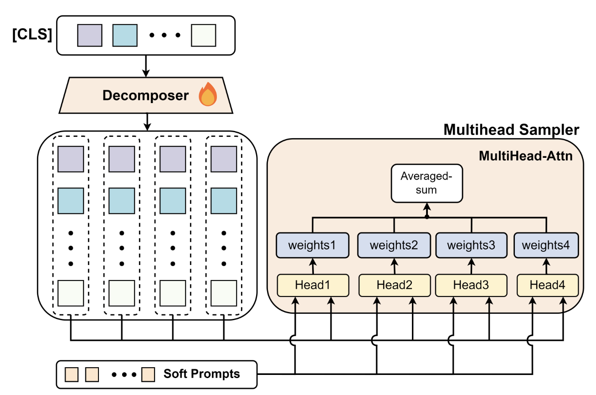
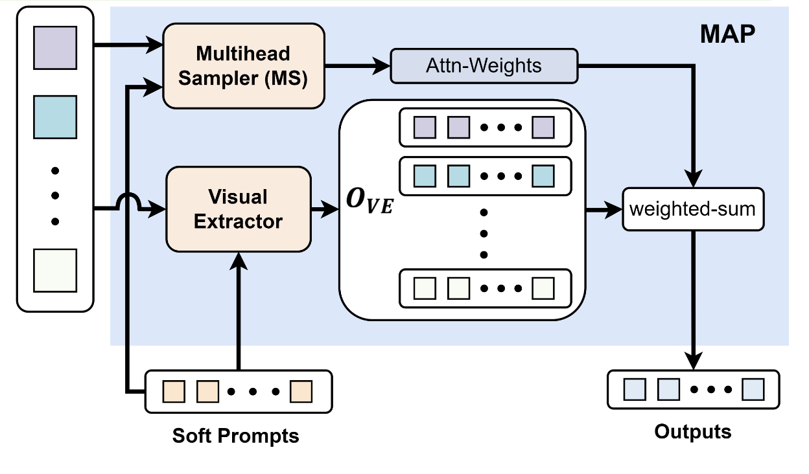

## Overview

- Introduces a **HoOA benchmark** that isolates hallucinations on **object attributes** (color, shape) from existence/relationship errors.
- Proposes **MIAVLM**: leverages **multiview images** (generated from a single image’s 3D representation) and a **Multiview Attributes Perceiver (MAP)** to make fusion **order-invariant**.
- Adds **negative instructions** during tuning to counter LVLMs’ tendency to answer "Yes".
- Results: best HoOA metric (**0.775 / 0.787**) with **fastest inference** (**0.071 / 0.105 s**). "9in1" tiling is ineffective; separate multiview inputs help.
- Training: LM loss, Adam (lr=0.001), cosine annealing, 20 epochs, single NVIDIA 3090.

## Hallucinations on Object Attributes (HoOA)

### Issues

- HoOA = incorrect attribute descriptions for existing objects (distinct from HoOE/HoOR).
- Root causes analyzed:
  - **Single-view insufficiency**: fine-grained details can be invisible from a single viewpoint.
  - **Instruction bias**: overexposure to positive/affirmative patterns → "Yes" bias.
  - **Order sensitivity**: multi-image inputs change predictions when view order changes.

### Mitigation Methods (this paper)

- **Multiview prompts**: sample views from a single image’s 3D reconstruction to recover missed details.
- **MAP (order-invariant fusion)**: learn view weights and fuse per-view features via **weighted sum**; input order has no effect; supports any number of views.
- **Negative instructions**: incorporate "No"-answerable questions in tuning to suppress "Yes" bias.

## Benchmark (HoOA)

### Construction

- Based on **CelebAText-HQ**; manual attribute descriptions rewritten into **Yes/No** questions.
  - **Positive questions** → correct answer "Yes".
  - **Negative questions** → attribute flipped/opposite → correct answer "No" (to expose "Yes" bias).
- Scale: 1,430 images, 14,291 positive + 14,291 negative questions.
- Split: **9:1** train:test.
- **Metric**: average of accuracy on positive and negative questions (balanced HoOA score).

## Model: MIAVLM

### Visual Extractor (VE)

- 6 stacked Transformer **decoder** blocks.
- **Soft prompts $P \in \mathbb{R}^{l \times d}$** are **queries**; **image embeddings $e_i$** are **keys/values**.
- Per-view cross-attention computed **in parallel** (no autoregressive chaining; no assumed order).
- Per-view output:
  $$
  o_i = \mathrm{softmax}\!\left(\frac{(P W_Q)(e_i W_K)^\top}{\sqrt{d}}\right) e_i W_V,\quad O_{VE}=\{o_1,\dots,o_n\}.
  $$

### Multihead Sampler (MS)

- Learns **view weights** for fusion.
- **Decomposer (2-layer MLP)** maps each view’s $[CLS]$ to **$m=4$** tokens $\{e_i^{1},\dots,e_i^{m}\}$.
- For each token/head $j$: compute attention scores vs. $P$ → mean over prompt tokens → $\mathrm{weights}^j \in \mathbb{R}^n$.
- Average across heads:
  $$
  w_{MS} = \tfrac{1}{m}\sum_{j=1}^{m}\mathrm{weights}^j \in \mathbb{R}^n.
  $$

### MAP (Multiview Attributes Perceiver)

- **Order-invariant weighted fusion**:
  $$
  \text{Output}=\sum_{i=1}^{n} w_i\,o_i.
  $$
- Properties: supports **any number of views**; **permutation-invariant** to input order.
- By learning weights for each view, MAP highlights informative perspectives and suppresses less useful ones, ensuring consistent predictions even when the view order changes. This directly addresses the input-order sensitivity observed in baselines such as OpenFlamingo.

## Benchmarks

### Baselines & Input Modes

- Baselines: **BLIP3**, **OpenFlamingo (4 variants)**, **OPERA**, **Idefics2**, **LLaVA-UHD**.
- Two input modes:
  1) **Original image only**.
  2) **Original + 8 generated views**.
     - Models that accept only one image use **9in1** tiling (nine images stitched into one).

### Main Results

- **MIAVLM**:
  - **HoOA metric:** **0.775 / 0.787** (modes 1 / 2)
  - **Positive accuracy:** 0.752 / 0.762
  - **Negative accuracy:** 0.797 / 0.812
  - **Inference time:** **0.071 / 0.105 s** (fastest)
- **9in1** tiling **did not improve** results (likely harder to interpret).
- **Nine separate multiview images** generally **improved** performance.

### Ablations

- **Negative instructions:** boost **negative-question** accuracy but slightly reduce **positive-question** accuracy; overall HoOA **increases** (approx. **0.665 → 0.787**).
- **Input-order sensitivity:**
  - MIAVLM is **order-invariant**
  - OpenFlamingos accuracy varies when shuffling view order.

## Limitations & Notes

- Trade-off from negative instructions (negatives ↑, positives ↓).
- Effectiveness depends on the quality of **generated views**.

## Insights

- This approach seems especially suitable for perception, where multiple scene views may arrive in arbitrary order, ensuring consistent attribute recognition.

## Ref

- Tan, Z., Li, Y., Meng, S., Yuan, X., Li, W., Mo, T., Wang, B., & Chu, X. (2025). Mitigating Hallucinations on Object Attributes using Multiview Images and Negative Instructions. ICASSP 2025 - 2025 IEEE International Conference on Acoustics, Speech and Signal Processing (ICASSP), 1–5. <https://doi.org/10.1109/ICASSP49660.2025.10888481>
