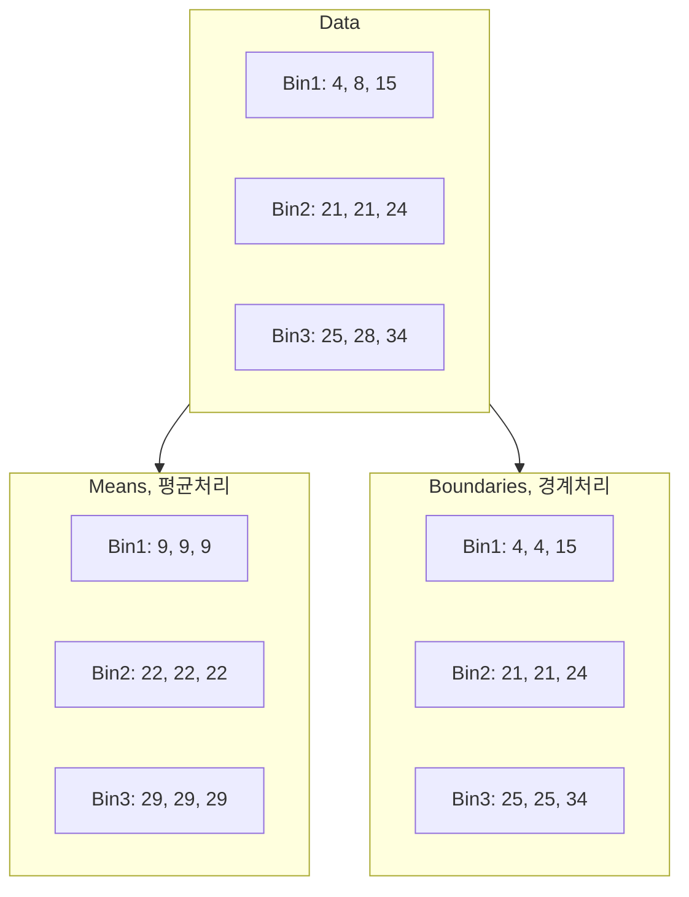
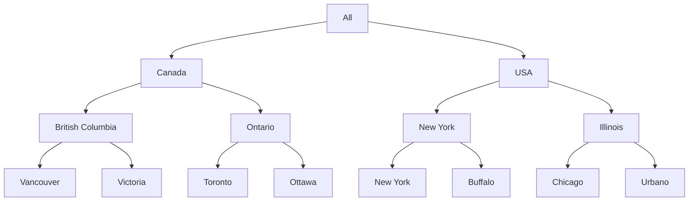
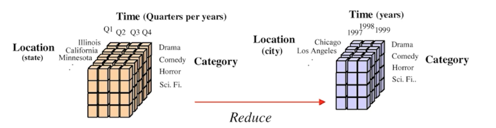
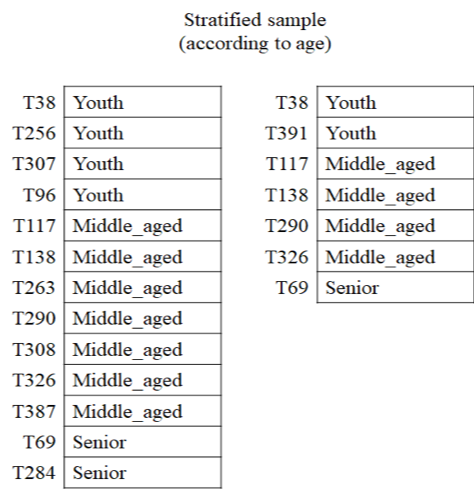

## Data Preparation

- In real world applications, data can be inconsistent, incomplete, and noisy.
- Data Collection problems: when data is collected incorrectly
- Incomplete Data: when information is missing
- Data entry problems: when data is entered incorrectly
- Contradictions in data: when the data says something in one place, and then says a different thing elsewhere in the dataset. We can think of this data as noisy.
- Discrepancy in naming conventions: when data descriptions are unclear, people may misinterpret their meaning.
- Duplicated records: when integrating data from different sources, the same data may get entered multiple times.
- Data transmission problems: when data is sent between different people or databases or companies, things can get lost in the process.

### Data mining tasks

- Classification
- Estimation
- Prediction
- Characterisation
- Discrimination
- Affinity grouping
- Clustering
- Time series analysis

## Data Cleaning

- Missing data
  - **Ignore the record**
  - **Fill the missing value manually**
  - **Fill missing values with calculated values**
    - The missing values can be filled using the average value for a particular attribute
    - or by using attribute mean for all samples belonging to the same class as the given record.
    - also be filled using methods such as Bayesian classification or decision trees to automatically infer the values.
- Noisy data: a meaningless variation that cannot be interpreted properly by machines
  - **Binning**
    - binning methods use the neighbour's data, this is referred to as local smoothing
    - can replace all data in a segment by its mean or boundary values
  - **Clustering**
    - grouping of data points according to a distance measure
    - use a clustering algorithm to classify each data point into a specific group
    - can detect outliers
  - **Regression**
    - a data mining function that deals with the prediction of a continuous value rather than a class
    - maps data values to a function
    - Using regression to fit data by finding a mathematical equation may be used to smooth noisy data.

### Binning

| Price | Equi-width | Equi-depth |
| --- | --- | --- |
| 7 | `[0, 10]` | `[7, 20]`|
| 20 | `[11, 20]` | `[7, 20]`|
| 22 | `[21, 30]` | `[22, 50]`|
| 50 | `[41, 50]`| `[22, 50]`|
| 51 | `[51, 60]`| `[51, 53]`|
| 53 | `[51, 60]` | `[51, 53]`|

- **Equi-width**: Bins have equal width.
- **Equi-depth**: Bins have the same number of values in them or almost the same number if they don't divide equally.

#### Equi-width binning

> Equal-interval binning, split the whole range of numbers into intervals with equal size.

- Price: **4, 8, 9, 15, 21, 21, 22, 26, 27, 28, 29, 36**
- Equal-width binning
  - Bin1 **[4, 12]**: 4, 8, 9
  - Bin2 **(12, 20]**: 15
  - Bin3 **(20, 28]**: 21, 21, 22, 26, 27, 28
  - Bin4 **(28, 36]**: 29, 36
- Smoothing by bin means
  - Bin1: 7, 7, 7
  - Bin2: 15
  - Bin3: 24, 24, 24, 24, 24, 24
  - Bin4: 33, 33
- Smoothing by bin boundaries
  - Bin1: 4, **9, 9**
  - Bin2: 15
  - Bin3: **21, 21, 21**, **28, 28, 28**
  - Bin4: 29, 36

#### Equi-depth binning

> Equal-frequency binning, use intervals containing an equal number of values.

- Price: **4, 8, 9, 15, 21, 21, 22, 26, 27, 28, 29, 36**
- Equal-depth binnning
  - Bin1: 4, 8, 9
  - Bin2: 15, 21, 21
  - Bin3: 22, 26, 27
  - Bin4: 28, 29, 36
- Smoothing by bin means: each value in a bin is replaced by the mean value of the bin.
  - Bin1: 7, 7, 7
  - Bin2: 19, 19, 19
  - Bin3: 25, 25, 25
  - Bin4: 31, 31, 31
- Smoothing by bin boundaries: each bin value is replace by the closest boundary value.
  - Bin1: 4, **9, 9**
  - Bin2: 15, **21, 21**
  - Bin3: 22, **27, 27**
  - Bin4: **28, 28**, 36

### Data Integration

> provides unified data by combining data from various heterogeneous data sources into a coherent data store

- The sources can include flat files, databases or multiple data cubes.
- Careful integration may help to avoid and reduce inconsistencies and redundancies in the final dataset.
- Building an enterprise's **data warehouse** is considered one of the most popular data integration implementations.
- **Redundant attributes**: An attribute (feature or column of a dataset) is called redundant if it can be derived from any other attribute or set of attributes.
  - In the process of data integration in data mining, the use of multiple data stores may lead to the problem of redundancy in data.
  - Dimension naming or inconsistencies in an attribute can also lead to redundancies in the dataset.

#### Pearson correlation coefficient

- Correlation analysis can be used to detect redundancies in **Numerical data**
- It can measure how strongly one attribute implies the other on the basis of the available data.
- `> 0.5`: a strong **positive** correlation, A⬆️ B⬆️
- `< -0.5`: a strong **negative** correlation, A⬆️ B⬇️
- `0`: no correlation. A and B are independent.
- **correlation != causation**

$$r_{A,B} = \frac{n\sum{}xy - (\sum{}x)(\sum{}y)} {\sqrt{(n\sum_{} x^2 - (\sum_{} x)^2) \, (n\sum_{} y^2 - (\sum_{} y)^2)}}$$

$$r_{A,B} = \frac{\sum_{} (x_i - \bar{x})(y_i - \bar{y})}{\sqrt{\sum_{} (x_i - \bar{x})^2} \, \sqrt{\sum_{} (y_i - \bar{y})^2}}$$

- step-by-step derivation
  - 분산: $Var(X) = \frac{1}{n} \sum_{} (x_i - \bar{x})^2$
  - 공분산: $Cov(X,Y) = \frac{1}{n} \sum_{} (x_i - \bar{x})(y_i - \bar{y})$
  - 상관계수 (정규화): $\rho = \frac{\mathrm{Cov}(X,Y)}{\sigma_X \sigma_Y}$
  - 평균: $\bar{x} = \frac{1}{n} \sum_{}x_i \quad \bar{y} = \frac{1}{n} \sum_{} y_i$
  - 분자 전개
    - $\sum_{} (x_i - \bar{x})(y_i - \bar{y})$
    - $\sum_{} (x_i y_i - x_i \bar{y} - y_i \bar{x} + \bar{x}\bar{y})$
    - $\sum_{} (x_i y_i ) - \bar{y}\sum_{} x_i - \bar{x}\sum_{} y_i + n\bar{x}\bar{y}$
    - 평균 대입
      - $\sum_{}x_iy_i - \frac{1}{n}(\sum_{}y_i)(\sum{}x_i) - \frac{1}{n}(\sum{}x_1)(\sum{}y_1) + \frac{1}{n}(\sum{}x_1)(\sum{}y_1)$
      - $\sum{}x_iy_i - \frac{1}{n}(\sum{}x_i)(\sum{}y_i)$
  - 분모 전개
    - $\sqrt{\sum_{} (x_i - \bar{x})^2} \, \sqrt{\sum_{} (y_i - \bar{y})^2}$
    - $\sqrt{\sum_{} x_i^2 - 2\bar{x}\sum_{} x_i + n\bar{x}^2} \, \sqrt{\sum_{} y_i^2 - 2\bar{y}\sum_{} y_i + n\bar{y}^2}$
    - 평균 대입
      - $\sqrt{\sum_{} x_i^2 - \frac{2}{n}(\sum_{} x_i)(\sum_{} x_i) + \frac{1}{n}(\sum{}x_i)^2} \, \sqrt{\sum_{} y_i^2 - \frac{2}{n}(\sum_{} y_i) + \frac{1}{n}(\sum{}y_i)^2}$
      - $\sqrt{\sum_{} x_i^2 - \frac{1}{n}(\sum_{} x_i)^2} \, \sqrt{\sum_{} y_i^2 - \frac{1}{n}(\sum_{} y_i)^2}$
  - 재정의
    $$r_{A,B} = \frac{\sum{}x_iy_i - \frac{1}{n}(\sum{}x_i)(\sum{}y_i)} {\sqrt{(\sum_{} x_i^2 - \frac{1}{n}(\sum_{} x_i)^2) \, (\sum_{} y_i^2 - \frac{1}{n}(\sum_{} y_i)^2)}}$$
  - 분자/분모에 n 곱하고 인덱스 생략
    $$r_{A,B} = \frac{n\sum{}xy - (\sum{}x)(\sum{}y)} {\sqrt{(n\sum_{} x^2 - (\sum_{} x)^2) \, (n\sum_{} y^2 - (\sum_{} y)^2)}}$$

### Data Transformation

> The data is consolidated or transformed so that the patterns found are easier to understand, and the consequent mining process is more efficient.

- **Smoothing**: smoothing is used to remove noise from the data to improve clarity around the important features in the dataset
- **Normalization**: the method of scaling your data, into a regularized range, so that you can compare and represent it more accurately
- **Discretization** & Concept hierarchy generation
  - Discretisation is the process of putting values into buckets so that there are a limited number of possible states.
  - Discretisation transforms a continuous attribute into **a categorical attribute**, usually happens after the data is cleaned.
  - This process includes replacing lower-level data (primitive) with higher-level concepts through the use of concept hierarchies.
  - Street may be replaced with city, country or region.
  - Age may be replaced with senior, adult, younger and youth.
- **Binarization**: transforming data into binary numbers (e.g. 0, 1).
  - This helps make classifier algorithms more efficient.

#### Data Nomalization

- the data should be standardised or normalised in order to avoid dependency on the selection of measurement units.
- This constitutes transforming data to lie within a common or smaller range, like `[0.0, 1.0]` or `[−1, 1]`.
- **Min-max normalization**

  - Min-max normalisation maps a value of $K$, indicated by $v_n$, to a new value $v'_n$ within the range $[new\_min_K, new\_max_K]$
    - $$v'_n = \frac{(v_n - min_K)}{(max_K - min_K)} \cdot (new\_max_K - new\_min_K) + new\_min_K$$
    - **calculates the relative position within the original range and reflects it in the new range accordingly.**
  - preserves the relationships between the original data values.
  - It will encounter an **out-of-bounds error** if a future input case for normalisation falls outside of the original data range for K.
- **Z-Score normalization**
  - normalises attribute values using the average (i.e., mean) and standard deviation of $K$.
    - $$v'_n = \frac{(v_n - \mu_K)}{\sigma_K}$$
    - It converts the **distance of a data point from the mean** into a unitless measure.
  - is **useful when there are outliers** that dominate the min-max normalisation
  - is **useful when the actual minimum and maximum of attribute $K$ are unknown.**
- **Decimal scaling normalization**
  - The number of decimal points moved is based on the maximum absolute value of $K$.
    - $$v'_n = \frac{v_n}{10^j}$$
    - where $j$ is the smallest integer such that $max(|v'_n|) < 1$.
    - **divides all values by the power of 10 just larger than the maximum absolute value,** bringing them into the range $(-1, 1)$.
- **Softmax normalization**
  - a nonlinear transformation that yields an 's'-shaped curve that approaches 0 and 1 asymptotically.
  - **New values will be mapped between 0 and 1** even if they are beyond the range of your existing data.
  - $$\alpha = \frac{\nu - \mu}{\lambda \, (\sigma / 2\pi)}, \qquad \nu' = \frac{1}{1 + e^{-\alpha}}$$
    - Center the data around the mean :: use $(\nu - \mu)$
    - Remove units by scaling with the standard deviation :: divide by $\sigma$.
    - Control how steep or flat the curve is :: adjust with $\lambda$.
    - Add $(2\pi)$ as a conventional constant to better match the logistic curve with statistical distributions.
    - the formula naturally arises by **centering at the mean, standardizing by the spread, letting the user control the slope, and refining with a scaling constant.**
- **Sigmoid normalization**
  - a nonlinear transformation similar to softmax. **It ranges between −1 and 1** (asymptotically), and has a fixed linear portion within $±mu$.
    - $$ \alpha = \frac{\nu - \mu}{\lambda \, (\sigma / 2\pi)}, \qquad \nu' = \frac{1 - e^{-\alpha}}{1 + e^{-\alpha}}$$
    - Center the data around the mean :: use $(\nu - \mu)$
    - Remove units by scaling with the standard deviation :: divide by $\sigma$.
    - Control how steep or flat the curve is :: adjust with $\lambda$.
    - Add $(2\pi)$ as a conventional constant to refine scaling with respect to statistical distributions.
    Apply the hyperbolic tangent :: map the result smoothly into the range $[-1, 1]$.
    - the formula naturally arises by centering at the mean, standardizing by spread, letting the user control the slope, and using tanh to compress all values into $[-1, 1]$.

#### Discretization & Concept hierarchy generation

- Data discretisation is a form of numerosity reduction that **transforms a continuous attribute into a categorical attribute.**
- Higher concept labels or a smaller number of intervals (i.e. binning) are used to replace the raw data in order to simplify the original data and increase the efficiency of mining.
- Discretisation is very beneficial for generating concept hierarchies automatically, which allow data mining at multiple levels of data abstraction.
- **One or more concept hierarchy can be defined** for the single attribute for accommodating the requirements of various users.

| Salary | Age | ➡️ | Salary | Age |
| --- | --- | --- | --- | --- |
| 2000 | 20 | - | `[2000, 2900)` | `[20, 25)` |
| 2800 | 25 | - | `[2000, 2900)` | `[25, 30)` |
| 3500 | 23 | - | `[2900, 3800)` | `[20, 25)` |
| 2400 | 26 | - | `[2000, 2900)` | `[25, 30)` |
| 5600 | 32 | - | `[5600, 6500)` | `[30, 35)` |
| 4200 | 36 | - | `[3800, 4700)` | `[35, 40]` |
| 5000 | 39 | - | `[4700, 5600)` | `[35, 40]` |
| 5000 | 40 | - | `[4700, 5600)` | `[35, 40]` |
| 3400 | 35 | - | `[2900, 3800)` | `[35, 40]` |
| 3600 | 34 | - | `[2900, 3800)` | `[30, 35)` |

- If dependent and independent variables have only a few values, a wide range of classification algorithms can be used.

#### Data Binarizaion

- maps a categorical or continuous attribute into one or more binary variables.
- Binarisation can convert a continuous attribute to a categorical attribute which can then be converted into set of binary attributes.
- only possible to keep the meaning of one categorical value at one time, losing the meaning of the others.

| ID | Gender |
| --- | --- |
| 1 | Male |
| 2 | Female |
| 3 | Not specified |
| 4 | Female |

| ID | Male | Female | Not specified |
| --- | --- | --- | --- |
| 1 | 1 | 0 | 0 |
| 2 | 0 | 1 | 0 |
| 3 | 0 | 0 | 1 |
| 4 | 0 | 1 | 0 |

| Outlook | Temperature | Humidity | Windy | Play |
| --- | --- | --- | --- | --- |
| Sunny | 85 | 85 | False | No |
| Sunny | 80 | 90 | True | No |
| Overcast | 83 | 78 | False | Yes |
| Rain | 70 | 95 | False | Yes |
| Rain | 68 | 80 | False | Yes |

| Outlook | Outlook | Outlook | Temperature | Humidity | Windy | Play |
| --- | --- | --- | --- | --- | --- | --- |
| Overcast | Rain | Sunny | | | | |
| 0 | 0 | 1 | 85 | 85 | 0 | 0 |
| 0 | 0 | 1 | 80 | 90 | 1 | 0 |
| 1 | 0 | 0 | 83 | 78 | 0 | 1 |
| 0 | 1 | 0 | 70 | 95 | 0 | 1 |
| 0 | 1 | 0 | 68 | 80 | 0 | 1 |

### Data Reduction

- to acquire a reduced data set representation which is much smaller in quantity and maintains the quality of the data close to the original data.
- to reduce data storage and analysis costs while increasing storage efficiency

#### Aggregation

- storing and presenting data as a summary, using statistical metrics like means, median and variance.
- Data aggregation is often used to construct a data cube for data analysis at multiple levels of abstraction.
- **Multidimensional aggregated information is stored** in data cubes

#### Dimensionality reduction

- to minimize the number of features
- **feature subset selection** or **feature selection** detects and removes weakly relevant, redundant, or irrelevant dimensions or attributes
- to determine a minimum set of attributes so that the resulting probability distribution of the data classes is as near as possible to the original distribution obtained using all attributes.
- Feature subset selection: uses only available subsets of the features to reduce the dimensionality of the data
  - Redundant features: Duplicates of all or much of the information present in one or more attributes.
    - the amount of sales tax paid / purchase price of a product
  - Irrelevant features: Contain no information that is important for the data mining process at hand.
    - the color of a product when predicting its price
  - While some redundant and irrelevant attributes can be eliminated immediately by considering the domain knowledge or common sense.
  - The ideal approach to feature selection is to **try all possible subsets of features** in the input for the data mining algorithm of interest, and then **consider the subset that gives the best outcome.**
- Feature subset selection techniques
  - Brute-force approach
  - Embedded approaches:
    - Feature selection occurs naturally as part of the data mining algorithm.
    - The algorithm decides by itself which attributes are to be ignored.
  - Filter approaches:
    - Features are chosen before running the data mining algorithm by taking some of the approaches which are independent of the data mining process.
    - can be selected with pairwise correlation as low as possible.
  - Wrapper approaches:
    - consider the target data mining algorithm as a black box to determine the best subset of attributes.
    - Instead of evaluating all possible combinations, it intelligently searches only a subset to find a near-optimal feature set.
    - Heuristic methods: Forward selection, backward elimination, genetic algorithm, greedy search.
    - Decision tree induction

#### Numerosity reduction

- Regression, clustering, histograms, sampling
- reducing the volume of the data, without any loss of data
  - parametric models: store only the model parameters rather than the actual data, regression, log-linear models
  - non-parametric approaches: clustering, sampling, histograms
- Histograms
  - unsupervised techniques that does not use a class label
  - Singleton bucket: each of the buckets shows only a single frequency pair/attribute value
  - Equal-width histogram: divided into equal ranges
  - Equal-frequency(depth) histogram: each bucket has the similar number of data
- Sampling
  - a large dataset to be denoted by a smaller random subset (or sample) of the data
  - often used in preliminary exploration as well as final analysis.
  - useful when processing the entire dataset is too large or expensive.
  - If the sample preserves the important properties of the original dataset (e.g., the mean), the sample is said to be representative
  - **Simple random sampling**: every data point has an equal probability of being chosen.
  - **Sampling without replacement**: once a data point is chosen, it cannot be selected again.
  - **Sampling with replacement (bootstrap)**: the same data point can be picked multiple times, since it is placed back into the dataset after selection.
  - **Cluster sampling**: the dataset is divided into clusters (groups), and sampling is performed at the cluster level.
  - **Stratified sampling**: the dataset is split into strata (partitions), and random samples are drawn from each stratum. This is especially useful when the data is imbalanced, e.g., sampling customers across different age groups.

- Strata: Youth, Middle-aged, Senior
