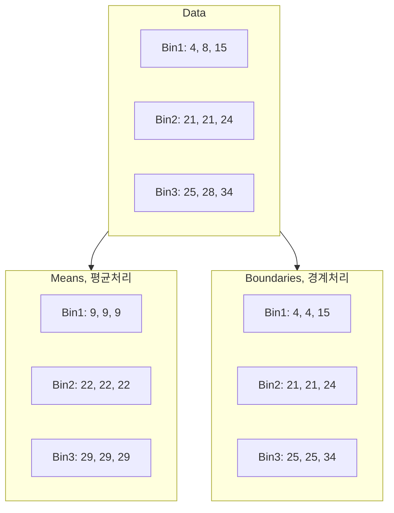

## Data Preparation

- In real world applications, data can be inconsistent, incomplete, and noisy.
- Data Collection problems: when data is collected incorrectly
- Incomplete Data: when information is missing
- Data entry problems: when data is entered incorrectly
- Contradictions in data: when the data says something in one place, and then says a different thing elsewhere in the dataset. We can think of this data as noisy.
- Discrepancy in naming conventions: when data descriptions are unclear, people may misinterpret their meaning.
- Duplicated records: when integrating data from different sources, the same data may get entered multiple times.
- Data transmission problems: when data is sent between different people or databases or companies, things can get lost in the process.

### Data mining tasks

- Classification
- Estimation
- Prediction
- Characterisation
- Discrimination
- Affinity grouping
- Clustering
- Time series analysis

## Data Cleaning

- Missing data
  - **Ignore the record**
  - **Fill the missing value manually**
  - **Fill missing values with calculated values**
    - The missing values can be filled using the average value for a particular attribute
    - or by using attribute mean for all samples belonging to the same class as the given record.
    - also be filled using methods such as Bayesian classification or decision trees to automatically infer the values.
- Noisy data: a meaningless variation that cannot be interpreted properly by machines
  - **Binning**
    - binning methods use the neighbour's data, this is referred to as local smoothing
    - can replace all data in a segment by its mean or boundary values
  - **Clustering**
    - grouping of data points according to a distance measure
    - use a clustering algorithm to classify each data point into a specific group
    - can detect outliers
  - **Regression**
    - a data mining function that deals with the prediction of a continuous value rather than a class
    - maps data values to a function
    - Using regression to fit data by finding a mathematical equation may be used to smooth noisy data.

### Binning

| Price | Equi-width | Equi-depth |
| --- | --- | --- |
| 7 | `[0, 10]` | `[7, 20]`|
| 20 | `[11, 20]` | `[7, 20]`|
| 22 | `[21, 30]` | `[22, 50]`|
| 50 | `[41, 50]`| `[22, 50]`|
| 51 | `[51, 60]`| `[51, 53]`|
| 53 | `[51, 60]` | `[51, 53]`|

- **Equi-width**: Bins have equal width.
- **Equi-depth**: Bins have the same number of values in them or almost the same number if they don't divide equally.

#### Equi-width binning

> Equal-interval binning, split the whole range of numbers into intervals with equal size.

- Price: **4, 8, 9, 15, 21, 21, 22, 26, 27, 28, 29, 36**
- Equal-width binning
  - Bin1 **[4, 12]**: 4, 8, 9
  - Bin2 **(12, 20]**: 15
  - Bin3 **(20, 28]**: 21, 21, 22, 26, 27, 28
  - Bin4 **(28, 36]**: 29, 36
- Smoothing by bin means
  - Bin1: 7, 7, 7
  - Bin2: 15
  - Bin3: 24, 24, 24, 24, 24, 24
  - Bin4: 33, 33
- Smoothing by bin boundaries
  - Bin1: 4, **9, 9**
  - Bin2: 15
  - Bin3: **21, 21, 21**, **28, 28, 28**
  - Bin4: 29, 36

#### Equi-depth binning

> Equal-frequency binning, use intervals containing an equal number of values.

- Price: **4, 8, 9, 15, 21, 21, 22, 26, 27, 28, 29, 36**
- Equal-depth binnning
  - Bin1: 4, 8, 9
  - Bin2: 15, 21, 21
  - Bin3: 22, 26, 27
  - Bin4: 28, 29, 36
- Smoothing by bin means: each value in a bin is replaced by the mean value of the bin.
  - Bin1: 7, 7, 7
  - Bin2: 19, 19, 19
  - Bin3: 25, 25, 25
  - Bin4: 31, 31, 31
- Smoothing by bin boundaries: each bin value is replace by the closest boundary value.
  - Bin1: 4, **9, 9**
  - Bin2: 15, **21, 21**
  - Bin3: 22, **27, 27**
  - Bin4: **28, 28**, 36

### Data Integration

> provides unified data by combining data from various heterogeneous data sources into a coherent data store

- The sources can include flat files, databases or multiple data cubes.
- Careful integration may help to avoid and reduce inconsistencies and redundancies in the final dataset.
- Building an enterprise's **data warehouse** is considered one of the most popular data integration implementations.
- **Redundant attributes**: An attribute (feature or column of a dataset) is called redundant if it can be derived from any other attribute or set of attributes.
  - In the process of data integration in data mining, the use of multiple data stores may lead to the problem of redundancy in data.
  - Dimension naming or inconsistencies in an attribute can also lead to redundancies in the dataset.

#### Pearson correlation coefficient

- Correlation analysis can be used to detect redundancies in **Numerical data**
- It can measure how strongly one attribute implies the other on the basis of the available data.
- `> 0.5`: a strong **positive** correlation, A⬆️ B⬆️
- `< -0.5`: a strong **negative** correlation, A⬆️ B⬇️
- `0`: no correlation. A and B are independent.
- **correlation != causation**

$$r_{A,B} = \frac{n\sum{}xy - (\sum{}x)(\sum{}y)} {\sqrt{(n\sum_{} x^2 - (\sum_{} x)^2) \, (n\sum_{} y^2 - (\sum_{} y)^2)}}$$

$$r_{A,B} = \frac{\sum_{} (x_i - \bar{x})(y_i - \bar{y})}{\sqrt{\sum_{} (x_i - \bar{x})^2} \, \sqrt{\sum_{} (y_i - \bar{y})^2}}$$

- step-by-step derivation
  - 분산: $Var(X) = \frac{1}{n} \sum_{} (x_i - \bar{x})^2$
  - 공분산: $Cov(X,Y) = \frac{1}{n} \sum_{} (x_i - \bar{x})(y_i - \bar{y})$
  - 상관계수 (정규화): $\rho = \frac{\mathrm{Cov}(X,Y)}{\sigma_X \sigma_Y}$
  - 평균: $\bar{x} = \frac{1}{n} \sum_{}x_i \quad \bar{y} = \frac{1}{n} \sum_{} y_i$
  - 분자 전개
    - $\sum_{} (x_i - \bar{x})(y_i - \bar{y})$
    - $\sum_{} (x_i y_i - x_i \bar{y} - y_i \bar{x} + \bar{x}\bar{y})$
    - $\sum_{} (x_i y_i ) - \bar{y}\sum_{} x_i - \bar{x}\sum_{} y_i + n\bar{x}\bar{y}$
    - 평균 대입
      - $\sum_{}x_iy_i - \frac{1}{n}(\sum_{}y_i)(\sum{}x_i) - \frac{1}{n}(\sum{}x_1)(\sum{}y_1) + \frac{1}{n}(\sum{}x_1)(\sum{}y_1)$
      - $\sum{}x_iy_i - \frac{1}{n}(\sum{}x_i)(\sum{}y_i)$
  - 분모 전개
    - $\sqrt{\sum_{} (x_i - \bar{x})^2} \, \sqrt{\sum_{} (y_i - \bar{y})^2}$
    - $\sqrt{\sum_{} x_i^2 - 2\bar{x}\sum_{} x_i + n\bar{x}^2} \, \sqrt{\sum_{} y_i^2 - 2\bar{y}\sum_{} y_i + n\bar{y}^2}$
    - 평균 대입
      - $\sqrt{\sum_{} x_i^2 - \frac{2}{n}(\sum_{} x_i)(\sum_{} x_i) + \frac{1}{n}(\sum{}x_i)^2} \, \sqrt{\sum_{} y_i^2 - \frac{2}{n}(\sum_{} y_i) + \frac{1}{n}(\sum{}y_i)^2}$
      - $\sqrt{\sum_{} x_i^2 - \frac{1}{n}(\sum_{} x_i)^2} \, \sqrt{\sum_{} y_i^2 - \frac{1}{n}(\sum_{} y_i)^2}$
  - 재정의
    $$r_{A,B} = \frac{\sum{}x_iy_i - \frac{1}{n}(\sum{}x_i)(\sum{}y_i)} {\sqrt{(\sum_{} x_i^2 - \frac{1}{n}(\sum_{} x_i)^2) \, (\sum_{} y_i^2 - \frac{1}{n}(\sum_{} y_i)^2)}}$$
  - 분자/분모에 n 곱하고 인덱스 생략
    $$r_{A,B} = \frac{n\sum{}xy - (\sum{}x)(\sum{}y)} {\sqrt{(n\sum_{} x^2 - (\sum_{} x)^2) \, (n\sum_{} y^2 - (\sum_{} y)^2)}}$$

### Data Transformation

### Data Reduction
