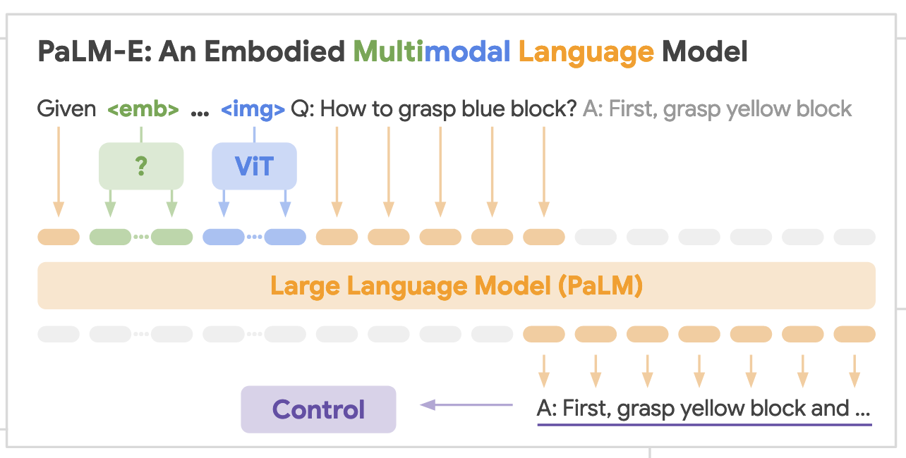

## PaLM-E

- ViT (e.g., ViT-4B, ViT-22B) extracts image embeddings.
- OSRT builds object-centric slot representations.
- These are injected into the LLM embedding space (PaLM variants: 8B, 62B, 540B) for high-level abstraction and planning, with execution delegated to low-level policies (e.g., RT-1).

## Core idea

- Build **embodied language models** by **injecting continuous sensor inputs** (images, states, other modalities) directly into a **pretrained LLM’s embedding space**, linking **words ↔ percepts**.
- Inputs are **multimodal sentences** that **interleave** text tokens with encoded visual/state tokens; outputs are **text** (answers or high-level plans).

## Architecture & representations

- Start from a **decoder-only, autoregressive LLM** (PaLM) and **condition on a prefix** that mixes text and **encoder-produced vectors**.
- Provide multiple encoder options:
  - **State vectors** (simplest).
  - **ViT** features with a learned **projector ψ** to match LLM embedding dimensionality.
  - **Object-centric, 3D-aware OSRT** (neural scene representations). Supports **entity-label tokens** (`<obj j>`) so the model can refer to specific objects in generated plans.

## Training setup

- Train **end-to-end** (encoders + projector + optionally the LLM) to output **sequential decisions as natural text** or answers (VQA, captioning).
- Dataset items contain **(continuous observations, text sequence, prefix index)**; loss is **cross-entropy on non-prefix tokens**.
- Explore **freezing the LLM** (train encoders/projection only), and **co-training** across diverse tasks ("full mixture"; only ~9% is embodied data).

## Planning & control loop

- For **planning/control**, PaLM-E emits **textual subgoals/skills** drawn from a small skill vocabulary; a separate **low-level policy** executes them.
- The system runs **closed-loop**: execute → observe → (re)plan; PaLM-E acts as a **high-level policy** sequencing low-level skills.

## Why not text-only LLMs or affordance-only grounding?

- Prior work that feeds **only text to the LLM** (and uses external affordance models) is **insufficient** when **spatial layout** matters.
- PaLM-E instead **grounds inside the LLM** by **injecting continuous observations**, enabling **direct plan generation** while leveraging the LLM’s world knowledge.

## Environments & use cases

- **Three domains**: **TAMP** (grasp/stack planning), **Language-Table** (multi-object tabletop pushing), **Mobile manipulation** (kitchen tasks).
- **Use cases** to test embodied reasoning: **affordance prediction**, **failure detection**, **long-horizon planning** (low-level policies from **RT-1**).

## Results (high level)

- **Transfer via co-training**: One model trained on mixed tasks/embodiments achieves **higher performance** than task-specialists; "full mixture" yields `>2×` gains (Fig. 3).
- **Few-shot/data efficiency**: Solves robotics tasks with **very few examples** (e.g., **10–80** for Language-Table, **320** for TAMP). **OSRT** further improves data efficiency.
- **Mobile manipulation**: End-to-end embodied planning works in real kitchens, robust to disturbances; PaLM-E beats **PaLI (zero-shot)** and **QT-OPT/CLIP baselines** on affordance/failure detection.
- **General V+L**: The **562B** generalist achieves **state-of-the-art on OK-VQA** and strong VQAv2/COCO without task-specific finetuning.
- **Language retention & scaling**: **Freezing LLM** preserves language ability but can struggle on some robotics tasks; **unfrozen + scale up** significantly reduces **catastrophic forgetting**.
- **Emergent behaviors**: **Multimodal chain-of-thought** and **multi-image reasoning** emerge in **PaLM-E-562B**, despite training on **single-image prompts**.

## Takeaways

- Injecting **neural scene representations (OSRT)** and **entity-labeled multimodal tokens** is **effective** even without massive embodied data.
- **Diverse, joint training** transfers vision-language knowledge **into embodied decision-making**, enabling **data-efficient robot planning**.
- Two viable paths to retain language skills during multimodal finetuning:
  1) **Freeze the LLM**, train encoders (max language retention, sometimes weaker robotics),
  2) **Unfreeze and scale** the LLM (much less forgetting, strong embodied performance).

## Ref

- Driess, D., Xia, F., Sajjadi, M. S. M., Lynch, C., Chowdhery, A., Ichter, B., Wahid, A., Tompson, J., Vuong, Q., Yu, T., Huang, W., Chebotar, Y., Sermanet, P., Duckworth, D., Levine, S., Vanhoucke, V., Hausman, K., Toussaint, M., Greff, K., Zeng, A., Mordatch, I., & Florence, P. (2023). PaLM-E: An Embodied Multimodal Language Model Proceedings of the 40th International Conference on Machine Learning, Proceedings of Machine Learning Research. `https://proceedings.mlr.press/v202/driess23a.html`
