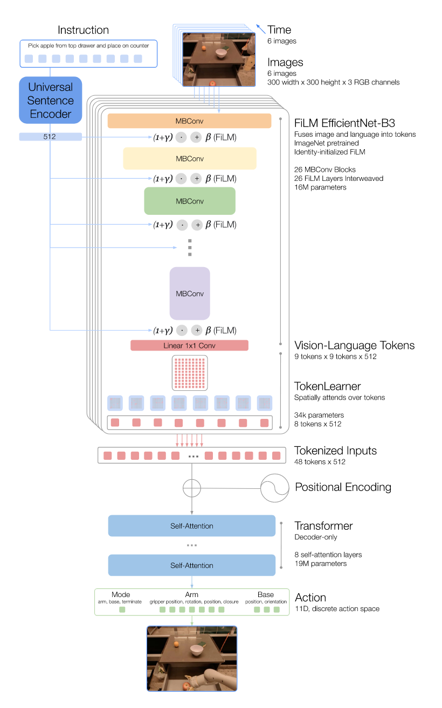
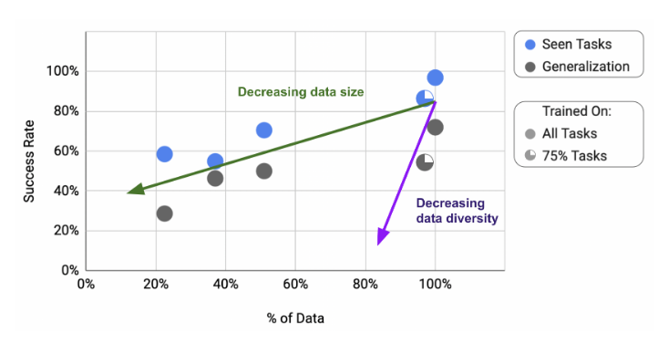

## RT-1

- RT-1 discretizes robot actions into 256-bin tokens, creating a shared "action language" across robots.
- It absorbs heterogeneous data from simulation and other robot morphologies without losing performance.
- It generalizes robustly to new tasks, environments, and long-horizon scenarios (up to 50 steps).

## Introduction & Motivation

- Leveraging large, diverse, task-agnostic datasets enables high performance in zero-shot or small task-specific settings.  
- Data collection and curation is a critical bottleneck in robotics ("the unsung hero" of large-scale ML).  
- Transformer-based controllers are powerful but inefficient for real-time robotics, requiring architectural adaptations.

## Model & Architecture

- RT-1 architecture: EfficientNet + FiLM layers + TokenLearner for compact vision-language tokenization.
- Action tokenization: 11 action dimensions (7 arm, 3 base, 1 mode) discretized into 256 bins each.
- This abstraction converts continuous robot actions into a discrete "token language", enabling cross-domain and cross-robot transfer.  
- Real-time feasibility: optimized design achieves ~3Hz inference speed suitable for real-world control.  

## Experiments & Results

### General Performance

- RT-1 executes over 700 unique instructions at **97% success rate**.  
- On unseen instructions: **76% success**, outperforming next-best baseline by +24%.  
- Robustness: 83% success with distractors, 59% with background changes (significantly higher than baselines).  

### Absorbing Simulation Data

- Adding sim data does not degrade real-task performance.  
- Objects/tasks only seen in simulation: performance boosted **23% ⇒ 87%**.  
- Unseen instructions with sim objects: **7% ⇒ 33%**, showing strong sim-to-real domain transfer.  

### Absorbing Multi-Robot Data

- Mixed RT-1 + Kuka datasets: only 2% drop in original tasks.  
- Bin-picking eval: RT-1 only 22% ⇒ mixed training 39% (almost 2×).  
- Kuka-only training: 0% on EDR robots ⇒ morphology transfer alone fails.  
- Mixed data enables RT-1 to **leverage cross-robot experiences** without explicit demonstrations.

### Long-Horizon Scenarios (SayCan Integration)

- Evaluated in two kitchens:  
  - Kitchen1: 67% execution success.  
  - Kitchen2 (novel environment): also 67% execution success.  
- Outperforms Gato (0% in Kitchen2) and BC-Z (13% in Kitchen2).  
- Demonstrated execution of **ultra-long tasks up to 50 steps**.  

### Data Quantity vs Diversity

- Reducing dataset size ⇒ gradual performance/generalization decline.
- Reducing task diversity ⇒ **much sharper decline**, especially in generalization.  
- Key takeaway: **Data diversity is more critical than data quantity.**

## Conclusions & Limitations

- RT-1 proves large-scale data absorption and strong generalization in robotics.  
- Limitations:  
  - Based on imitation learning ⇒ cannot surpass demonstrator performance.  
  - Generalization limited to recombinations of known concepts ⇒ fails on truly novel motions.  
  - Dataset is large but not dexterous (fine manipulation limited).  

## Future Directions

- Enable non-experts to collect training data and prompt models for faster skill scaling.  
- Increase environmental diversity to strengthen robustness to backgrounds/environments.  
- Improve reaction speed and context retention via scalable attention and memory.  

## Ref

- Brohan, A., Brown, N., Carbajal, J., Chebotar, Y., Dabis, J., Finn, C., Gopalakrishnan, K., Hausman, K., Herzog, A., & Hsu, J. (2022). Rt-1: Robotics transformer for real-world control at scale. arXiv preprint arXiv:2212.06817.
