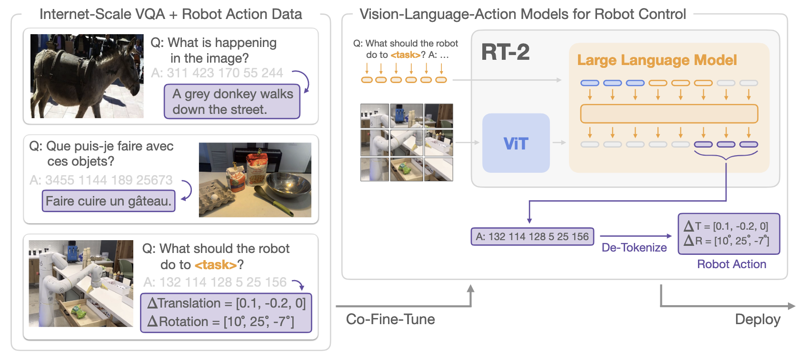
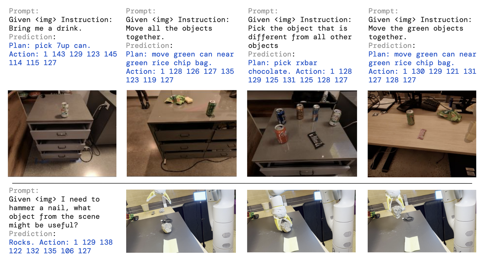

# RT-2

- Trains a **Vision-Language-Action (VLA)** model by co-fine-tuning web-scale VLMs with robot trajectories, and **treats robot actions as text tokens**.
- Yields **strong generalization** and **emergent capabilities** (symbol understanding, reasoning, human recognition) beyond what appears in robot data.
- Runs in **direct closed-loop control**; largest evaluated model (55B) executes at ~1–3 Hz via a cloud (multi-TPU) inference setup.

## What RT-2 Is

- A family of VLA models (RT-2-PaLI-X, RT-2-PaLM-E) that fine-tune large VLMs on robot trajectories to output **low-level actions**.
- Target: **generalizable, semantically aware** manipulation policies that map images + instructions → actions end-to-end.

## Core Recipe

- **Directly train** open-vocabulary VQA/dialogue VLMs to **output robot actions** while they still solve standard vision-language tasks.
- Build on RT-1 protocol/data, but replace the policy backbone with a **large VLM**.

## Action as Language (Tokenization)

- Discretize continuous action dims (Δpos/Δrot, gripper, terminate) into **256 bins**; represent each dimension with an **integer token**.
- **PaLI-X**: reuse numeric tokens (`≤1000`). **PaLM-E**: overwrite **256 least-frequent tokens** as action vocabulary (**symbol tuning**).
- Form a single output string per step (e.g., `terminate Δposx Δposy Δposz Δrotx Δroty Δrotz gripper`).

## Co-Fine-Tuning & Output Constraint

- **Mix robot data with original web VQA/caption data** in training batches (up-weight robot samples) to prevent forgetting and improve generalization.
- During decoding on robot tasks, **restrict sampling to valid action tokens** so outputs are always executable.

## Closed-Loop Control & Real-Time Inference

- RT-2 is trained and deployed for **direct closed-loop control** (camera → action → camera …), not just high-level planning.
- For large models, inference runs via a **multi-TPU cloud service**; **RT-2-PaLI-X-55B** reaches **~1–3 Hz**; smaller models ~5 Hz.

## Generalization & Benchmarks

- Matches RT-1 on seen tasks but **far exceeds** baselines on **unseen objects/backgrounds/environments** (~**2×** vs RT-1/MOO; up to **~6×** vs others).
- Open-source **Language-Table** sim: co-fine-tuned **PaLI-3B** outperforms baselines, showing the approach transfers to other robots/sims.

## Emergent Capabilities

- **Symbol understanding** (e.g., “move apple to 3 / heart / star”).
- **Reasoning** (visual matching, simple math like “sum of two plus one”, **multilingual** commands).
- **Human recognition** (e.g., “person with glasses”); none of these were present as low-level actions in robot data.
- **Chain-of-thought (CoT) variant** adds a **Plan** step before actions → supports **multi-stage semantic reasoning** (e.g., pick a rock as an improvised hammer; pick an energy drink for a tired person).

## Scaling & Ablations

- **From-scratch** training (even 5B) performs poorly; **fine-tuning** helps; **co-fine-tuning** helps **most**.
- **Bigger models** (`55B > 5B`) generalize better.
- PaLM-E variant shows an edge on **math reasoning**; PaLI-X stronger on symbols/vision reasoning on average.

## Limitations

- Does **not** learn fundamentally **new motor skills** beyond the distribution in robot data; mainly transfers **semantic/visual knowledge**.
- **Compute/latency** costly; real-time control can bottleneck. Limited availability of strong open VLMs and convenient FT APIs.

## Future Directions (from the text)

- Acquire new skills from **human videos** or richer datasets.
- **Quantization/distillation** for faster/cheaper inference.
- More **open VLMs / FT APIs** to make VLA models broadly buildable.

## Ref

- Zitkovich, B., Yu, T., Xu, S., Xu, P., Xiao, T., Xia, F., Wu, J., Wohlhart, P., Welker, S., Wahid, A., Vuong, Q., Vanhoucke, V., Tran, H., Soricut, R., Singh, A., Singh, J., Sermanet, P., Sanketi, P. R., Salazar, G., Ryoo, M. S., Reymann, K., Rao, K., Pertsch, K., Mordatch, I., Michalewski, H., Lu, Y., Levine, S., Lee, L., Lee, T.-W. E., Leal, I., Kuang, Y., Kalashnikov, D., Julian, R., Joshi, N. J., Irpan, A., Ichter, B., Hsu, J., Herzog, A., Hausman, K., Gopalakrishnan, K., Fu, C., Florence, P., Finn, C., Dubey, K. A., Driess, D., Ding, T., Choromanski, K. M., Chen, X., Chebotar, Y., Carbajal, J., Brown, N., Brohan, A., Arenas, M. G., & Han, K. (2023). RT-2: Vision-Language-Action Models Transfer Web Knowledge to Robotic Control Proceedings of The 7th Conference on Robot Learning, Proceedings of Machine Learning Research. `https://proceedings.mlr.press/v229/zitkovich23a.html`
