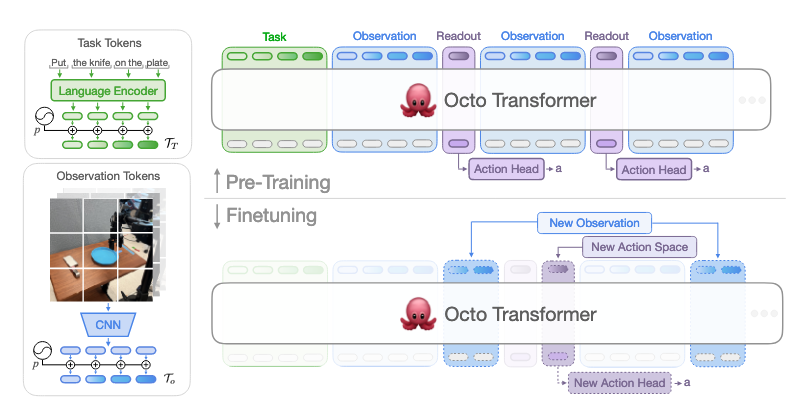

## Octo

- Octo is a transformer-based policy with modular tokenizers (language via T5, images via CNN patches), blockwise masking, and readout tokens, trained on 800k multi-robot trajectories.  
- Actions are generated through a diffusion head that produces continuous, multimodal, chunked predictions, enabling precise control and broad generalization.
- It achieves state-of-the-art zero-shot performance across 7 robots and allows efficient finetuning to new sensors and action spaces, while being fully open-source.

| Category | Simple Analogy | Actual Tokenization |
| --- | --- | --- |
| **Language** | `[Sentence]` | `[l₁, l₂, l₃, …]` <br/>→ multiple tokens from a tokenized sentence |
| **Goal Image** | `[Goal]` | `[g₁, g₂, g₃, …]` <br/>→ image split into patches |
| **Observation (time t)** | `[Observation]` | `[oₜ¹, oₜ², oₜ³, …]` <br/>→ camera frames/sensors tokenized into patches |
| **Readout Token** | `[ ]` (empty slot) | `[TR,t]` <br/>→ one per timestep, reserved for predicting actions |

```bash
Time t-1: [l] [g] [o_{t-1}] [TR,t-1]
Time t:   [l] [g] [o_t]     [TR,t]
Time t+1: [l] [g] [o_{t+1}] [TR,t+1]

[TR,t-1], [TR,t], [TR,t+1]  ──►  Diffusion head  ──►  [a_t, a_{t+1}, …]
```

## Motivation

- Traditional robot learning trains policies **from scratch** on robot/task-specific datasets → costly data collection, narrow generalization.
- **Generalist Robot Policies (GRPs)** pretrained on diverse robots/tasks can be **finetuned with little in-domain data** while generalizing broadly.
- Real-world deployments face challenges across **robot embodiments, sensor setups, action spaces, task specs, and environments**.

## Prior GRPs & Gaps

- GRPs aim for **low-level visuomotor control** across tasks, environments, and robotic systems.
- Existing models often have **restricted inputs (e.g., a single camera)**, **lack efficient finetuning to new domains**, and importantly, **largest models are not publicly available**.

## Contribution (What is Octo?)

- **Octo**: a large transformer-based policy trained on **800k trajectories** from the Open X-Embodiment dataset.
- Accepts **language instructions or goal images**, and can be **finetuned within hours on consumer GPUs** to new sensors and action spaces.
- **First GRP** to support **effective finetuning to new observations and actions** and to be **fully open-source** (training pipeline, checkpoints, data).
- Novelty lies in combining: **transformer backbone + language/goal image conditioning + diffusion head** for expressive action distributions.

## Architecture

- **Input tokenizers**:  
  - Language via pretrained **T5-base**  
  - Images via shallow CNN → patch tokens  
- **Transformer backbone**: processes unified token sequence.  
- **Blockwise masking + Readout tokens**:  
  - Nonexistent modalities are masked  
  - Readout tokens *only attend* to past observations/tasks, not vice versa  
- **Diffusion action head**: predicts **continuous, multimodal, chunked actions**.  
- **Modularity**: new sensors/outputs can be added by only training lightweight encoders or heads; pretrained backbone remains unchanged.



## Training Data & Objective

- Mixture of **25 heterogeneous robot datasets**: diverse robots, sensors (with/without wrist cams), labels (with/without language).
- **Conditional diffusion decoding** predicts continuous, multimodal action distributions.  
  - Transformer runs **one forward pass**; denoising steps are contained in the small diffusion head.

## Experiments

- Evaluated on **7 robotic platforms across 4 institutions**.  
- Key questions:  
  1) Zero-shot multi-robot control?  
  2) Do Octo weights improve finetuning vs. scratch or standard pretrained representations?  
  3) Which design choices matter for generalist robot policies?

## Results

- Achieves **state-of-the-art zero-shot multi-robot control**, competitive with RT-1-X and RT-2-X.  
- Provides a **versatile policy initialization**: significantly outperforms baselines for **data-efficient finetuning** to new obs/action spaces.

## Limitations / Future Work

- Needs **better language conditioning**, **improved wrist camera support**, and **data beyond optimal demonstrations**.

## One-line Takeaway

- **Octo = modular, efficient, open-source GRP**:  
  A transformer + diffusion policy trained on large-scale multi-robot data that **adapts quickly with little in-domain data** to new sensors and action spaces, enabling broad generalization.

## Ref

- Mees, O., Ghosh, D., Pertsch, K., Black, K., Walke, H. R., Dasari, S., Hejna, J., Kreiman, T., Xu, C., & Luo, J. (2024). Octo: An open-source generalist robot policy. First Workshop on Vision-Language Models for Navigation and Manipulation at ICRA 2024.
