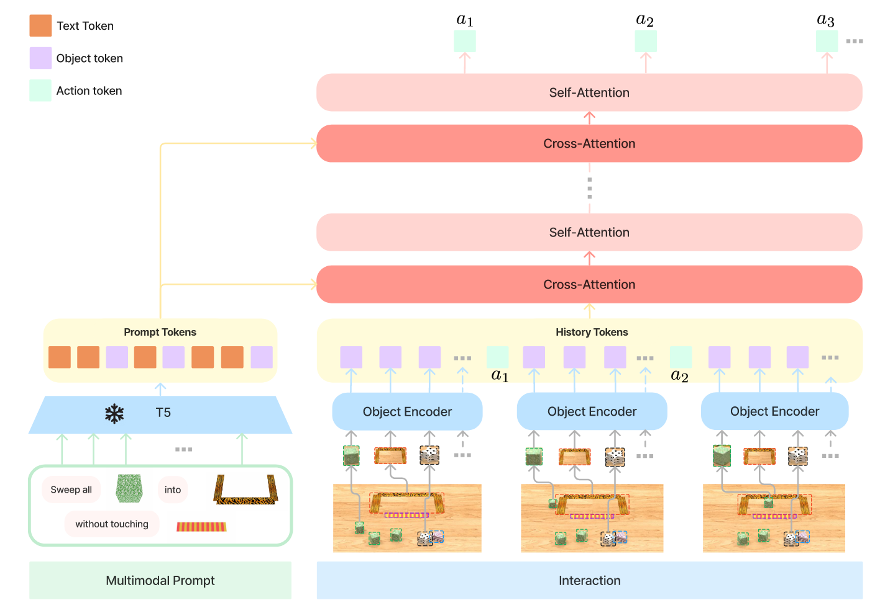

## VIMA

- **Unified Multimodal Prompts**: Reformulates diverse robot tasks (language, images, video) into a single sequence modeling problem.  
- **Object-Centric Tokenization**: Uses object-level tokens (Mask R-CNN + ViT) instead of raw pixels, improving data efficiency and semantic generalization.  
- **Cross-Attention Conditioning**: Conditions the policy on prompts via cross-attention, maintaining strong zero-shot performance even with small models or novel tasks.  

## Motivation

- Robot task specification comes in many forms: one-shot demonstrations, language instructions, and visual goals.  
- Traditionally, each task required distinct architectures and pipelines, leading to siloed systems with poor generalization.

## Key Contributions

1. **Multimodal Prompting**  
   - A novel formulation that unifies diverse robot manipulation tasks into a **sequence modeling problem**.  
   - Prompts are defined as interleaved sequences of text and images, enabling flexibility across task formats.  

2. **VIMA-BENCH**  
   - A large-scale benchmark with **17 tasks** across six categories (object manipulation, goal reaching, novel concept grounding, video imitation, constraint satisfaction, visual reasoning).  
   - Provides **650K expert trajectories** and a **four-level evaluation protocol** for systematic generalization.  

3. **VIMA Agent**  
   - A transformer-based visuomotor agent with **encoder-decoder architecture** and **object-centric design**.  
   - Encodes prompts with a pre-trained **T5 model**, parses images into object tokens via **Mask R-CNN + ViT**, and decodes actions autoregressively using **cross-attention**.  

## Design Insights

- **Object-Centric Representation**: Passing variable-length object token sequences directly to the controller is more effective than pixel-based tokenization.  
- **Cross-Attention Conditioning**: Stronger prompt focus and efficiency compared to simple concatenation (e.g., GPT-style).  
- **Robustness**: Minimal degradation under distractors or corrupted prompts, aided by T5 backbone and object augmentation.  

## Results

- **Performance**:  
  - Outperforms baselines (VIMA-Gato, VIMA-Flamingo, VIMA-GPT) by up to **2.9× success rate** in hardest zero-shot generalization.  
  - With **10× less training data**, still **2.7× better** than best competitor.  

- **Scaling**:  
  - Sample-efficient: with just **1% of data**, matches baselines trained with 10× more.  
  - Generalization holds across L1–L4 evaluation, with smaller regression than alternatives.  

## Conclusion

VIMA demonstrates that multimodal prompting is a powerful unifying framework for robot learning.  
It achieves strong scalability, data efficiency, and generalization, establishing a **solid starting point for future generalist robot agents**.

## Ref

- Jiang, Y., Gupta, A., Zhang, Z., Wang, G., Dou, Y., Chen, Y., Fei-Fei, L., Anandkumar, A., Zhu, Y., & Fan, L. (2023). VIMA: Robot Manipulation with Multimodal Prompts Proceedings of the 40th International Conference on Machine Learning, Proceedings of Machine Learning Research. `https://proceedings.mlr.press/v202/jiang23b.html`
