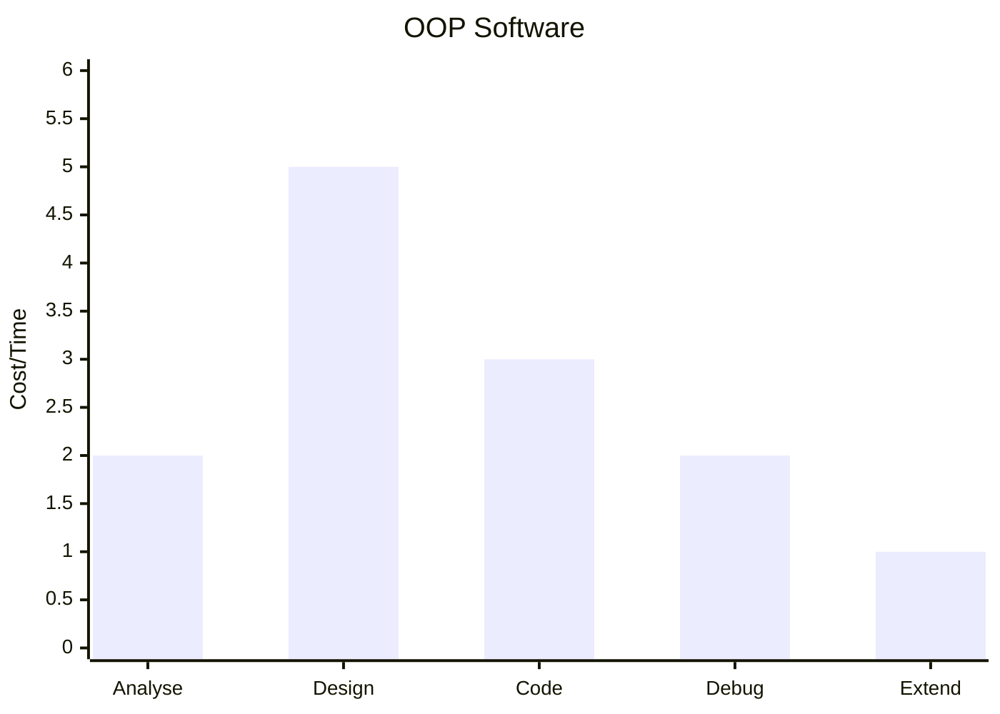
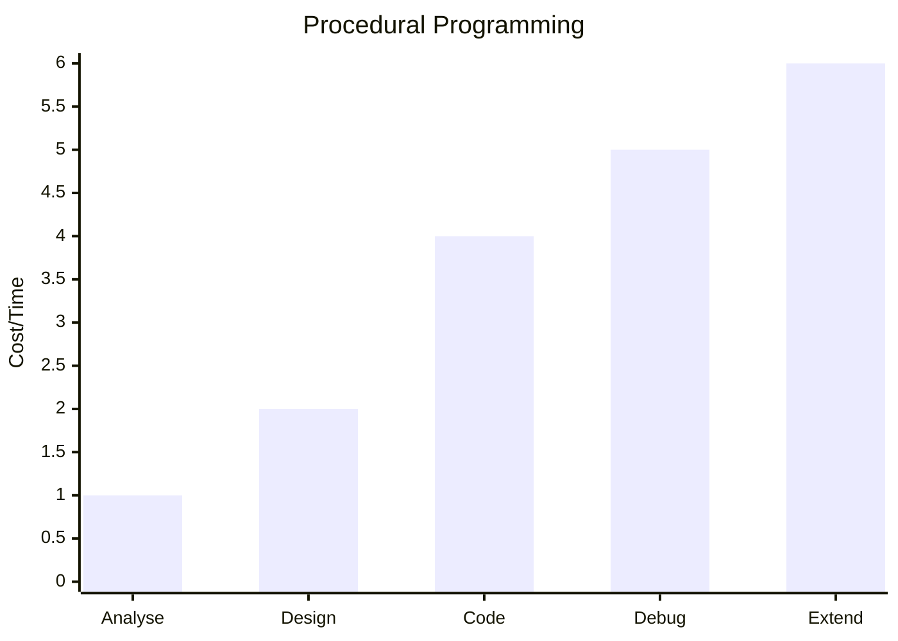

## OOP vs Procedural Programming

### OOP

- a programming paradigm built around the concept of objects, which contain data and code to manipulate data.
- The idea to model real-world entities and their interactions.
- Global Data (fields) are enclosed in the objects.
- Program components/tasks are easily divided across the development team / Requires more planning and design preparation
- Easier to manage and maintain dependencies between objects / OOP programs are much larger and complex
- Objects export the interface and hide the implementation and data / Tend to use more memory and GPU
- Code is highly reusable and easy to scale and distribute / Making changes in one class potentially impact others, which can complicate the development of the code.



### Procedural Programming

- the concept of procedure calls by structuring the program around procedures. (or functions/subroutines)
- a sequential manner unless directed otherwise.
- Global data (elements) is exposed to all the functions.
- Easier to compile and interpret / Difficult to scale or extend
- Straightforward and simpler to code / Dependencies between elements are unclear and not well-structured.
- Less memory requirements / Data is exposed and insecure due to its exposure across the whole program
- Easy to track the program flow / Hard to divide the work among programmers in a team.



## Classes

- A class is a template/blueprint used to create objects

| java | python |
| --- | --- |
| a pure OOP language | supports OOP |
| code must be written in classes | classes are optional |
| executable class must have `main()` | scripts run without including a class |
| Encapsulation can be enforced by declaring fields as private | fields (global variables) are public by default |
| Visibility is managed through access modifiers | N/A ("_" to identify private data attributes, but still accessible) |

```py
class <class-name> (<extend - superclass>):
    <variable-name> = <value> #Class fields - data members

    def __init(self, <parameters>): #class constructor - object sbuilder
        <code>

    <method-name> (self, <parameters>): #methods
        <code>
```

### Classes Py

| Keywords | Functions |
| --- | --- |
| `class` | `__init__()` |
| `self`: keyword used to refer to object properties | del: the function is used to delete an object |
| `pass`: keyword used to occupy no-code placement in a function | `__str__()`: The function is used to return string representation of instances |
| `cls`: keyword used to refer to class properties | `super()`: the function is used call a parent method in a child class |

- Accessors: functions (with no parameters) in a Python class that provide access to the data attributes of an object.
  - known as getter methods, are named starting with the verb get, followed by the field name, which should start with an uppercase letter.
- Mutators: procedures (with parameter) in a Python class that enable the developer to modify the values of object attributes.
  - known as setter methods, are named starting with the verb set, followed by the field name, which should start with an uppercase letter.

```py
def get<Variable> ():
    return self.<field>

def set<Variable> (self, value):
    self.<field> = value
```

### Classes Java

```java
public class Bank {
  private Customer customer;
  private String branch;

  public Bank() {
    customer = new Customer();
  }

  public Bank(String name) {
    this();
    this.branch = name;
  }

  public boolean find(Bank bank) {
    return this.branch.equals(bank.branch);
  }
}
```

## Packages

### Packages Java

- used to group related classes
- like folders containing files (classes)
- either Java defined or user-defined
- used to write maintainable and portable code and to avoid class name conflicts.

### Modules Py

- used to grou prelated functio nand classes together
- normal Python scripts that are used into other scripts
- either Python defined or user-defined
- used to write maintainable and portable code to improve reusability
