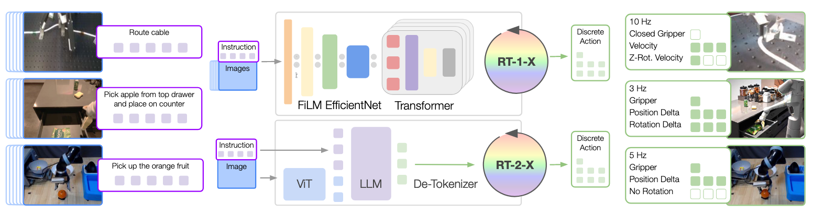
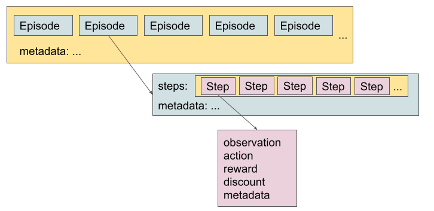

## RT-X

- RT-X trains generalist robot policies by co-training RT-1/RT-2 on an X-embodiment mix of multi-robot, multi-task data, enabling efficient adaptation to new robots, tasks, and environments.  
- It standardizes 1M+ trajectories from 22 embodiments into the Open X-Embodiment (RLDS/tfrecord) repository, unifying observations and 7-DoF actions via coarse alignment.  
- Experiments show strong positive transfer and emergent skills (≈3× with RT-2-X on cross-robot tasks); performance scales with model capacity, short image histories, and web pretraining, while sensing/actuation diversity and frame alignment remain open problems.

## Motivation

- Seeks a **generalist X-robot policy** that can be efficiently adapted to new robots, tasks, and environments.
- Mirrors a trend from CV/NLP where **general-purpose, web-scale pretrained models** outperform narrow, task-specific models.
- Robotics lacks comparably large, diverse **interaction datasets**, making direct transfer of these lessons challenging.

## Objectives

1. **Positive transfer:** Test whether co-training on data from many robots improves performance on each training domain.
2. **Ecosystem building:** Organize large robotic datasets to enable future X-embodiment research.

## Core Approach

- Train **RT-1** and **RT-2** on data from **9 different manipulators**, producing **RT-X** variants that outperform policies trained only on the evaluation domain and show **better generalization** and **new capabilities**.

## What’s Different From Prior Transfer Methods

- Many prior works reduce the **embodiment gap** via specialized mechanisms (shared action spaces, representation learning objectives, policy adaptation using embodiment metadata, decoupled robot/environment representations, domain translation).
- **RT-X directly trains on X-embodiment data without explicit gap-reduction machinery** and still observes **positive transfer**.

## Dataset & Format (Open X-Embodiment)

- **1M+ real robot trajectories, 22 embodiments** (single-arm, bimanual, quadrupeds), pooled from **60 datasets / 34 labs**, standardized for easy use.
- Uses [**RLDS**](https://github.com/google-research/rlds) (serialized `tfrecord`), supporting varied action spaces and input modalities (RGB, depth, point clouds), and efficient parallel loading across major DL frameworks.
- Language annotations are leveraged; **PaLM** is used to extract objects/behaviors from instructions.

## Data Format Consolidation (Coarse Alignment)

- **Observations:** History of recent images + language instruction. One **canonical camera view** per dataset is resized to a common resolution.
- **Actions:** Convert original controls to a **7-DoF end-effector vector** (x, y, z, roll, pitch, yaw, gripper or their rates). Actions are **normalized before discretization**; outputs are **de-normalized per embodiment**.
- **Deliberate non-alignment:** Camera poses/properties are **not** standardized; action frame alignment across datasets is **not** enforced. The same action vector may cause **different motions** on different robots (absolute/relative, position/velocity allowed).

## Policy Architectures

- **RT-1 (≈35M params):** Transformer for control. Inputs: 15-frame image history + natural-language instruction.
  - Vision via ImageNet-pretrained **EfficientNet**; language via **USE** embedding.
  - Fuse via **FiLM** → 81 vision–language tokens → **decoder-only Transformer** outputs tokenized actions.
- **RT-2 (VLA family):** Internet-scale VLM co-fine-tuned to output **action as text tokens** (e.g., `1 128 91 241 5 101 127`).
  - Any pretrained VLM can be adapted; this work uses **RT-2–PaLI-X** (ViT backbone + UL2 LM; primarily pretrained on WebLI).

## Training Setup

- **Robotics data mixture:** Data from **9 manipulators** (a union of multiple well-known robotics datasets).
- **Loss:** Standard **categorical cross-entropy** over tokenized actions.
- **Regimes:**  
  - **RT-1-X:** Trained solely on the robotics mixture.  
  - **RT-2-X:** **Co-fine-tuned** on a ~1:1 mix of original VLM data and the robotics mixture.

## Experimental Questions

1. Does X-embodiment co-training improve in-domain performance (positive transfer)?
2. Does it improve **generalization** to **unseen tasks**?
3. How do **model size**, **architecture**, and **dataset composition** influence performance/generalization?

## Key Results

- **Small-scale domains:** **RT-1-X** outperforms the **Original Method** (the authors’ per-dataset baselines) on **4/5** datasets with a large average gain → **limited data domains** benefit greatly from X-embodiment co-training.
- **Large-scale domains:**  
  - **RT-1-X** does **not** beat an RT-1 trained only on the embodiment-specific large dataset (suggests underfitting for this class).  
  - **RT-2-X** (larger capacity) **outperforms both** Original Method and RT-1 → X-robot training helps even in **data-rich** regimes when using **sufficient capacity**.

## Generalization & Emergent Skills

- **Unseen objects/backgrounds/environments:** RT-2 and RT-2-X perform **on par** (VLM backbone already strong here).
- **Emergent skills (transfer across robots):** On Google Robot tasks that **do not appear** in RT-2’s dataset but exist in **Bridge** (for **WidowX**), **RT-2-X ≈ 3×** RT-2.  
  - Removing **Bridge** from RT-2-X training **significantly reduces** hold-out performance → skills likely **transferred** from WidowX data.

## Design Insights (Ablations)

- **Short image history** notably **improves generalization**.
- **Web pretraining** is **critical** for large models’ high performance.
- **Model capacity matters:** **55B** model succeeds more than **5B** on emergent skills → greater capacity ⇒ greater cross-dataset transfer.
- **Co-fine-tuning vs. fine-tuning:** Similar performance in this study (attributed to the **greater diversity** of robotics data in RT-2-X vs. prior works).

## Limitations (Open Problems)

- Does **not** cover robots with **very different sensing/actuation modalities**.
- Does **not** study generalization to **new robots** nor define a **decision criterion** for when positive transfer will occur.
- Camera pose/properties and control frame **remain unaligned**; a deliberate but still challenging domain gap to address in future work.

## Ref

- O’Neill, A., Rehman, A., Maddukuri, A., Gupta, A., Padalkar, A., Lee, A., Pooley, A., Gupta, A., Mandlekar, A., & Jain, A. (2024). Open x-embodiment: Robotic learning datasets and rt-x models: Open x-embodiment collaboration 0. 2024 IEEE International Conference on Robotics and Automation (ICRA).
