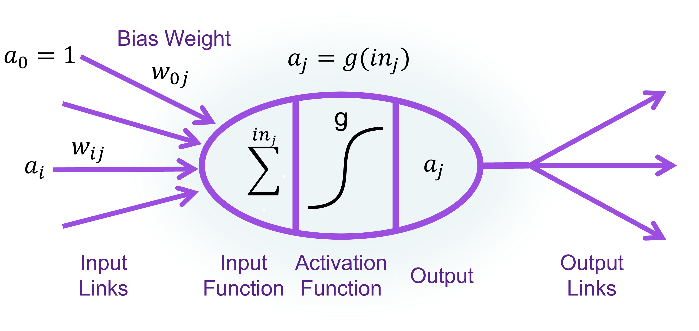
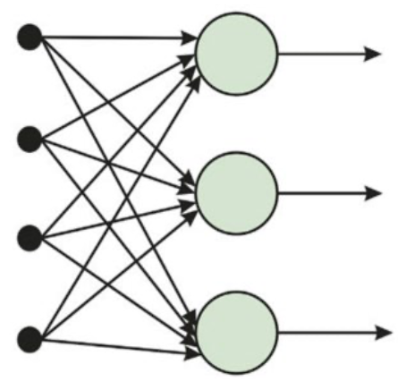
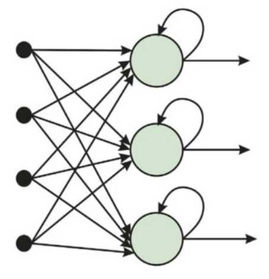

## Neural Network Development History

- 1950s-1960s: Early Foundations
  - McCulloch & Pitts (1943): mathematical neuron model
  - Rosenblatt’s Perceptron (1958): first trainable network
  - Minsky & Papert (1969): limitations (XOR problem) → AI Winter
- 1970s–1980s: First Revival
  - Werbos (1974); Rumelhart, Hinton, Williams (1986): Backpropagation
  - Hopfield Networks (1982): associative memory
  - Renewed optimism but limited by hardware
- 1990s: Consolidation
  - LeCun’s CNN (LeNet, 1989): digit recognition
  - Elman, Jordan: Recurrent Neural Networks
  - Symbolic AI still dominated mainstream
- 2000s: Deep Learning Foundations
  - Better hardware (GPUs) + large datasets
  - Hinton (2006): Deep Belief Networks (unsupervised pretraining)
  - Connectionism regains attention
- 2010s: Deep Learning Boom
  - ImageNet (2012): AlexNet breakthrough
  - RNNs, LSTMs, GRUs → speech & translation
  - Transformers (2017): revolutionized NLP
- 2020s: Scaling & Foundation Models
  - Large Language Models (GPT, BERT, etc.)  
  - Multimodal AI: vision, text, speech integration
  - Connectionism dominates AI research & industry

## Neural Network Models

- a collection of units (neurons) connected together
- The properties of the network are determined by its topology and the properties of the neurons.
- Roughly speaking, the neuron fires when a linear combination of its inputs exceeds some (hard or soft) threshold.

- $in_j = \sum_{i=0}^{n} w_{ij}a_i$
- $out_j = g(in_j)$
- $a_j = g(\sum_{i=0}^{n} w_{ij} a_i)$

## Activation function

### ReLU function

$$ReLU(x) = max(0, x)$$

- an abbreviation for rectified linear unit
- Commonly used

### Softplus function

$$Softplus(x) = \log(1 + e^x)$$

- A smooth version of the ReLU function

### Logistic or Sigmoid function

$$Logistic(x) = \frac{1}{1 + e^{-x}}$$

- Non-linear, can represent a nonlinear function

### Tanh function

$$ tanh(x) = \frac{e^{2x} -1}{e^{2x} + 1} $$

## Topology of a neural network

- Feed-forward network (FFN):
  - Every node receives inputs from "upstream" nodes and delivers output to "downstream" nodes.
  - There are no loops.
  - FFN represents a function of its current inputs, thus it has no internal state other than the weights themselves.
- Recurrent Network (RNN):
  - A recurrent network feeds its outputs back into its own inputs.
  - In a recurrent network, the neuron values can eventually settle down, keep cycling, or behave unpredictably.
  - can support short-term memory

| FFN | RNN |
| --- | --- |
| |  |

## Training Process

- Go through each training sample.
- If correctly classified → do nothing.
- If misclassified → update the weights:
- $w_i \leftarrow w_i + \alpha(y - \hat{y})x_i$

### Perceptron for Binary Classification

- A perceptron separates data into two classes with a hyperplane.
- if $w \cdot x \geq 0 \rightarrow 1$
- if $w \cdot x \le 0 \rightarrow 0$

### Learning Rules

| Aspect | Perceptron Learning Rule | Gradient Descent (with Sigmoid) |
|---|---|---|
| **Activation function** | Hard threshold (계단 함수)  $Threshold(z) = 1 \; \text{if} \; z \ge 0,\; 0 \; \text{otherwise}$ | Sigmoid (연속 함수)  $h_w(x) = \frac{1}{1+e^{-w \cdot x}}$ |
| **Output** | 0 또는 1 | 0과 1 사이의 실수 값 |
| **Loss function** | 없음 (틀리면 조정, 맞으면 유지)  규칙 기반 학습 | $L = (y - h_w(x))^2$ (L2 loss)  또는 Cross-Entropy (실무에서 자주 사용) |
| **Update rule** | 틀렸을 때만:  $w \leftarrow w + \alpha (y - h_w(x))x$ | 경사하강법:  $w \leftarrow w + \alpha (y - h_w(x)) \cdot h_w(x)(1-h_w(x)) \cdot x$ |
| **Why derivative?** | Hard threshold는 미분 불가능 → 단순 규칙 사용 | Sigmoid는 연속적이고 미분 가능 → Loss 함수의 기울기(gradient)를 따라 업데이트.  여기서 $h_w(x)(1-h_w(x))$ 항은 sigmoid의 도함수에서 나온 것. |
| **Interpretation** | 틀리면 정답 방향으로 한 걸음 이동 | Loss가 줄어드는 방향으로 점진적으로 이동 |
