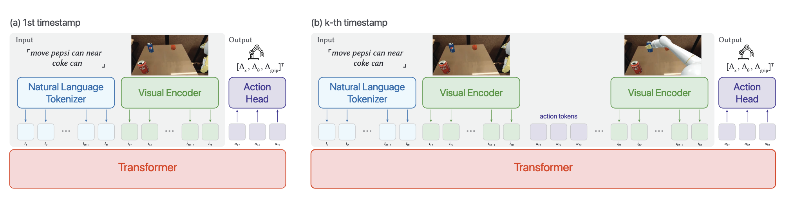
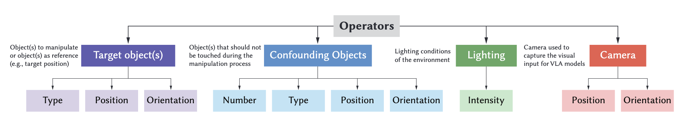

## VLATest: Testing and Evaluating Vision-Language-Action  Models for Robotic Manipulation

- VLATest fuzzes 18,604 manipulation scenes (10 operators, 4 tasks) to systematically stress-test VLA robustness.
- Seven VLA models show low success and brittleness to confounders, lighting/camera changes, unseen objects, and instruction mutations; larger pretraining helps.
- Priorities: scale/augment demo data (incl. sim2real), use stepwise/CoT prompting & multi-agent setups, and expand benchmarks with online risk assessment.

## Motivation & Gap

- **Problem:** Current VLA models are typically evaluated on **small, hand-crafted scenes**, leaving **general performance and robustness** in diverse scenarios underexplored.
- **Goal:** Introduce **VLATest**, a **generation-based fuzzing framework** that automatically creates robotic manipulation scenes to **test performance and robustness** of VLA models.

## What Are VLA Models?

- **Vision-Language-Action (VLA)** models take **natural language instructions** + **camera images** and output **low-level robot actions** (Δx, Δθ, Δgrip).
- **Inference loop:** Tokenize text/image → transformer predicts action token **A₁** → execute → append **A₁** + new image tokens **I₂** → predict **A₂** → … until success or step limit.

## Training & Evaluation

- **Training:** (1) Train from scratch on robot demonstrations, or (2) **fine-tune a large VLM** (e.g., Llava) with `>`1B params pretraining.
- **Evaluation:** Task-specific metrics (e.g., **grasp**, **lift**, **hold** for “pick up”), either in **sim** (auto-metrics) or **real** (manual labels).

## VLATest Framework

- **Ten testing operators** grouped across:
  - **Target objects:** type, position, orientation
  - **Confounding objects:** type, position, orientation, **count**
  - **Lighting:** **intensity**
  - **Camera:** **position**, **orientation**
- **Scene generation (Alg. 1):** sample valid targets → (optional) confounders → mutate lighting (factor **α**) → mutate camera pose (**d**, **θ**). Semantic validity checks prevent infeasible scenes.

## Research Questions (RQ)

- **RQ1:** Basic performance on popular manipulation tasks  
- **RQ2:** Effect of **confounding object count**  
- **RQ3:** Effect of **lighting changes**  
- **RQ4:** Effect of **camera pose changes**  
- **RQ5:** Robustness to **unseen objects** (OOD)  
- **RQ6:** Robustness to **instruction mutations**

## Tasks & Prompting

- **Tasks:**  
  1) **Pick up** an object (grasp + lift ≥0.02 m for 5 frames)  
  2) **Move A near B** (≤0.05 m)  
  3) **Put A on B** (stable stacking)  
  4) **Put A into B** (fully inside)
- **Standard prompts (RQ1–RQ5):**  
  - `pick up [obj]` · `move [objA] near [objB]` · `put [objA] on [objB]` · `put [objA] into [objB]`
- **Instruction mutations (RQ6):** 10 paraphrases per task (GPT-4o), manually validated for semantic equivalence.

## Experimental Setup

- **Scenes:** **18,604** across 4 tasks (ManiSkill2).  
- **Models:** 7 public VLAs (RT-1-1k/58k/400k, RT-1-X, Octo-small/base, OpenVLA-7b).  
- **Compute:** `>`**580 GPU hours**.

## Key Results & Findings

### RQ1 — Overall Performance

- VLA models **underperform** overall; no single model dominates across tasks.
- Example best-case rates (default settings): **34.4%** (Task1, RT-1-400k), **12.7%** (Task2, OpenVLA-7b), **2.2%** (Task3, RT-1-X), **2.1%** (Task4, Octo-small).
- **Stepwise breakdown (Task 1):** grasp **23.3%** → lift **15.7%** → hold **12.4%** ⇒ difficulty **composing sequential actions**.  
  - **Implication (Finding 2):** Consider **stepwise prompting / chain-of-thought** to decompose complex tasks.

### RQ1 — Coverage Metric

- No established coverage for VLA; adopted **trajectory coverage** (pragmatic).  
- Increasing cases from **n=10** to **n=1000** achieved **100%** coverage across tasks (object-position novelty relative to workspace).

### RQ2 — Confounding Objects

- **More confounders ⇒ worse performance**; models struggle to **locate the correct object**.
- **Similarity doesn’t matter much:** Mann–Whitney U shows **no significant difference** between **similar** vs **dissimilar** distractors (p = 0.443, 0.614, 0.657, 0.443; effect sizes ≈ 0.23–0.29).

### RQ3 — Lighting Robustness

- **Lighting perturbations significantly hurt performance.**
- **OpenVLA-7b** most robust (**77.9%** of previously passed cases still pass), plausibly due to **SigLIP + DINOv2** pretraining and LLaVA 1.5 mixture.
- **Sensitivity:** even **α `<` 2.5** increase drops success to ~**0.7×**; **α `>` 8** ⇒ ~**40%** of default-pass scenes succeed.
- **Decreasing** light hurts **less** than increasing; **α `<` 0.2** still ~**60%** pass.

### RQ4 — Camera Pose Robustness

- Small pose changes (≤**5°** rotation, ≤**5 cm** shift) reduce success to **34.0%** of default.
- **RT-1-400k** most robust (**45.6%** retain), **OpenVLA-7b** at **31.3%**; **Octo** models `<`**10%**.  
  - Likely due to **training data scale** differences.

### RQ5 — Unseen Objects

- Using **YCB (56 unseen objects)** leads to large performance drops versus seen objects: avg **–74.2%**, **–66.7%**, **–66.7%**, **–20.0%** on Tasks 1–4.
- **Transfer rate** across steps:
  - \( \displaystyle T_r^n = \frac{\text{Success rate}_n}{\text{Success rate}_{n-1}} \), with \( \text{Success rate}_0 = 100\% \)
  - Paired t-tests show significant differences on **\(T_r^1\)** for **Task 1 & 2** (p = 0.011, 0.007; Cohen’s d = 1.34, 0.891).  
  - **Primary failure mode:** **recognizing/locating unseen objects**.

### RQ6 — Instruction Mutations

- Mutated instructions generally **reduce performance** (avg drops: **–32.8%** T1, **–1.7%** T2, **–8.3%** T3; negligible on T4).
- **Larger language backbones help:** **OpenVLA-7b (Llama 2-7B)** is **more robust**, sometimes **improving** under mutations (e.g., T1, T4).

## Implications & Directions

- **Scale matters:** larger **pretraining** and **robot-demo datasets** improve robustness (lighting/camera).
- **Data enrichment:** use **data augmentation** and **sim-to-real** to diversify external factors; leverage **traditional controllers** to auto-generate demonstrations.
- **Prompting strategies:** adopt **stepwise/CoT prompting**; consider **multi-agent** decompositions.
- **Benchmarking:** the **18,604** VLATest scenes serve as an **early benchmark**; expand to more tasks/robots/conditions.
- **Online risk assessment:** explore **uncertainty estimation** and **safety monitoring** for runtime quality control.

## Related Work

- **Robotics foundation models:** (1) LLMs for planning/rewards; (2) **Multi-modal** FMs (VLMs/VLAs) for manipulation & perception.
- **CPS testing:** gray-box/black-box fuzzing and search-based testing exist, but **not directly applicable** to VLAs (multimodality, autoregression, scale).
- **FM evaluation:** beyond static benchmarks, VLATest **dynamically generates** 3D manipulation test cases—distinct from **text-only** testing.

## Threats to Validity (mitigations in study)

- **Internal:** randomness (mitigated by **18,604** scenes); potential prompt bias (mutations **manually validated**).
- **External:** generalization to other tasks/models; chose **popular tasks** (Open X-Embodiment) and **SOTA public models**.
- **Construct:** limited operators (lighting/camera/confounders chosen; future: #lights, camera intrinsics, resolution).  
  - Coverage: **trajectory coverage** used as a pragmatic proxy.

## Conclusion

- **VLATest**: early, **generation-based fuzzing** framework (10 operators) for VLA testing in ManiSkill2.  
- **Empirical evidence** across **7 models / 4 tasks / 18,604 scenes** shows **limited robustness** (lighting, camera, unseen objects, instruction variation).  
- Points to **data scaling**, **prompting**, **benchmarking**, and **risk assessment** as practical paths to **more reliable** VLA systems.

## Ref

- Wang, Z., Zhou, Z., Song, J., Huang, Y., Shu, Z., & Ma, L. (2025). VLATest: Testing and Evaluating Vision-Language-Action Models for Robotic Manipulation. Proceedings of the ACM on Software Engineering, 2(FSE), 1615–1638.
