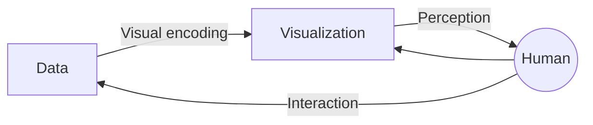
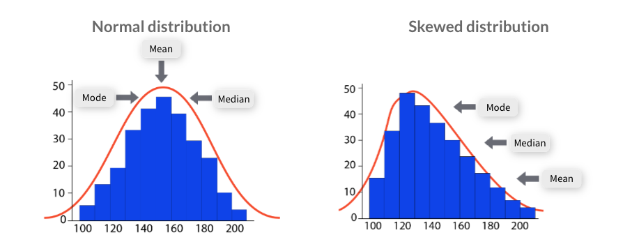

## Data visualization

- Successful visualization requires data be converted into a visual format.
- Motivation is to play to the strengths of people
  - for people to quickly absorb a large mount of informatin and find patterns in it.

### Data visualization process

- a human who looks at the visual and perceives information.
- the human should be able to answer some questions by looking at the visual after perception.

| Item | Exploratory | Explanatory |
| --- | --- | --- |
| Purpose | To analyse data to solve a question or develop a hypothesis. | To convey a message or idea. |
| Target audience | Expert users with prior knowledge of the subject. | Non-expert users with limited or no background knowledge. |
| When | Usually happens during the data analytics project and is internal facing. | Usually happens after the exploration phase and is often external facing. |
| Approach | Unguided, users explore, with no clear conclusion. | Guided through author-chosen comparisons, clear conclusions. |
| Representation | Has an analytical purpose and represents the complexity of data. | No analytical purpose and represents understandable data. |

- [Driven by Data: Explanatory visualization examples](https://driven-by-data.net/)

## Descirptive statistics

- Describe some data through a quantitative summarisation of its behaviour
- Help us summarise data in a meaningful way.
- Highlight things like whether there are any values that are ill defined, or which make no sense.
- measures of central tendency
  - mean
  - median
  - mode
- measures of spread
  - range
  - variance
  - standard deviation
  - interquartile range

## Inferential statistics

- includes more advanced methods such as hypothesis tests, ANOVA, and regression.
- make claims about how general this dataset is.
- we can make inferences from a sample to a population.

## Measures of central tendency

- a quick and easy way to describe a dataset by condensing it down to just one representative value.
- can easily compare one dataset to another.
- **Mean**: the averge of a dataset.
- **Median**: the middle value in a dataset.
- **Mode**: the most commonly occurring value in a dataset.

## Measures of spread

- how similar or varied a set of values are for a particular variable
- summarise the data in a more detailed way that shows how scattered the values are and how much they differ from the central tendency.
- **Range**: the largest value of a variable and subtracts the smallest.
  - The bigger the range the more spread out a data set is.
- **Variance**: how far a set of numbers are spread out from their average value.
- **Standard deviation**: the square root of the variance
  - gives us back a value that has the same units as the mean
- **Interquarile range, IQR**: the difference between the upper and lower medians.
  - First, find the median of a set of data.
  - Then, find the medians of the upper and lower half of the data.

## Frequency distribution

- Frequency is the number of times a data value occurs or repeats.
- $frequency(v_i) = \frac{\text{number of objects with attribute value}\thinspace v_i}{m}$
- Visual displays that organise and present frequency counts so that the information can be interpreted more easily.
- can show absolute frequencies or relative frequencies, such as proportions or percentages.
- can be shown in a table or graph.
- Some common methods of showing frequency distributions include frequency tables, histograms or bar charts.
- **Frequency tables**: display the number of occurrences of a particular value or characteristic.
- **Histograms**: a type of graph in which each column represents a numeric variable
  - useful for describing the shape, centre and spread to better understand the distribution of the dataset.
- **Bar charts**: a type of graph in which each column represents a categorical variable or a discrete ungrouped numeric variable.
