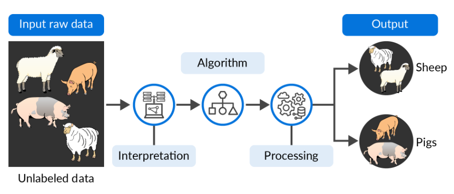
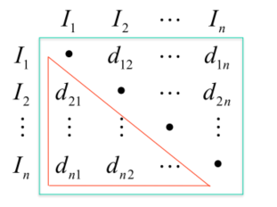
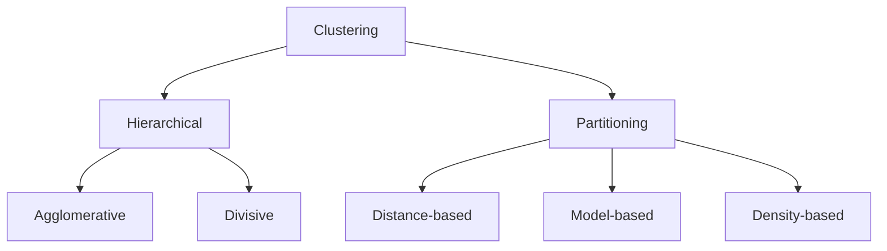
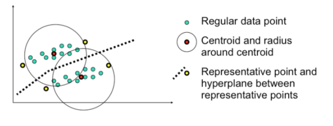
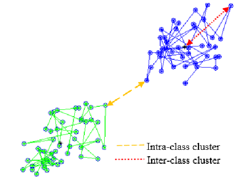
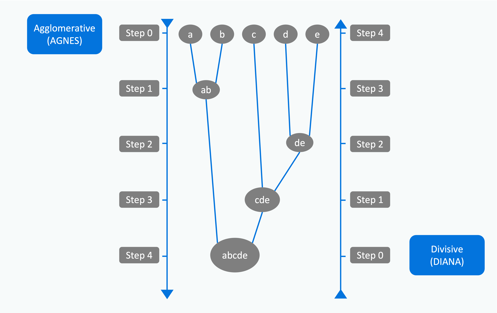

## Unsupervised machine learning

| Item | Supervised machine learning | Unsupervised machine learning |
| --- | --- | --- |
| **Data availability** | Input and output variables will be given. | Only the input data will be given. |
| **Labeling** | Algorithms are trained using labelled data. | Algorithms are used against data which is not labelled. |
| **Algorithms** | Support Vector Machine, Linear and Logistic Regression and Classification Trees. | Cluster algorithms, K-means, Hierarchical clustering, etc. |
| **Complexity** | simpler method. | computationally complex. |
| **Learning mode** | The learning method takes place offline. | The learning method takes place in real-time. |
| **Reliability** | highly accurate and trustworthy method. | less accurate and less trustworthy method. |

- most common tasks are **clustering**, **anomaly detection**, and **neural networks**.
- infer underlying patterns without human supervision or intervention and enable us to discover both the differences and similarities in a dataset.
- can be considered ideal solutions for exploratory data mining.

## Clustering

> objects (unlabelled data) are organised into groups, where the members of each group are similar in some way to each other and less similar to those in other groups.

- **Classification** assigns objects/data to the predefined (labelled) classes
- **Clustering** groups the objects/data based on the similarities between them
- used in pattern recognition, image analysis and bioinformatics.
- different clustering algorithms can produce different results based on their own definition of a cluster
- the parameters (such as the distance function, density threshold and the number of expected clusters) of the clustering algorithm should be set based on the particular characteristics of the dataset and the user’s intention

| Domain | Use cases |
| --- | --- |
| Biology and bioinformatics | Cluster algorithms have been used in biological systematics for comparing the genus differences in organisms. |
| Medicine | Cluster analysis can be used to detect underlying factors of particular diseases, such as coronary artery disease. It is also used to describe patterns of antibiotic resistance. |
| Market basket | Cluster analysis has gained increasing popularity in market research. It can be used to classify different groups of consumers by behaviour analysis. It helps to build a better understanding of market segmentation, pricing and new product testing. |
| Computer science | Clustering is a powerful tool for various tasks in the area of computer science, such as reforming functionality in software evolution, object recognition in computer vision and lexical ambiguity in natural language process. |
| Car insurance | Identify customer groups with high average claim costs. |

- **Similarity Measure**: Numerical measure of how alike two data objects often fall between 0 (no similarity) and 1 (complete similarity)
- **Dissimilarity, or Distance Measure**: Numerical measure of how different two data objects are range from 0 (objects are alike) to $\infty$ (objects are different)
- **Proximity**: Refers to a similarity or dissimilarity

### Distance measures

> Distance metrics or dissimilarity measures

- basically deal with finding the proximity or distance between data points and determining if they can be clustered together.
- **Manhattan distance**: distance between two vectors if they could only move right angles.
  - $Dist(A, B) = \sum_{} |a_{i} - b_{i}|$
  - no diagonal movement involved in calculating the distance.
- **Euclidean distance**: can best be explained as the length of a segment connecting two points.
  - $ Dist(A, B) = \sqrt{\sum_{} (a_{i} - b_{i})^{2}} $
  - calculated from the cartesian coordinates of the points using the Pythagorean theorem.
  - Typically, one needs to **normalize the data before using this distance measure**.
  - the dimensionality increases of your data, the less useful Euclidean distance becomes
- **Cosine similarity**: the cosine of the angle between two vectors.
  - $ Dist(A, B) = \frac{\sum_{} (x_i \cdot y_i)}{\sqrt{\sum_{} x_i^2 \cdot \sum_{} y_i^2}} $
  - a way to counteract Euclidean distance’s problem with high dimensionality.
  - has the same inner product of the vectors if they were normalized to both have length one
  - The magnitude of vectors is not taken into account, merely their direction.
    - In practice, this means that the differences in values are not fully taken into account.
- **Single link**: the shortest distance between points
- **Complete link**: the largest distance between points.
- **Average link**: average distance between points.
- **Centroid**: the distance between centroids.

#### Weighted distance measures

$$ Dist(A, B) = \sqrt{\sum_{} w_i (a_{i} - b_{i})^{2}} $$

- a weight to the attributes as some attributes are more important than others.
- force clustering to pay more attention to higher weight attributes and form clusters that depend more on those heavily weighted attributes.

#### Dissimilarity

- **Simple matching coefficient, SMC**: invariant, if the binary variable is symmetric.
  - $ d(i,j) = \frac{b+c}{a+b+c+d} $
    - the proportion of mismatches (b+c) out of all attributes (a+b+c+d).
  - The simple matching coefficient is used when 0 and 1 are equally important, treating matches of both 1s and 0s the same way.
- **Jaccard coefficient**: non-invariant, if the binary variable is asymmetric.
  - $ d(i,j) = \frac{b+c}{a+b+c} $
    - ignores cases where both are 0 (d), and only considers mismatches relative to at least one positive case.
  - The Jaccard coefficient is used when 1 (presence) is more meaningful than 0 (absence).

#### Similarity Matrix

- After calculating all distances, we can create a similarity matrix
- containing the distance between each pair of data points.

| ID | Gender | Age | Salary |
| --- | --- | --- | --- |
| 1 | M | 45 | 45000 |
| 2 | F | 32 | 54000 |
| 3 | F | 23 | 32000 |
| 4 | M | 36 | 58000 |

- Gender: binarized
- Age: normalized
- Salary: normalized

| ID | Gender | Age | Salary |
| --- | --- | --- | --- |
| 1 | 1 | 1 | 0.25 |
| 2 | 0 | 0.6 | 0.7 |
| 3 | 0 | 0 | 0 |
| 4 | 1 | 0.7 | 0.8 |

- $dist(ID2, ID3) = \sqrt{(0-0)^2 + (0.6-0)^2 + (0.7-0)^2} = 0.92$
- $dist(ID2, ID4) = \sqrt{(0-1)^2 + (0.6-0.7)^2 + (0.7-0.8)^2} = 1.02$

## Clustring methodologies

- **Hierarchical approach**: create trees of clusters and sub-clusters
  - Divisive (Top-down): Start with all examples in a single cluster, and decide how to break the cluster into multiple sub-clusters.
  - Agglomerative (Bottom-up): Start with each example in its own separate cluster. Decide which clusters to merge.
- **Partitional (K starting points)**: Start with $K$ random cluster centers, and decide which examples to put in each of the clusters.
  - Adjust the cluster centers after each allocation of examples to clusters.
  - k-means, k-medoids

### Choosing a clustering method

| Consideration | What to look for | Typical choices |
| --- | --- | --- |
| Scalability | Near-linear time and bounded memory on large datasets. | MiniBatch K-Means, BIRCH, scalable DBSCAN with indexing. |
| Arbitrary shapes | Ability to find non-spherical clusters. | DBSCAN, HDBSCAN, Spectral clustering. |
| Noise and outliers | Robustness to noise; ability to mark points as noise. | DBSCAN, HDBSCAN (labels noise), GMM with low-weight components. |
| Mixed attribute types | Works with categorical + numeric or custom distances. | k-prototypes/k-modes, Agglomerative with Gower distance. |
| Few parameters | Minimal, intuitive hyperparameters; stable defaults. | Agglomerative (linkage, distance), HDBSCAN (min cluster size). |
| Order insensitivity | Results independent of input order. | Most batch methods; shuffle for MiniBatch K-Means. |
| High dimensionality | Handles curse of dimensionality or uses reduction. | PCA + K-Means/Agglomerative, Spectral after reduction, cosine distance. |
| User constraints | Must-link/cannot-link or size constraints supported. | COP-K-Means, constrained agglomerative, semi-supervised variants. |
| Interpretability | Easy to explain clusters and decisions. | K-Means centroids, Agglomerative dendrograms, GMM probabilities. |

## Clustering Terminology

- **Centroid**: a point in the middle of a cluster. It may not be an actual point in the dataset.
- **Medoid**: an actual point in the dataset that is centrally located and is, therefore, representative of the cluster.
- **Representative points**: are points around the cluster that are representative of the cluster.
- **High intra-class similarity**: the homogeneity, the closeness of data points within a single cluster
- **Low inter-class similarity**: The distance between two separate clusters

- A good clustering method will produce high-quality clusters with high intra-class similarity and low inter-class similarity.

## Hierarchical clustering

- Hierarchical approaches lead to the formation of dendrograms
- The top and bottom of a dendrogram represent the two extremes of clustering
  - At the bottom, a leaf is an individual cluste
  - At the top, the root is one cluster

### AGNES

> AGgglomerative NESting hierarchical clustering algorithm.

- Agglomerative hierarchical clustering follows a bottom-up approach
  - starting with clusters of single objects and merging them into bigger and bigger clusters
- agglomerative clustering process terminates (or finishes) when a termination condition is satisfied or there is only one cluster containing all objects.
- based on Euclidean distance between two objects
- steps of the algorithm:
  1. Make a cluster with only one object as member for all objects
  2. Calculate the Euclidean distance between each pair of clusters
  3. Choose the cluster pair with the smallest distance and merge them to make one cluster
  4. Repeat step 2 with the new combined cluster and the other, older clusters
  5. Repeat steps 3 and 4 until all the objects are merged into a single cluster.

### DIANA

> DIvisive ANAlysis clustering algorithm.

- The top-to-bottom approach is followed in divisive hierarchical clustering
  - starts with a cluster containing all objects.
- This cluster is broken up into smaller clusters, and this process of breaking up clusters continues until each cluster contains one object or a given termination condition is satisfied.
- steps of the algorithm:
  1. The process of starts at the root with all the points as one cluster.
  2. It recursively splits higher-level clusters to build the dendrogram.
  3. It can be considered as a global approach.
  4. It is more efficient when compared with agglomerative clustering.

### Single-linkage clustering

> the minimum method, connectedness, or nearest neighbour method

- two clusters are linked by a single element pair
- The distance between clusters is defined as the shortest distance from a member of the first cluster to a member of the second cluster.

### Complete-linkage clustering

> the furthest neighbour method, maximum method, or diameter method.

- the distance between two clusters is defined as the greatest distance between any member of the first cluster and any member of second cluster

### Average-linkage clustering

> the minimum variance method

- the distance between two clusters is calculated by averaging the distance between each member of first cluster and each member of second cluster
