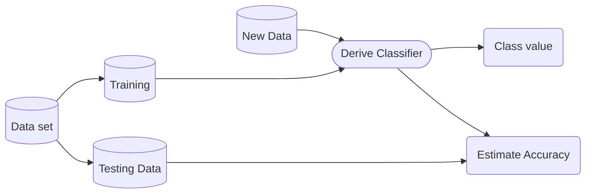

## Classification and Prediction

### Classification

> classifies data based on the training set and the class labels and uses it in classifying new data

- Model construction (learning)
- Model evaluation (accuracy)
- Model use (classification)

### Prediction

> predicts categorical class labels based on unseen data

- models continuous-valued functions

### Classfication Methods

- Decision tree induction
- Bayesian classification
- Nearest neighbour classification, case-based reasoning
- Neural networks
- Support Vector Machines
- Ensemble methods

### Issues around classification and prediction

- Predictive accuracy
- Speed and scalability
- Robustness
- Interpretability
- 'Goodness' of classifier

## Classification process



## Decision Tree

- Builds trees to describe data
- Easy to translate into rules
- Robust to niosy data
- able to build disjunctive expressions
- Inductive bias prefers small trees over larger.

### Decision Tree Methodologies

- Itertative Dichotomiser 3 (ID3)
- C4.5
- Classification And Regression Trees (CART)
- Chi-square Automatic Interaction Detection (CHAID)
- Multivariate Adaptive Regression Splines (MARS)

### Decision Tree Forms

- Balanced
  - each branch has the same depth from the root to leaves.
  - all nodes have the same number of splits
- Deep
  - some nodes have different levels, wherein some of them are split into more branches.
- Bushy
  - split into multi-way from the root
  - undesirable because the split may lead to small numbers of instance in each leaf node.

## Entropy and Information Gain

### Entropy

> measures the amount of disorder / (im)purity in a collection of things.
> i.e. the unpredictability of the data.

$$ Entropy(S) = -p_{+} log_2(p_{+}) - p_{-} log_2(p_{-}) $$

- Constructing a decision tree is all about finding an attribute that returns the highest information gain and the smallest entropy.
- $S$ stands for total number of samples
- $P_{+}$ denotes the likelihood of a yes (positive) answer.
- $P_{-}$ denotes the likelihood of a no (negative) outcome.

$$ E(S) = \sum_{i=1}^{c} -p_i log_2(p_i) $$

### Information Gain

> measures how well a given attribute separates the training examples according to the target classification.

- The larger the information gain is, the stronger the feature will be.

$$ Gain(S,A) = Entropy(S) - \sum_{v \in Values(A)} \frac{|S_v|}{|S|} Entropy(S_v) $$

- $S$ = set of training examples
- $A$ = the particular attribute to be tested
- $Values(A)$ = the set of values for the attribute A
- $S_v$ = subset of $S$ with attribute $A$ having value $v$s

## Iterative Dichotomiser 3

- constructs trees in a top-down manner.
- check each instance attribute with a statistical test to see how well it alone classifies (splits) the training examples.
- this becomes the root node.
- descendent is created for each possible value of the attribute and training examples split to the appropriate descendent.
- repeat the procedure for each descendent.
- the algorithm is going to issue recursion on each of the partitions.
- the output of this algorithm is the creation of a Model.

```py
function id3 (examples, target, attrs):
  create root node for tree
  
  if examples all +ve, return root with label=+
  if examples all -ve, return root with label=-
  if attrs is empty
    return root w/ label=most common value of target in examples else
   else
      A ← attribute from attrs that best splits examples
      root ← A for each possible value, vi , in A
        add a new branch below root corresp. to the test A = vi
        examples_v ← the subset of examples with A = vi

        if examples_vi is empty
          add a leaf node below branch w/ label = most common value of target from examples
        else below the branch add the subtree given by
          id3(examples_vi , target, attrs - {A})

      return root
```

### Hypothesis space search

- ID3 can be seen as a search through a space of hypotheses for one that matches the training data.
- It's a greedy search
- Hypothesis space = all the possible trees
- Simple to complex, hill climbing search
- Complete search = decision tree can represent all possible hypotheses
- Maintains only one current hypothesis
  - cannot find alternative decision trees
- No backtracking, maybe stuck in local optima
- Uses all training data at each step
  - less sensitive to errors in individual examples

### Inductive Bias

- Shorter trees preferred
- High information gain near the root
- cos' simple to complex search

## Issues with decision trees

### Overfitting training data

- occurs when a tree gives higher accuracy on the training data than another tree, but lower accuracy on the unseen data.
- because the training data is noisy or not representative of the unseen data.
- can measure how well the tree generalizes by checking error on test data.

### Dividing the data

- Training set
  - used to build the initial model
  - may need to enrich the data to get enough of the special cases
- Cross validation set
  - used to adjust the initial model
  - used to work out the correct values of parameters in model
  - models can be tweaked to be less dependent on idiosyncrasies in the training data to be a more general model
  - idea is to prevent over-training (i.e. finding patterns where none exist)
- Test set
  - used to evaluate the model performance

### Avoiding Overfitting

- stop growing the tree once the test error decreases
- grow the tree as normal (i.e. wit hoverfitting) then post-prune it.
- use a separate set of data apart from training to test when to prune nodes (training & cross-validation set)
- use all data to train, but apply a statistical test whether to expand/prune a node.
- use an explicit complexity measure (e.g. Minimum Description Length, MDL) to trade off accuracy vs complexity.

### Reduced-Error pruning

- build tree
- consider each node in tree for pruning
- pruning
  - remove subtree
  - make into a leaf
  - assign label as most common class in associated training examples.
- if pruned tree has as good error on the cross validation set as the unpruned tree, do the prune.
- keep pruning until the error on cross validation set increases.

### Cross validation set

- the main difficulty comes when you don't have much data and need it all for training.
- k-fold cross-validation or leave-one-out training can help.

### Rule Post-Pruning

- converts the decision tree to rules
- removes preconditions that do not worsen the accuracy (on the cross validation set or with a statistical test)
- sorts the rules by estimated accuracy and uses this order when classifying new data

### Continuous Valued Variables

- use real valued attributes for tests at nodes.
- Dynamically define new discrete attributes that partition the continuous attribute.
- discrete: $A < v = true$ and $A >= v = false $
- the boundary poins can be estimated from the training data.

## The confusion matrix

- a basic method of evaluation of classifiers
- The columns have numbers associated with the actual number of positive data points in the test set and the actual number of negative data points in the test set

| | Predicted Positive | Predicted Negative |
| --- | --- | --- |
| Actual Positive | True Positive (TP) | False Negative (FN) |
| Actual Negative | False Positive (FP) | True Negative (TN) |

- TP: the number of correct prediction of positive samples.
  - the number of data points in the test set that were positive and the classifier correctly assigned them to the positive group
- TN: the number of correct prediction of negative samples
  - the number of data points in our test set that was actually negative and predicted as negative by the classifiers
- FP: the number of incorrect predictions of positive samples
  - the value of data points in our test set that was actually negative but were predicted by the classifier as positives.
  - These ones are obvious errors, which is called a type 1 error.
  - `type I error`
- FN: the number of incorrect prediction of negative samples.
  - the number of data points in our test set that was actually positive but were predicted by the classifier as negative
  - usually called the type 2 error, and when we are trying to build a classification.
  - might have a trade-off between the number of the type 1 error or the type 2 error.
  - `type II error`
