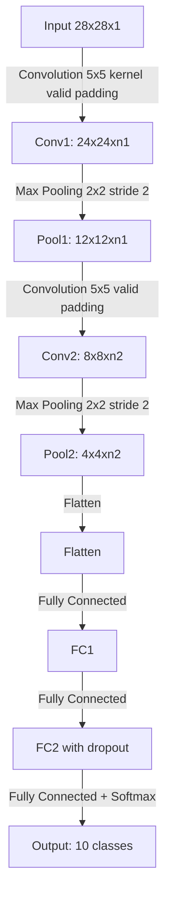
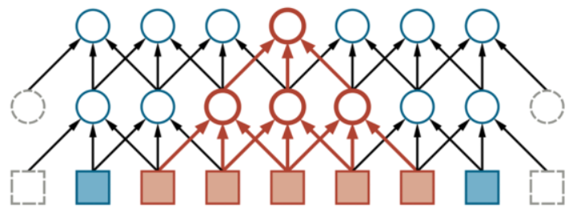

## Computer vision

- a field of artificial intelligence enabling computers and systems to derive meaningful information from digital images, videos and other visual inputs.
- vision is a perceptual channel that accepts a stimulus and reports soome representation of the world
- computer vision enables intelligent agents to see, observe and understand of environment

## Core problems of CV

- reconstruction: an agent builds a mode lfo the world from an image or a set of images
- recognition: an agent draws distinctions amont the objects it encounters based on visual and other information.
  - image classification
  - object detection
  - image segmentation

## Classic approaches to object recognition problems

- feature-based object recognition approach
  - works well for faces looking directly at the camera.
- pattern-element-based object recognition approach
  - a useful abstraction is to assume that some objects are made up of local patterns which tend to move around with respect to one another.
  - we can model objects with pattern elements.

## Modern approaches to object recognition problems

- deep learning networks
  - to recognition problems enables that features can be automatically learned and extracted from raw image data compares with the manual feature extraction in the classic approaches.
  - AlexNet, VGGNet, GoogleNet, ResNet, DenseNet, EfficientNet, RegNet...
- basic models and derived models
  - YOLO, SSD, RetinaNet, R-CNN...

## Evaluation metrics for image classification

| Metric | Definition | Use case |
| --- | --- | --- |
| Accuracy | the percentage of correcly predicted labels out of all predictions made | commonly used in balanced datasets but can be mis leading in imbalanced classes |
| Precisino | the ratio of correctly predicted positive observations to the total predicted positives. | useful when the cost of false positives is high (e.g., spam detection) |
| Recall (Sensitivity or True Positive Rate) | the ratio of correctly predictted observations to all the actual positives | important when the cost of false negatives s high (e.g., disease detection) |
| F1 Score | the harmonic mean of Precision and Recall | used when you need to balance precision and recall, especially in imbalanced datasets |
| Specificity (True Negative Rate) | the ratio of correctly predicted negative observations to all the actual negatives. | important when false positives should be minimized (e.g. medical tests for diseases) |
| Confusion Matrix | a table used to describe the performance of a classification model by showing the true positive, false positive, true negative, and false negative counts | provides a comprehensive understanding of a models' performance across all classes |
| ROC Curve (Receiver Operation Characteristic) | a graphical representation of the classifier's performance across all thresholds, plotting the true positive rate (recall) against the false positive rate (1 - specificity) | used to evaludate binary classirifres and compare models |
| AUC (Area Under the Curve) | the area under the ROC curve, providing a single number summary of the models' ability to discriminate between positive and negative classes | useful for evaluating binary classification models, particularly when dealing with imbalanced datasets. |

### Confusion Matrix

| Actual class ➡️<br/>Predicted class ⬇️ | Positive | Negative | Metric |
| --- | --- | --- | --- |
| **Positive** | TP: True Positive | FP: False Positive | Precision: $\frac{TP}{TP + FP}$ |
| **Negative** | FN: False Negative | TN: True Negative | Negative Predictive Value: $\frac{TN}{TN + FN}$ |
| **Metric** | Recall or Sensitivity: $\frac{TP}{TP + FN}$ | Specificity: $\frac{TN}{TN + FP}$ | Accuracy: $\frac{TP + TN}{TP + TN + FP + FN}$ |

### ROC Curve

1. Sort predicted probabilities
2. Try multiple thresholds
3. For each threshold, compute predicted labels
4. Compute TPR and FPR
5. Plot ROC curve (FPR vs TPR)
  i. $TPR = \frac{TP}{TP + FN}$
  ii. $FPR = \frac{FP}{FP + TN}$
6. Compute AUC as area under ROC curve

```py
from sklearn.metrics import roc_curve, roc_auc_score
fpr, tpr, thresholds = roc_curve(y_true, y_scores)
auc = roc_auc_score(y_true, y_scores)
```

## Evaluation metric for object detection

| Metric | Definition | Use case |
| --- | --- | --- |
| Intersection over Union (IoU) | measures how much the predicted bounding box overlaps with the ground truth. | $IoU = \frac{\text{Area of Overlap}}{\text{Area of Union}}$ |
| Precision | the ratio of correctly predicted postive observations to the total predicted positives | $Precision = \frac{TP}{TP + FP}$ |
| Recall | the ratio of correctly predicted observations to all the actual positives | $Recall = \frac{TP}{TP + FN}$ |
| F1 Score | the harmonic mean of Precision and Recall | $F1 = 2 \times \frac{Precision \cdot Recall}{Precision + Recall}$ |
| Average Precision (AP) | Precision-Recall Curve: Precision vs Recall at different thresholds<br/>AP: Area under the Precision-Recall curve (per class) | $AP = \int_{0}^{1} P(r) \, dr$ |
| Mean Average Precision (mAP) | mean of AP across all classes | provides a comprehensive understanding of a models' performance across all classes |
| AP@[.50:.95] | COCO benchmark | Averages AP at IoU threshold from 0.5 to 0.95 in steps of 0.05 |

- AP is computed by summing trapezoid areas under the Precision-Recall curve.

## Convolutional Neural Network (CNN)

- contains spatially local connectinos at lest in the early layers
- has patterns of weights that are replicated across the units in each layer.
- use a **kernel** to detect patterns of weights that is replicated across multiple local regions in an image
- use **convolution** that applies the kernel to the pixels of the image

```bash
Input
   ↓
[Conv → ReLU] → [Pooling]
   ↓
[Conv → ReLU] → [Pooling]
   ↓
Flatten (2D → 1D 벡터)
   ↓
Fully Connected Layer
   ↓
Output Layer (Softmax/Sigmoid)
```



$$ z_i = \sum_{j=1}^{l} k_j \cdot x_{j + (i-1)s} $$

- **$z_i$**: the $i$-th output element (convolution result)  
- **$j$**: index inside the kernel (from 1 to $l$)  
- **$l$**: kernel size (number of elements in the kernel)  
- **$k_j$**: the $j$-th kernel weight (filter element)  
- **$x$**: input sequence (the original data)  
- **$x_{j+(i-1)s}$**: the input element aligned with kernel position $j$ when shifted by stride
- **$s$**: stride (step size of the kernel movement)
- **$(i-1)s$**: total shift in the input for the $i$-th convolution

### Receptive Field

- the receptive field of a neuron is the portion of the sensory input that can affect aht neuron's activation.
- In CNNs, the receptive field of a unit in the first hidden layer is small.
- just the size of the kernel, e.g., 3x3 or 5x5.
- In the deeper layers of the network, it can be much larger.



$$R_{L} = R_{L-1} + (k_{L} - 1) \cdot \prod_{i=1}^{L-1} s_i$$

- **\(R_L\)**: receptive field size at the \(L\)-th layer  
- **\(k_L\)**: kernel size at the \(L\)-th layer  
- **\(s_i\)**: stride at the \(i\)-th layer  

### Pooling

- works like a convolutional layer, with a kernel size $l$ and stride $s$, but the operation is applied is fixed rather than learned.
- no activation fucntion is associated with the pooling layer.
- common forms of pooling
  - **average pooling**
  - **max pooling**: saying a feature exists somewhere in the unit's receptive field.

## Dropout

- a way to reduce the test-set error of a network to increase its ability of generalization.
- makes a etwork herder to fit the traninig set.
- the network is created by deactivating a randomly chosen subset of the units (dropout rate).
- cannot explain why it works but the results is better

## Batch Normalization

- modern neural networks are almost always trained with some variant of stochastic gradient descent (SGD).
- **Batch normlization** rescales the values generated at the internal layers of the network from the examples within each minibatch.
  - it standardizes the input to a layer for each mini-batch.
- standardizes the mean and variance of the values.
- maeks it much simpler to train a deep network.
