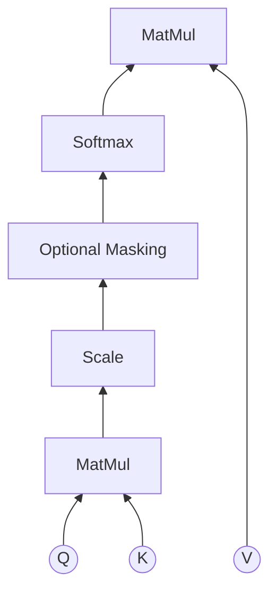

## NLP

### Tokenization

> The process of dividing a text into a sequence of words.

- Different models uses different tokenization methods.

| BERT TOKEN | BERT ID | GPT TOKEN | GPT ID |
| --- | --- | --- | --- |
| my | 2026 | My | 3666 |
| grandson | 7631 | Ġgrandson | 31845 |
| loved | 3866 | Ġloved | 10140 |
| it | 2009 | Ġit | 340 |
| ! | 999 | Ġ! | 0 |
| so | 2061 | Ġso | 1406 |
| much | 2172 | Ġmuch | 881 |
| fun | 4569 | Ġfun | 1257 |
| ! | 999 | Ġ! | 0 |

### Corpus

> a large and structured collection of text

- a corpus typically consists of at least a million words of text
- at least tens of thousands of distinct vocabulary words.

## Text classification

- the process of categorizing text into organized groups.
- text classifiers can automatically analyze text and then assign a set of predefined tags or categories based on its content.
- machine learning approach
  - Features
    - **BoW**
    - **TF-IDF**
  - Features + classifier
    - Logistic regression
    - SVM
    - **Naive Bayes**
- Deep learning approach
  - Neural models: CNNs (capture local **n-grams**)
  - RNNs, LSTMs (sequence-aware)
  - **Transformers** (e.g. BERT)
    - **Contextual embedding**
- Modern enhancements
  - Embedding + classifier: Pretrained embeddings (**Word2Vec**) + classifier
  - Fine-tuned transformers: BERT fine-tuned

### Bag of Words, BoW

- it represents a text as a bag of its words
- we can understand the meaning of a document from its content (words) their multiplicity (frequency, number of occurrences)
- mainly used as a tool of feature extraction.
- limitations
  - ignores syntax and the context
  - disregarding grammar
  - discards word order - words are independent of each other
  - considers only the meanings of the words in the sentence

```py
# examples

Example1 = "He likes to watch movies. Mary likes movies too."
Example2 = "Mary also likes to watch football games."

# Vocabulary
Vocab = {"He", "likes", "to", "watch", "movies", "Mary", "also", "football", "games"}

# BoW representation
BoW1 = {He: 1, likes: 2, to: 1, watch: 1, movies: 2, Mary: 1, also: 0, football: 0, games: 0}
BoW2 = {He: 0, likes: 1, to: 1, watch: 1, movies: 0, Mary: 1, also: 1, football: 1, games: 1}

[[1,2,1,1,2,1,0,0,0], [0,1,1,1,0,1,1,1,1]] 
```

### TF-IDF

> Term Frequency - Inverse Document Frequency

- Model based on the statistics of word counts.
- idea is that key terms and important ideas are likely to repeat.
- includes a scoring function that measure the relevance of a document to a query.
  - the function takes a document with a corpus and a query as input and returns a numeric score.
  - the doucments that have the highest scores are considered as the most relevant documents.
- **Term Frequency**
  - $TF(q_i, d_j, D)$
- **Inverse Document Frequency**
  - $IDF(q_i, D) = \log\frac{N}{DF(q_i, D)}$
    - $DF(q_i, D)$: number of documents in the corpus $D$ that contain the term $q_i$
- $N = |D|$: total number of documents in the corpus $D$
- **TF-IDF score**
  - $TFIDF(q_i, d_j, D) = TF(q_i, d_j) \cdot IDF(q_i, D)$

### Naive Bayes

- naive refers to a very strong simplifying assumption about the features
- Conditional independence assumption
  - Given class $Y$, all the features $X = {X_1, X_2, ..., X_n}$ are assumed mutually independent.
- $P(X | Y) = P(X_1, ..., X_n | Y) = \prod_{i=1}^{n} P(X_i | Y)$
- Bayes rule
  - $P(Y | X) = \frac{P(X | Y) P(Y)}{P(X)} \propto P(Y) P(X | Y)$
  - $P(Y | X_1, ..., X_n) \propto P(Y) \prod_{i=1}^{n} P(X_i | Y)$
- Sentiment Analysis
  - $p(C_k | x_1, ..., x_n) = \frac{1}{Z} p(C_k) \prod_{i=1}^{n} p(x_i | C_k)$
    - $Z = p(x) = \sum_{k} p(C_k) p(x | C_k)$
      - scaling factor for normalization of $p(C_k | x)$
  - maximum a posteriori (MAP) decision rule
    - $\hat{y} = \argmax\limits_{k \in 1, ..., K}p(C_k) \prod_{i=1}^{n} p(x_i | C_k)$

#### Examples of Naive Bayes

> $P(Class | w_{1:N}) = \alpha \cdot P(Class) \cdot \prod_{j} P(w_j | Class)$

- Analyze the sentiment
  - `my grandson loved it`
  - $x_1 = \text{my}$, $x_2 = \text{grandson}$, $x_3 = \text{loved}$, $x_4 = \text{it}$
  - $C = {positive, negative}$
  - $\hat{y} = \argmax\limits_{k \in \{positive, negative\}} p(C_k) \cdot p(x_1 | C_k) \cdot p(x_2 | C_k) \cdot p(x_3 | C_k) \cdot p(x_4 | C_k)$
    - positive case
      - $p(positive) = 0.49$
      - $p(my | positive) = 0.30$
      - $p(grandson | positive) = 0.01$
      - $p(loved | positive) = 0.32$
      - $p(it | positive) = 0.30$
      - $p(positive | x) \propto p(positive) \cdot p(my | positive) \cdot p(grandson | positive) \cdot p(loved | positive) \cdot p(it | positive) = 0.49 \times 0.30 \times 0.01 \times 0.32 \times 0.30 = 0.00014256$
    - nagative case
      - $p(negative) = 0.51$
      - $p(my | negative) = 0.20$
      - $p(grandson | negative) = 0.02$
      - $p(loved | negative) = 0.08$
      - $p(it | negative) = 0.4$
      - $p(negative | x) \propto p(negative) \cdot p(my | negative) \cdot p(grandson | negative) \cdot p(loved | negative) \cdot p(it | negative) = 0.51 \times 0.20 \times 0.02 \times 0.08 \times 0.4 = 0.00006528$
    - $Z = p(x) = \sum_{k} p(C_k) p(x | C_k)$
      - $= p(positive) \cdot p(my, grandson, loved, it | positive) + p(negative) \cdot p(my, grandson, loved, it | negative)$
      - $= 0.00014256 + 0.00006528 = 0.00020784$
      - the probability of $x$, obtained by adding up its probabilities under each class.
    - $p(positive | x) = \frac{p(positive) \cdot p(my, grandson, loved, it | positive)}{Z} = \frac{0.00014256}{0.00020784} \approx 0.6867$
    - $p(negative | x) = \frac{p(negative) \cdot p(my, grandson, loved, it | negative)}{Z} = \frac{0.00006528}{0.00020784} \approx 0.3133$
  - Decision
    - $\hat{y} = \argmax\limits_{k \in \{positive, negative\}} \{k = positive : 0.6867, k = negative : 0.3133\}$
    - The sentiment is **positive**.
- Spam detection
  - Probabilities learned from data:
    - $P(\text{Spam}) = 0.4$, $P(\text{Ham}) = 0.6$  
    - $P(\text{free}|\text{Spam}) = 0.8$, $P(\text{free}|\text{Ham}) = 0.1$  
    - $P(\text{win}|\text{Spam}) = 0.7$, $P(\text{win}|\text{Ham}) = 0.05$  
  - New document: "free win"  
    - Spam score: $0.4 \times 0.8 \times 0.7 = 0.224$  
    - Ham score: $0.6 \times 0.1 \times 0.05 = 0.003$  
    → Classified as **Spam**.

### N-gram model

- N-gram: a sequence of written symbols of length `n`
  - unigram, bigram, trigram
- the probability of each symbol is dependent only on the `n-1` previous symbols.
- $P(w_j|w_{1:j-1}) = P(w_j|w_{j-n+1:j-1})$
- $P(w_1:N) = \prod_{j=1}^{N} P(w_j|w_{1:j-1}) \approx \prod_{j=1}^{N} P(w_j|w_{j-n+1:j-1})$

#### Examples of N-gram

- $W_{1:N}$ is "This article is on NLP"
  - N=5
  - Bigram (n-gram with n=2)

```js
P("This article is on NLP")
/* full chain rule,  */
= P("This") // j = 1
  * P("article" | "This") // j = 2
  * P("is" | "This article") // j = 3
  * P("on" | "This article is") // j = 4
  * P("NLP" | "This article is on") // j = 5
/* bigram approximation */
= P("This") // j =1
  * P("article" | "This") // j = 2
  * P("is" | "article") // j = 3
  * P("on" | "is") // j = 4
  * P("NLP" | "on") // j = 5
```

## Transformer

- given a set of input vectors (tokens), attention lets each token look at the others and form a weighted average of them.
- The weights are data-dependent.
- The model learns the weights representing which tokens are relevant to which other tokens.



$$ X = \text{Input Embeddings},\qquad Q = X W_Q,\quad K = X W_K,\quad V = X W_V $$

- Scores: $S = \frac{QK^T}{\sqrt{d}}$
  - dot products between every query and every key
  - the scale $\sqrt{d}$ keeps gradients stable
- Weights: $A = Softmax(S)$
  - row-wise softmax
  - each row sums to 1
- Output: $Attention(Q, K, V) = A V$
  - each output token is a weighted sum of the value vectors, with weights determined by the attention scores.(how much to pay attention to each position)
- Query (Q): What am I looking for?
- Key (K): What is the label/address of the information I have?
- Value (V): What is the actual information I want to convey?

### Cross-Attention

- look up relevant information in another sequence.
  - e.g. decoder attending to encoder outputs in translation
- $Q$ from the current sequence, $K$ and $V$ from the other sequence.
  - $Q = X_{\text{target}} W_Q, \quad K = X_{\text{source}} W_K, \quad V = X_{\text{source}} W_V$
- Cross-attention = Which source tokens are relevant to this target token?
- Self-attention = Which other tokens in this sequence are relevant to this token?
- $head_i = Attention(Q W_i^Q, K W_i^K, V W_i^V)$
- $MultiHead(Q, K, V) = Concat(head_1, ..., head_h) W_O$

## Word representation

### One-hot representation

- represents each word as a vector of length `N`.
- where `N` is the size of the vocabulary.

```text
vocab = {he, is, singing, she, dancing, stage}

she = [0, 0, 0, 1, 0, 0]
is = [0, 1, 0, 0, 0, 0]
singing = [0, 0, 1, 0, 0, 0]
```

- limitations
  - incredibly inefficient for large vocabularies
  - not embed any intrinsic meaning of words
  - unable to represent similarity between likely words
  - the representation of documents is sparse vectors
    - can cause challenges in computation

### Word Embedding

- represents individual words as vectors in a low-dimensional continuous space.
- a distributed representation of a word.
- generate a unique value for each word while using smaller vectors compared with one-hot encoding.
- common vector dictionaries
  - word2vec
  - Glove (Global Vectors)

### Contextual embedding

- generates different vectors for the same word based on its context.
- the word "bank" would have different embeddings in the sentences:
  - "He went to the bank to deposit money."
  - "She sat by the river bank and enjoyed the view."
- BERT or GPT use deep neural networks to process a sequence of tokens.
- Each token's embedding is computed by considering the token itself, its position in the sequence and the surrounding tokens, context.
- captures both semantic and syntactic role in that specific context.

## Part of Speech (POS) tagging

- lexical category or tag that indicates the grammatical role of a word in a sentence.
- parts of speech allow language models to capture generalizations such as "adjectives often modify nouns" or "verbs often follow subjects".

```bash
From  the start , it  took  a   person
IN    DT  NN    , PRP VBD   DT  NN

with great qualities  to  succeed
IN   JJ    NNS        TO  VB
```

| Tag | Description        | Example  |
| --- | ------------------ | -------- |
| CC | Coordinating conjunction | and, but |
| CD | Cardinal number    | one, two |
| DT | Determiner         | the, a    |
| EX | Existential there  | there     |
| FW | Foreign word       | doppelgänger |
| IN | Preposition or subordinating conjunction | in, of |
| JJ | Adjective          | big, old  |
| JJR | Adjective, comparative | bigger, older |
| JJS | Adjective, superlative | biggest, oldest |
| LS | List item marker   | 1, 2, One |
| MD | Modal              | can, will |
| NN | Noun, singular or mass | cat, tree |
| NNS | Noun, plural       | cats, trees |
| NNP | Proper noun, singular | John, London |
| NNPS | Proper noun, plural | Smiths, Londons |
| PDT | Predeterminer      | all, both  |
| POS | Possessive ending  | 's, s'     |
| PRP | Personal pronoun   | I, you, he |
| PRP$ | Possessive pronoun | my, your, his |
| RB | Adverb             | quickly, very |
| RBR | Adverb, comparative | faster, better |
| RBS | Adverb, superlative | fastest, best |
| RP | Particle           | up, off    |
| SYM | Symbol             | $, %, &    |
| TO | to                 | to         |
| UH | Interjection       | oh, wow    |
| VB | Verb, base form    | be, have   |
| VBD | Verb, past tense   | was, had   |
| VBG | Verb, gerund or present participle | being, having |
| VBN | Verb, past participle | been, had |
| VBP | Verb, non-3rd person singular present | talk, have |
| VBZ | Verb, 3rd person singular present | talks, has |
| WDT | Wh-determiner     | which, that |
| WP | Wh-pronoun         | who, what  |
| WP$ | Possessive wh-pronoun | whose     |
| WRB | Wh-adverb          | where, when |
| # | Pound sign       | #          |
| $ | Dollar sign      | $          |
| , | Comma            | ,          |
| . | Sentence-final punctuation | . ! ? |

### Example of POS tagging

- Hidden Markov Model (HMM)
  - takes in a temproral sequence of evidence observations
  - predicts the lexical categories
- Logistic regression
  - build 45 different logistics regression models, one for each part of speech
  - ask each model how probable it is that the example word is a member of that category, given the feature values for that word in its particular context.
