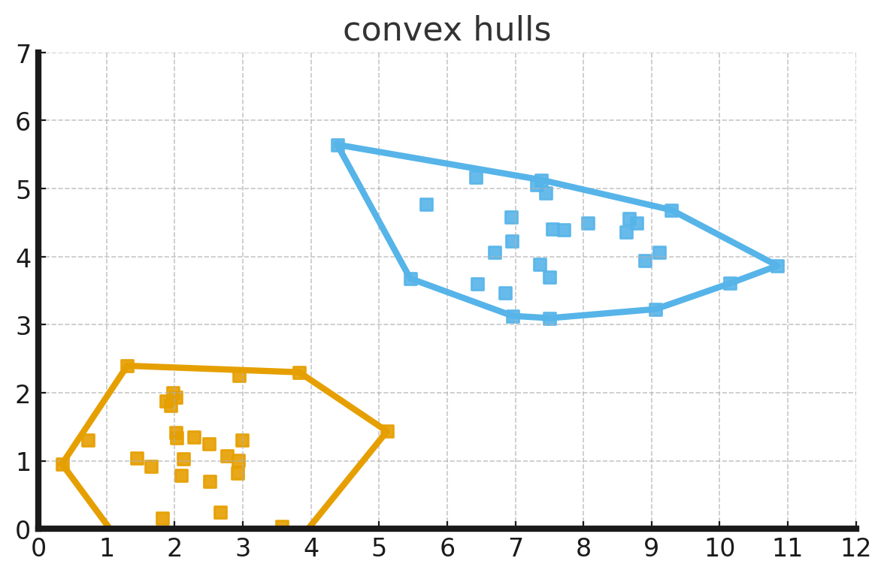

## SVM

### Convex Hull

- the lines surrounding the outermost points of each class.
- since the classes are linearly separable, convex hulls do not intersect.

### Margins

- the distance between data points of different classes seprarated by a hyperplane.
- multiple possible hyperplanes can separate the classes, but the optimal hyperplane maximizes the margin.
- Maximum Margin Hyperplane
  - a separation line/plane orthogonal to the shortest line connecting the convex hull.
  - the line that is farthest apart from each convex hull.
  - it separates the data points with the widest margin.

### Kernels

- kernel is used to represent kernel functions
  - which are used to convert low-dimensional space to high-dimensional space
  - by applying a function on low-dimensional data points to come up with higher dimensions
    - which can be used to linearly separate the data points of classes using a hyperplane.
- the function of a kernel is to take data as input and transform it into the required form.
  - different algorithms use different types of kernel functions.
  - linear, non-linear, polynomial, radial basis function (RBF), and sigmoid.

### Kernel trick

- Basic idea of SVM and Kernel trick is to find the plane which can separate, classify or split the data with maximum margin as possible.
- The distance from a point $(x_0, y_0)$ to a line $Ax + By + C = 0$ is given by the formula:
  \[
  \text{Distance} = \frac{|Ax_0 + By_0 + C|}{\sqrt{A^2 + B^2}}
  \]
- The distance between $H_0$, $H_1$ is then: $|w \cdot x + b| / ||w|| = 1/||w||$.
  - The total distance between $H_1$ and $H_2$ is $2/||w||$.
  - $H_1: w \cdot x + b = 1$
  - $H_2: w \cdot x + b = -1$.
  \[
    \text{Distance} = \frac{|(+1) - (-1)|}{||w||} = \frac{2}{||w||}
  \]
- to maximiza the margin, we need to minimize $||w||$
- this can be solved through Lagrangian formula or Lagrangian multipliers.
  \[
    L = \frac{1}{2} ||w||^2 - \sum_{i=1}^{n} \alpha_i [y_i (w \cdot x_i + b) - 1]
  \]
- Setting the gradient of $L$
  \[
    \frac{\partial L}{\partial w} = 0 \Rightarrow w = \sum_{i=1}^{n} \alpha_i y_i x_i
  \]
  \[
    \frac{\partial L}{\partial b} = 0 \Rightarrow \sum_{i=1}^{n} \alpha_i y_i = 0
  \]
- The dual form of the optimization problem is:
  \[
    \text{Maximize } W(\alpha) = \sum_{i=1}^{n} \alpha_i - \frac{1}{2} \sum_{i=1}^{n} \sum_{j=1}^{n} \alpha_i \alpha_j y_i y_j (x_i \cdot x_j)
  \]
