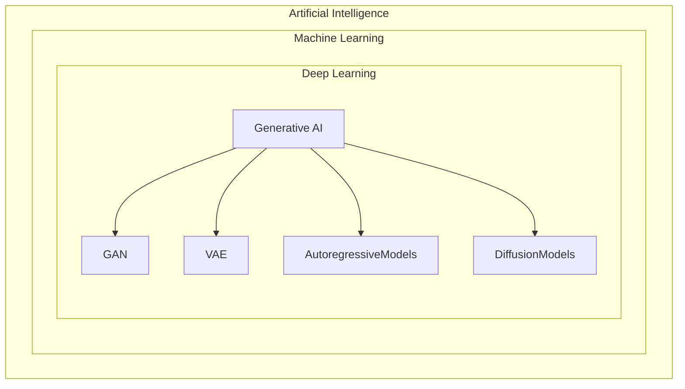
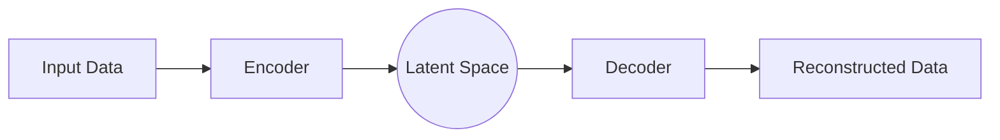
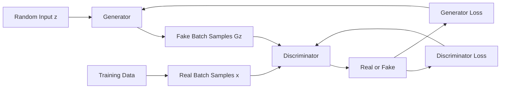

## Generative AI

- Gen AI refers to a category of AI models designed to generte new content, synt99hetic data that resembles a given dataset.
- Gen AI models create new content, including text, images, audio, and video.

### Historcal context of Gen AI

- 1980s: The development of statistical approaches to AI emerged, focusing on probabilistic models
- 1990s: Hidden Markov Models (HMMs) became popular in speech recognition and sequence generation tasks, making a shift towards using statistical methods in generative processes.
- 1990s-2000s: The resurgence of Neural Networks, with the introduction of deep learning techniques. However, hardware and data limitations hampered progress.
- 2010s: The advent of deep learning algorithms, especially convolutional neural networks (CNNs) and recurrent neural networks (RNNs), transformed the landscape of AI.
- 2013: VAEs were introduced, providing a probabilistic approach to data generation, allowing for smooth latent space interpolation and structure.
- 2014: GANs, a novel framework where two neural networks (a generator and a discriminator) are trained simultaneously, allowing for the generation of highly realistic images and other data types.
- 2015-2020: Generative models began to find applications beyond image synthesis, including text generation, music composition, and even video generation. OpenAI's GPT-2 showcased the potential of transformer-based models for generating coherent text.
- 2020s: The introduction of larger and more capable models like OpenAI's GPT-3 and subsequent iterations revolutionized natural language processing.
  - DALL-E and Stable Diffusion pushed the boundaries of image generation, allowing users to create images from textual descriptions. This sparked creative exploration and practical applications in marketing, art, and design.
- Present: The integration of multiple data modalities (text, image, audio) led to the development of models like CLIP and GPT-4, which can understand and generate content across different formats, enhancing the versatility of generative AI.

## Variational Autoencoders, VAEs

- VAEs are from the probabilistic approach to build a generative AI model
- VAE learns a latent distribution instead of a fixed latent presentation, allowing for the generation of new samples.
- Latent space
  - sample from a Gaussian distribution
  - $\mu$ and $\sigma$ are learned during training
  - $z$ is a new sample from the latent space
- $q_\phi(z|x)$ is the encoder that maps input data $x$ to a distribution over the latent space $z$
- $p_\theta(x|z)$ is the decoder that maps a latent variable $z$ back to the data space $x$
- During training, the model optimizes the reconstruction loss and a regularization term (KL divergence) to ensure the learned latent distribution is close to a prior distribution (usually a standard normal distribution).
- Latent Representation
  - Dimensionality Reduction: latent space is typically lower-dimensional than the input space
  - Smoothness: In a well-structured latent space, similar inputs will be represented by nearby points.
  - Generative Capabilities: Once trained, can sample from the latent space to generate new data that resembles the training set.
  - Regularization: The VAE incorporates a regularization term in its loss function (KL divergence), which encourages the lerned latent distribution to be close to a standard normal distribution.
- Decoder
  - The decoder takes the sampled latent representation $z$ and reconstructs the original input data.
  - The goal is to make the reconstructed data as close as possible to the original input.

### VAE Examples

#### Face Generation Example

- Trains a VAE on face photos.
- Latent space learns meaningful features (e.g. hair color, glasses, smile)
- By sampling and interpolating in latent space, can generate new faces or smoothly morph one face into another.

#### Anomaly Detection Example

- Train a VAE on normal sensor data.
- When fed unusual data, reconstruction error will be high.
- Use this for fault detection in machines, fraud detction, etc.

### Autoencoder

- Encoder
  - Input Layer: takes in the original data
  - Hidden Layer: These layers progrssively reduce the dimensionality of the input through operations like linear transformations and non-linear activations. (e.g., ReLU-Rectified Linear Unit)
  - Ouput Layer: Produces the final latent represntation. Sometimes Sigmoid or Tanh are used depending on the nature of the input data.
  - Learns to capture meaningful patterns in the data by minimizaing reconstruction loss, which mesures the difference between the original input and the reconstructed output produced by the decoder.
- Decoder
  - typically mirrors the structure of the encoder but in reverse.
  - During trainng, Mean squared Error (MSE) for continuous data or Binary Cross-Entropy (BCE) for binary data are commonly used to quantify the reconstruction loss.

#### Image Reconstuction Example

- input: 28x28 pixel
- encoder: compresses it to just 16 numbers (latent vector)
- decoder: expands those 16 numbers back into a 28x28 image
- result: the reconstructed digit looks similar to the original but not in the training set.

#### Denoising Images

- input: a noisy photo of a cat
- encoder: learns to ignore the noise and compress meaningful features.
- decoder: rebuilds the image without the noise.
- output: a clearer cat image.

### Loss function

- Reconstruction loss: Ensure output similar to input
- KL divergence loss: Push the learned distribution to be close to a standard normal distribution. (can sample new data)

## Generative Adversarial Network, GAN

- Generator: Learns to generate fake (generated) data that resembles data distribution.
- Discriminator: Learns to distinguish between real data and data generated by the Generator.
- Steps
  1. Generator creates fake data samples fro mrandom input (noise).
  2. Discriminator evaludates these samples together with real data samples.
  3. Discriminator outputs probabilities indicatcing whether each sample is real or fake.
  4. Based on the prediction of the Discriminator, the Generator and Discriminator are updated using specific loss functions.
- Applications
  - Labels to Street Scenes
  - Labels to Facade
  - BW to Color
  - Aerial to Map
  - Day to Nihght
  - Edges to Photo
  - Text-to-Image Synthesis

## Autoregressive Models

- a class of generative models where the current value of a time series is expressed as a linear function of its own past values plus some noise.
- foundational in generative AI and widely used in generative AI, particularly for tasks like text generation, speech synthesis.
- Examples
  - GPT series: state-of-the-art autoregressive language models used for text generation.
  - WaveNet: an autoregressive model for generating high-quality audio by predicting each sample conditioned on previous samples.

### Training Autoregressive Models

- Pretraining
  - the model sees sequences of tokens and learns to guess the next token.
  - objective: minimize cross-entropy loss between its guess and the true next token.
  - this teaches grammar, facts, reasoning patterns, and style from raw text.
- Supervised fine-tuning (optional)
  - smaller curated datasets (questions to answer, instructions to respond) teach it to follow directions.
- Reinforcement learning from Human Feedback (optional)
  - Humans rank multiple model outputs; a reward model is trained on those rankings; GPT is then optimized to produce higher-reward responses (safer, more helpful, less toxic)
- Text to **Tokens** via a tokenizer (e.g. BPE, Byte Pair Encoding)
- Each token becomes a vector (**Embedding**)
- **Positional encodings** inject order information.
- **Transformer layer**
  - **self-attention**: each token looks at all previous token (causal mask) and decides which ones matter, computing weighted combinations.
  - Multiple **heads** let it attend to different patterns (syntax, long-range links, etc.).
  - **feed-forward network**: a nonlinear MLP refines each token's representation.
  - **residual connections & layer norm** stabilize tranining.

### Interfence

- a prompt (the context)
- GPT computes probabiliites for the next token.
- A decoding stragety samples a token
  - Decoding knobs
    - Greedy: take the top token
    - Top-K
    - Nucleus (Top-p) sampling (limit to likely options)
    - Temperature scales randomness, controls how random the next token choice is
      - lower = more determistic, higher = more creative
- append the token and repeat autoregressive generation.
