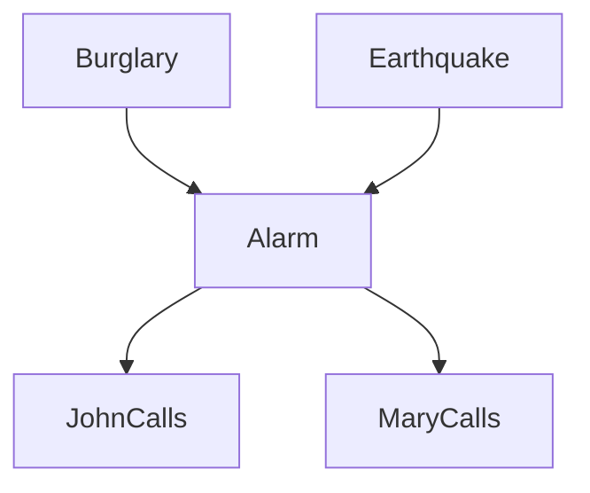

## Uncertain Domain

- Agent may need to handle uncertainty
- Environment is partially observable
  - Fully observable: An agent knows where it is.
  - The drone never knows its exact position, only an estimated one.
  - The true user intent is not directly observable, only noisy speech data.
  - It cannot see the whole environment or detect humans perfectly.
  - The true health state (disease present or not) is hidden.
- Environment is non-deterministic
  - AI Trading Agent
    - even if the agent takes the same action, the outcome can vary dramatically.
    - from market prices changes unpredictably due to external events (news, other traders, economic data).
    - network latency, competing traders' behavior are stochasic and independent, random fluctuations can affect the outcome.
    - buy action could lead to profit, loss, or no change depending on uncontrollable external factors.
  - AI Helpdesk Chatbot
    - even when the chatbot executes the same action, it sends queries to multiple backend systems, the result may differ each time.
    - network latency or failures, backend load, concurrent requests, and external dependencies can lead to different response times or outcomes.
    - same command doesn't guarantee the same outcome.
- Autonomous Driving
  - Partial Observability
    - Sensors cannot detect everything, blind spots, weather effects, occluded vehicles.
  - Non-Determinism
    - Even if the car signals a turn and starts moving, other drivers might brake suddenly, pedestrians might cross unexpectedly, or traffic lights might malfunction.
    - depending on random external events.
- Medical Diagnosis & Treatment Assistant
  - Partial Observability
    - The patient's internal health state is not directly visible.
    - tests can be inaccurate or incomplete: false positives/negatives, missing data
  - Non-Determinism
    - The same treatment can have different effects on different patients due to genetics, lifestyle, or random biological responses.
    - A drug may succeed, fail, or cause side effects.

## Knowledge Representation

- The agent's knowledge can at best provide only a degree of belief in the relevant logical sentences.
- A probabilistic agent may have a numerical degree of belief between 0 and 1.

### Bayesian Network

- a directed graph
- each node repressents a random variable and edge with an arrow from X to Y represents that X is a parent of Y.
- each node is associated with a probability distribution
- if a node Y has parents X, the Y node has a conditional probability distribution with respect to its parents X, i.e. $P(Y| \text{parents}(Y))$
- if a node has no any parents, it has an unconditional probability distribution.

### Burglary Example

- a new burglar **alarm** installed at home.
- it is reliable at detecting a **burglary**, but also responds on occasion to minor **earthquakes**
- you have two neighbors, **John** and **Mary** who promised to call you at work when they hear the alarm.
- given the evidence of who has or has not called, estimate the probability of a burglary.
- Knowledge representation as the probability of each event that can occur in this case.

$$P(\text{event}_{j}) = \frac{\text{number of ccurrences of event }_j}{\text{total number of experiments}}$$

- calulate the full joint probability distribution for all relevant variables.
  - specifying probabilities for all possible events one by one is unnatural and tedious.

## Bayes' Theorem

$$ P(A|B) = \frac{P(B|A) \cdot P(A)}{P(B)} $$

- $P(A|B)$: Posterior probability, the probability of event A given taht B has occurred.
- $P(B|A)$: Likelihood, the probability of event B occurring given that A is true.
- $P(A)$: Prior probability, the initial probability of A being true before considering B.
- $P(B)$: Evidence, the total probability of B occurring.
- examples
  - 1% of people have a certain disease (prior probability). $P(Disease) = 0.01$
  - the test for the disease is 99% accurate (likelihood).
    - $P(PositiveTest|Disease) = 0.99$
    - $P(NegativeTest|NoDisease) = 0.99$
    - so $P(PositiveTest|NoDisease) = 0.01$
  - $P(PositiveTest) = P(PositiveTest|Disease) \cdot P(Disease) + P(PositiveTest|NoDisease) \cdot P(NoDisease)$
  - $= 0.99 \cdot 0.01 + 0.01 \cdot 0.99 = 0.0198$
- the conditional probability $P(effect|cause)$ quantifies the relationship in **the causal direction** from cause to effect.
- but $P(cause|effect)$ is often what we really want to know, describing the relationship in **the diagnostic direction** from effect to cause.
  - In medical dignosis, the doctor knows $P(symptoms|disease)$ from medical studies, and want to derive a $P(disease|symptoms)$ for a particular patient.
  - $$P(disease|symptoms) = \frac{P(symptoms|disease) \cdot P(disease)}{P(symptoms)}$$
