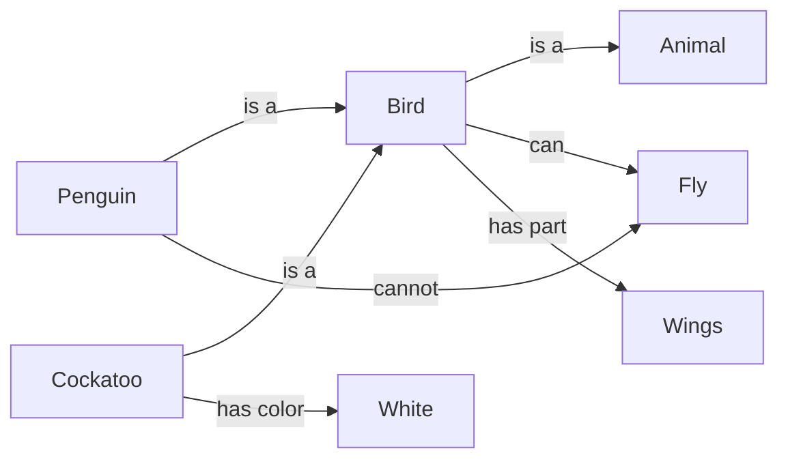
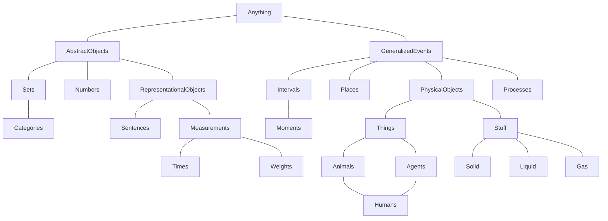
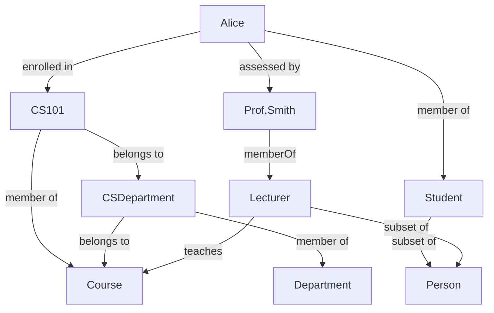

## Structural Knowledge

- Structural knowledge: the relationship between concepts and objects in the world.
- Hierarchical approach: built on classification and uses hierarchies as the structures for knowledge representation, presented in a graphical format.
  - Semantic networks: nodes represent concepts, and edges represent relationships between concepts.
  - Ontologies
    - A formal specification of concepts, relationships, and constraints within a domain that enables machines to reason automatically.
    - It defines classes (concepts), subclasses (hierarchical relations), and properties (attributes or relations) that describe how entities interact.
    - Unlike simple taxonomies, ontologies also include logical axioms and constraints that specify allowable relationships and permit inference and consistency checking through automated reasoning.
    - Classes: Main concepts or categories (e.g. Person, Animal).
    - Subclasses: Subcategories (e.g. Dog ⊂ Animal).
    - Properties: Attributes (e.g. hasPart, hasColor).
    - Relations: Connection rules (e.g. MemberOf, SubsetOf).
    - Constraints: Logical constraints (e.g. disjointness, transitivity) that enable inference.

### Requirement of hierarchices

- Inclusiveness: `Dog ⊆ Mammal ⊆ Animal`
- Species/differentia: `Dog = Mammal + (barks, canine traits, etc.)`
- Inheritance: `Mammal: has_fur, gives_live_birth` → `Dog: inherits all Mammal properties`
- Transitivity: If `Dog ⊆ Mammal` and `Mammal ⊆ Animal`, then `Dog ⊆ Animal`
- Systematic and predictable rules for association and distinction
- Mutual exclusivity: `Reptile ∩ Mammal = ∅`
- Necessary and sfficient criteria:
  - Necessary: $\forall x,\ \text{Mammal}(x) \Rightarrow \text{Vertebrate}(x) \land \text{ProducesMilk}(x)$
  - Sufficient: $\forall x,\ \text{Vertebrate}(x) \land \text{ProducesMilk}(x) \Rightarrow \text{Mammal}(x)$

### Advantage of hierarchical approach

- Inferring from incomplete evidence (if the shared criteria are not obvious or easily observable).
  - `Animal → Mammal → Dog`: If an entity is classified as a *Mammal*, we can infer properties such as *having fur* and *giving live birth*, even if the entity is not explicitly identified as a *Dog*.
- Excellent representations in mature domains
  - Domains where entities and relationships are well understood and stable
  - e.g. medical diagnosis, biological taxonomy, type systems in programming languages.
- Useful for entities that are well defined and have clear class boudnaries.
  - Good fit: HTTP status codes, chemical elements, and biological species
  - Poor fit: emotions, social roles, and cultural practices
- Some theory or model is necessary to guide the identification
  - Provides criteria for defining entities and relationships
  - e.g. Evolutionary theory in biological taxonomy, Type theory in programming languages

## Partition

> A partition of a category is a set of subcategories that form a disjoint, exhaustive composition of that category.

- Disjoint: Two or more categories are disjoint if they don't share common members.
- Exhaustive composition: The subcategories together cover all members of the parent category, leaving no member unclassified.
- Examples:
  - ❌ Category: Animal (Not a partition)
    - Mammal, Bird (Reptiles, fish, insects are missing, not exhaustive)
  - ✅ Category: Integer (Partition)
    - Even, Odd (Disjoint and exhaustive)

## Physical composition

- **PartOf** Relation: `Partof(a, b)` is a relation representing that one thing, 'a', is a part of another thing, 'b'.
- **BunchOf** Relation: `BunchOf(a)` is a relation, taking a set of objects 'a', to represent a composite object made up of those parts.
- Examples:
  - `Partof(Wheel, Car)`: A wheel is part of a car (**one-to-one** relation).
  - `BunchOf({Wheel1, Wheel2, Wheel3, Wheel4})`: A car is a bunch of four wheels (**many-to-one** relation).
- Link between `PartOf` and `BunchOf`:
  - $\forall x (x \in s \implies PartOf(x, BunchOf(s)))$
  - $\forall y \Big[\big(\forall x (x \in s \implies PartOf(x, y)\big) \implies PartOf(BunchOf(s), y)\Big]$
- Why useful?
  - Reasoning from individual `parts -> group -> larger object`.
  - Avoiding ambiguity between: "this thing is part of", "these things together form"
  - Without `BunchOf`, ontologies cannot represent: piles, colleciton, aggregates, composite physical structures.

## Measurements

- Quantitive measures (Ratio, Interval)
  - Represented as numbers with units
  - Support arithmetic and unit conversion
  - Enable numeric reasoing (e.g. 2.54cm = 1 inch)
- Non-quantitative measures (Ordinal)
  - Cannot be meaningufully represented as numbers
  - Can still be compared using ordering relactions (`<`, `>`, `=`)
  - Suppor qualitative reasoning (e.g. one task is more difficult than another)

### Objects

- Stuff
  - Represents substances
  - Uncountable masses
  - Definitions include only **intrinsic** properties (e.g. Butter, Unsalted Butter)
  - $b \in Butter \land PartOf(p, b) \implies p \in Butter$
- Things
  - Represents discrete objects
  - Countable entities
  - Definitions include **extrinsic** properties (e.g. PoundOfButter, StickOfButter)
    - It depends on measurement
    - It depends on contextual constraints

### Time

- Fluent: a condition whose truth value can change over time.
  - e.g. "The box is on the table", $On(box, table)$, $On(box, table, t)$
  - a time-dependent proposition.
- Time scale and absolute time
  - Ontology represents time along a single continuous timeline with a fixed reference point.
  - $Date(0, 20, 21, 24, 1, 1995) = Seconds(300000000)$
  - It allows arithmetic operations on time and comparisons between time points.
- Time intertvals
  - Time can be represented as moments (instants) or intervals (durations).
  - $Duration(i) = Time(End(i)) - Time(Start(i))$
- Partition of time
  - $Partition({Moments, ExtendedIntervals}, Intervals)$
  - All time intervals can be partitioned into moments and extended (non-zero-length) intervals.
  - It provides a complete and precise ontology of time.

#### Event calculus

- $T(f, t_1, t_2)$: Fluent $f$ is true for all time between time $t_1$ and $t_2$.
- $Happens(e, t_1, t_2)$: Event $e$ start at time $t_1$ and ends at time $t_2$.
- $Initiate(e, f, t)$: Event $e$ causes fluent $f$ to become true at time $t$.
- $Terminates(e, f, t)$: Event $e$ causes fluent $f$ to cease to be true at time $t$.
- $Initiated(f, t_1, t_2)$: Fluent $f$ becomes true at some point between $t_1$ and $t_2$.
- $Terminated(f, t_1, t_2)$: Fluent $f$ ceases to be true at some point between $t_1$ and $t_2$.
- $t_1 < t_2$: Time point $t_1$ occurs before time point $t_2$.
- Happens(PutBoxOnTable, 10, 12)
- Initiate(PutBoxOnTable, On(Box, Table), 12)
  - Initiated(On(box, table), 10, 12)
- T(On(Box, Table), 12, 20)
- Terminates(RemoveBoxFromTable, On(Box, Table), 20)
  - Terminated(On(box, table), 18, 22)

### Successor-state axiom

> 후속상태공리

- Define how the world changes after an action occurs.
  - what changes when an action happens
  - what stays the same.
- Without successor-state axioms, we face the frame problem:
  - after every action, we would need to explicitly list all facts that did not change.
- $Move(A, B, X)$: moving block A from the top of block B to position X.
  - Preconditions:
    - $On(A, B)$: A is on top of B
    - $Clear(A)$: nothing is on top of A
    - $Clear(X)$: nothing is on position X
  - Effects:
    - $On(A, X)$: A is now on position X
    - $Clear(B)$: B is now clear
    - $Clear(X)$: X is no longer clear (X is now occupied by A)

## Semantic networks

- Visually represent a knowledge base.
- Support efficient inference.
- Allow properties of an object ot be inferred from its category membership.
- Representing individual objects, categories of objects, and relations among objects.
- Categories are the primary buildling blokcs of large-scale knowledge representation schemes.

### Taxonomy hierarchy

- A hierarchical structure of categories
- Each lower category is a more specific kind of its parent
- Organized from general → specific

### University Ontology

| Entity | Class | Example Statemnets |
| --- | --- | --- |
| Alice | Student | $enrolledIn(CS101)$, $assessedBy(Prof.Smith)$ |
| Prof.Smith | Lecturer | $memberOf(Lecturer)$, $teaches(CS101)$ |
| CS101 | Course | $belongsTo(CSDepartment)$ |

## Knowledge graph

- represents information and its relationships using a graph structure.
- Nodes: entities or concepts (e.g. people, places, things).
- Edges: relationships between nodes (e.g. "is a", "part of", "located in").

### Types of Knowledge Graphs

- General Knowledge Graphs
- Domain-Specific Knowledge Graphs
- Semantic Knowledge Graphs
- Social Knowledge Graphs
- Temporal Knowledge Graphs
- Special Knowledge Graphs
- Statistical Knowledge Graphs
- Probabilistic Knowledge Graphs
- Textual Knowledge Graphs
- Multi-modal Knowledge Graphs

#### General Knowledge Graphs

- Comprehensive information representation
- Entity-Relationship Structure
- Linked Data
- Semantic Enrichment
- Capabilities & Use Cases
  - Querying and Analysis
  - Data Integration
  - ML and AI applications

#### Examples

- DBPedia
- Wikidata
- YAGO
- Google Knowledge Graph
- Microsoft Academic Graph
- IBM Watson Knowledge Studio
