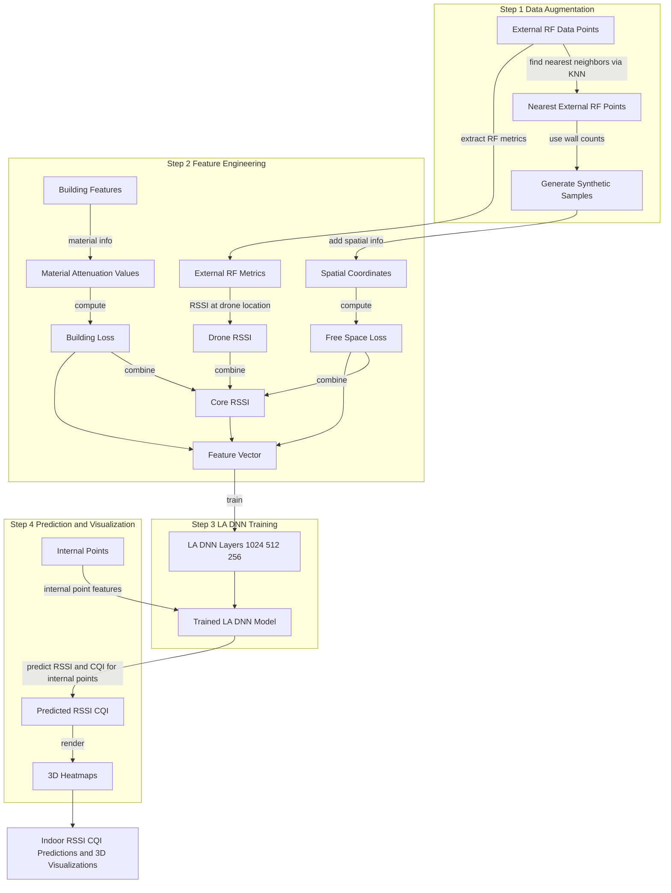

## Architecture

## Wall Detection

1. Pre-process floor images to gray scale.
2. Apply Otsu's threshold and thinned method.
3. Enhance the contrast of wall lines using Canny edge detection.
4. Employ Hough Transform to detect and map wall lines.

## Ref

- Hason Rudd, D., Sanin, C., En, K. M., Gao, X., Islam, M. R., Hasan, M., Wang, X., Huo, A., & Xu, G. (2025). Location-Aware Deep Neural Network for Predicting Indoor 5G RSSI and CQI Using Drone-Based External RF Sensing. Procedia Computer Science, 270, 4765–4775. `https://doi.org/10.1016/j.procs.2025.09.602`
