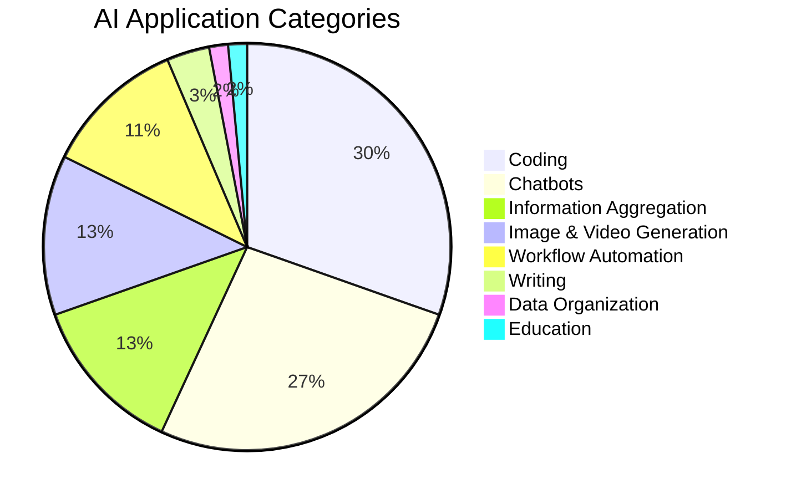
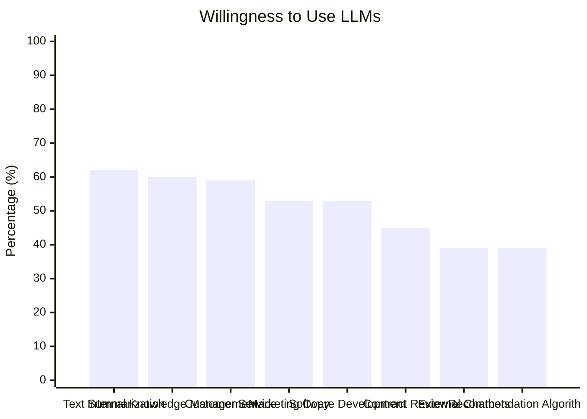

## AI Application Categories

```mermaid
pie title AI Application Categories
    "Coding" : 30.4
    "Chatbots" : 26.5
    "Information Aggregation" : 12.7
    "Image & Video Generation" : 12.7
    "Workflow Automation" : 11.3
    "Writing" : 3.4
    "Data Organization" : 1.5
    "Education" : 1.5
```

## LLM Adoption by Use Case

```mermaid
xychart-beta
    title "Willingness to Use LLMs"
    x-axis ["Text Summarization", "Internal Knowledge Management", "Customer Service", "Marketing Copy", "Software Development", "Contract Review", "External Chatbots", "Recommendation Algorithms"]
    y-axis "Percentage (%)" 0 --> 100
    bar [62, 60, 59, 53, 53, 45, 39, 39]
```
