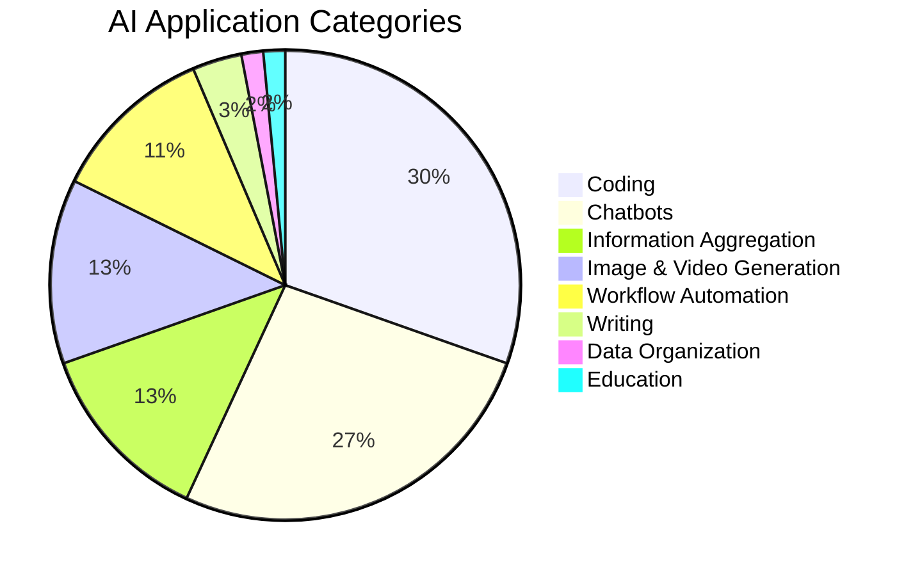

## AI Application Categories

## LLM Adoption by Use Case

1. Text Summarization: 62%
2. Internal Knowledge Management: 60%
3. Customer Service: 59%
4. Marketing Copy: 53%
5. Software Development: 53%
6. Contract Review: 45%
7. External Chatbots: 39%
8. Recommendation Algorithms: 39%
